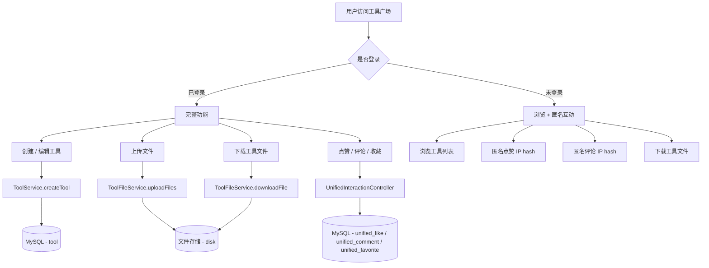
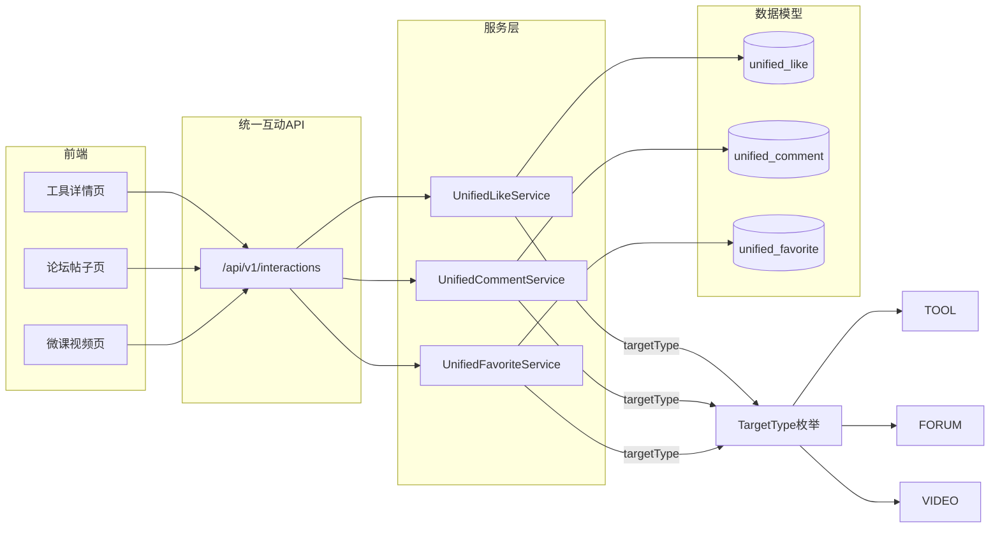

# 工具广场（Tool Plaza）

工具广场是 CodingHub 平台的核心业务模块，承载了工具的创建、分享、下载、互动等完整生命周期。该模块包含 **226 个组件**，覆盖了从工具元数据管理、文件上传下载、分类体系到统一互动系统（点赞、评论、收藏）的全部功能。

用户可以在工具广场中发布自己开发的 AI 工具，为其上传文件和 README 文档，其他用户则可以浏览、搜索、下载工具，并通过点赞、评论、收藏等方式进行互动。平台同时支持匿名互动（基于 IP hash 防重复），兼顾了登录用户与访客的使用体验。

---

## 核心业务流程

---

## 统一互动系统架构

统一互动系统是整个 CodingHub 平台的互动基础设施。通过 `TargetType` 枚举（TOOL / FORUM / VIDEO），同一套点赞、评论、收藏逻辑可服务于工具广场、[社区论坛](community-social.md)和[微课视频](community-social.md)三大内容模块，避免了为每种内容类型重复实现互动功能。

---

## 组件职责说明

### Controllers

| Controller | 路径前缀 | 职责 |
|---|---|---|
| `ToolController` | `/api/v1/tools` | 工具 CRUD、置顶/取消置顶（ADMIN）、热门 Top5、分页列表（支持 categoryId / keyword / sortBy） |
| `ToolFileController` | `/api/v1/tools/{toolId}/files` | 文件上传（multipart 多文件）、文件列表、文件删除、文件下载（流式响应） |
| `CategoryController` | `/api/v1/categories` | 工具分类列表 |
| `UnifiedInteractionController` | `/api/v1/interactions` | 统一点赞（toggleLike）、评论 CRUD、收藏（toggleFavorite）、我的收藏列表，支持匿名点赞 |
| `AvatarStaticController` | — | 头像静态资源服务 |
| `StaticController` | — | README 静态资源服务 |
| `McpController` | — | MCP 健康检查端点 |

### Services

| Service | 核心职责 |
|---|---|
| `ToolService` | 工具 CRUD 核心逻辑；创建/更新/软删除（status=DELETED）；版本管理；置顶；热度排序（score）；关联标签管理 |
| `ToolFileService` | 多文件上传（单文件 ≤ 50MB，总计 ≤ 200MB）；文件按 toolId 目录组织存储；流式下载；README 内容保存 |
| `CategoryService` | 分类 CRUD |
| `UnifiedCommentService` | 评论管理，支持 TOOL / FORUM / VIDEO 三种目标类型；IP hash 匿名评论；XSS 净化 |
| `UnifiedLikeService` | 统一点赞，支持多种 TargetType；匿名点赞（IP hash 防重复）；联动更新热度分数 |
| `UnifiedFavoriteService` | 收藏管理，支持多种 TargetType；需认证 |
| `McpSearchService` | MCP 搜索服务，为 MCP 工具提供搜索能力 |

### Models

| Model | 关键字段 |
|---|---|
| `Tool` | name, content, version, category, score, pinned, status（共 35 字段） |
| `ToolFile` | toolId, originalName, storedPath, fileSize, contentType, readme |
| `Category` | name, description, icon |
| `UnifiedComment` | targetType, targetId, content, userId, ipHash |
| `UnifiedLike` | targetType, targetId, userId, ipHash |
| `UnifiedFavorite` | targetType, targetId, userId |
| `TargetType` | 枚举：TOOL, FORUM, VIDEO |

### Repositories

| Repository | 说明 |
|---|---|
| `ToolRepository` | 30 个方法，含自定义查询（按分类/关键词/排序等） |
| `ToolFileRepository` | 工具文件数据访问 |
| `CategoryRepository` | 分类数据访问 |
| `UnifiedCommentRepository` | 统一评论数据访问 |
| `UnifiedLikeRepository` | 统一点赞数据访问 |
| `UnifiedFavoriteRepository` | 统一收藏数据访问 |

### DTOs

| DTO | 用途 |
|---|---|
| `ToolSummaryDTO` | 工具列表摘要信息 |
| `ToolDetailDTO` | 工具详情（含文件、评论等） |
| `CreateToolRequest` | 创建工具请求体 |
| `UpdateToolRequest` | 更新工具请求体 |
| `ToolFileDTO` | 文件信息传输 |
| `FileUploadResponse` | 文件上传响应 |
| `FileListResponse` | 文件列表响应 |
| `CategoryDTO` | 分类信息传输 |
| `InteractionRequest` | 互动请求（点赞/评论/收藏） |
| `InteractionResponse` | 互动响应 |
| `CreateCommentRequest` | 创建评论请求 |
| `ToolCommentDto` | 评论信息传输 |
| `PostSearchResult` | 搜索结果（帖子） |
| `ToolSearchResult` | 搜索结果（工具） |
| `PageResponse` | 通用分页响应 |
| `ApiResponse` | 通用 API 响应包装 |

---

## API 端点

### 工具管理

| 方法 | 路径 | 说明 | 认证 |
|---|---|---|---|
| `GET` | `/api/v1/tools` | 工具分页列表（categoryId / keyword / sortBy=hot\|latest） | 否 |
| `GET` | `/api/v1/tools/hot` | 热门工具 Top5 | 否 |
| `GET` | `/api/v1/tools/{id}` | 工具详情 | 否 |
| `POST` | `/api/v1/tools` | 创建工具 | 是 |
| `PUT` | `/api/v1/tools/{id}` | 更新工具 | 是（owner/admin） |
| `DELETE` | `/api/v1/tools/{id}` | 删除工具（软删除） | 是（owner/admin） |
| `POST` | `/api/v1/tools/{id}/pin` | 置顶工具 | 是（ADMIN） |
| `POST` | `/api/v1/tools/{id}/unpin` | 取消置顶 | 是（ADMIN） |

### 文件管理

| 方法 | 路径 | 说明 | 认证 |
|---|---|---|---|
| `POST` | `/api/v1/tools/{toolId}/files` | 上传文件（multipart, 多文件） | 是 |
| `GET` | `/api/v1/tools/{toolId}/files` | 文件列表 | 否 |
| `DELETE` | `/api/v1/tools/{toolId}/files/{fileId}` | 删除文件 | 是（owner/admin） |
| `GET` | `/api/v1/tools/{toolId}/files/{fileId}/download` | 下载文件（流式） | 否 |

### 分类

| 方法 | 路径 | 说明 | 认证 |
|---|---|---|---|
| `GET` | `/api/v1/categories` | 分类列表 | 否 |

### 统一互动

| 方法 | 路径 | 说明 | 认证 |
|---|---|---|---|
| `POST` | `/api/v1/interactions/like` | 切换点赞（toggleLike） | 可选（匿名 IP hash） |
| `GET` | `/api/v1/interactions/comments` | 评论列表 | 否 |
| `POST` | `/api/v1/interactions/comments` | 创建评论 | 可选（匿名 IP hash） |
| `PUT` | `/api/v1/interactions/comments/{id}` | 更新评论 | 是（owner/admin） |
| `DELETE` | `/api/v1/interactions/comments/{id}` | 删除评论 | 是（owner/admin） |
| `POST` | `/api/v1/interactions/favorite` | 切换收藏（toggleFavorite） | 是 |
| `GET` | `/api/v1/interactions/favorites` | 我的收藏列表 | 是 |

---

## 关键特性

### 热度排序机制

工具的热度通过 `score` 字段量化，不同互动行为对分数的贡献不同：

| 行为 | 分数变化 |
|---|---|
| 浏览 | +1 |
| 下载 | +2 |
| 点赞 | +3 |
| 评论 | +5 |

排序时支持 `hot`（按 score 降序）和 `latest`（按创建时间降序）两种模式。

### 匿名互动

未登录用户也可以通过 IP hash 参与点赞和评论。系统对用户 IP 进行哈希处理，既保护隐私又能防止同一 IP 重复操作。匿名互动的限制：
- 不支持收藏功能（收藏需认证）
- 评论内容经过 XSS 净化（`XssSanitizer.sanitize()`）

### 文件上传

- 支持多文件同时上传（multipart/form-data）
- 单文件大小限制：50MB
- 总计大小限制：200MB
- 文件按 `toolId` 目录组织存储
- 文件格式无硬性限制（可通过配置白名单扩展）
- 支持保存 README 内容到文件记录

### 软删除

工具删除采用软删除策略，将 `status` 字段设为 `DELETED`，而非物理删除数据库记录。查询时自动过滤已删除的工具。

---

## 与其他模块的关系

- **标签系统**：工具可关联多个标签，通过 `ToolTag` 关联表管理，标签服务提供 `getOrCreateTag` 幂等创建。详见 [社区与概览](community-social.md)。
- **通知系统**：工具互动（评论、点赞）可触发通知。详见 [社区与概览](community-social.md)。
- **知识库**：工具广场与知识库独立运作，但共享统一互动系统的基础设施。详见 [知识库](knowledge-base.md)。
- **MCP 集成**：`McpSearchService` 为 MCP 工具提供搜索能力，通过 SSE 端点 `/mcp/sse` 对外暴露 17 个 MCP 工具。

---

## 数据库表

| 表名 | 说明 |
|---|---|
| `tool` | 工具主表（35 字段） |
| `tool_file` | 工具文件表 |
| `category` | 工具分类表 |
| `tool_like` | 工具点赞表（旧版） |
| `tool_comment` | 工具评论表（旧版） |
| `unified_comment` | 统一评论表 |
| `unified_like` | 统一点赞表 |
| `unified_favorite` | 统一收藏表 |

> 数据库迁移由 Flyway 管理（V1~V9），迁移文件位于 `backend/src/main/resources/db/migration/`。
