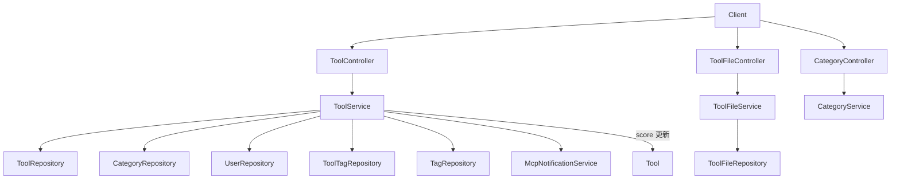

# 工具广场模块（Tool Plaza）

## 模块简介

工具广场是 CodingHub 的核心领域，承载 **AI 工具的发布、检索、详情、编辑、删除、置顶、热度排行与文件管理**。它是用户贡献与发现工具的主要场所，也是论坛、视频、知识库之外最活跃的内容域。

- 入口前缀：`/api/v1/tools`、`/api/v1/tools/{id}/files`、`/api/v1/categories`
- 核心分层：`ToolController` / `ToolFileController` / `CategoryController`（L4）→ `ToolService` / `ToolFileService` / `CategoryService`（L3）→ `ToolRepository` 等（L2）→ `Tool` / `ToolFile` / `ToolLike` / `ToolComment` / `Category`（L1）
- 跨模块：`createTool` / `updateTool` / `deleteTool` 会触发 [MCP 服务模块](mcp-service.md) 的 `McpNotificationService` 通知。

## 架构图

## 核心组件职责

### ToolController（`controller/ToolController.java`）
- `GET /api/v1/tools` — 分页检索；`sortBy` 支持 `hot`（默认，pinned DESC + score DESC）、`latest`、`name`。
- `GET /api/v1/tools/{id}` — 详情（仅 `status = NORMAL`）。
- `POST /api/v1/tools` — 创建，成功后调用 `mcpNotificationService.notifyToolCreated`。
- `PUT /api/v1/tools/{id}` — 更新（权限：`isOwner || isAdmin`），成功后 `notifyToolUpdated`。
- `DELETE /api/v1/tools/{id}` — 软删除（`status = DELETED`，先 `cleanupToolFiles`），成功后 `notifyToolDeleted`。
- `POST/DELETE /api/v1/tools/{id}/pin` — 置顶/取消，需 `ADMIN`/`SUPER_ADMIN`。
- `GET /api/v1/tools/hot-top5` — 热门前 5（供首页/概览使用）。

### ToolFileController（`controller/ToolFileController.java`）
工具文件管理，路径前缀 `/api/v1/tools/{toolId}/files`：
- `POST`（multipart）上传多个文件 + 可选 `readme`；`GET` 列表；`DELETE /{fileId}` 删除（需登录）；`GET /{fileId}/download` 以 `InputStreamResource` 流式下载并设置 `Content-Disposition: attachment`。

### CategoryController（`controller/CategoryController.java`）
- `GET /api/v1/categories` — 返回全部工具分类（`CategoryDTO`，含 `icon`）。

### ToolService（`service/ToolService.java`）
业务核心逻辑：
- **检索排序**：`getTools` 按 `sortBy` 分发到 `findByFiltersOrderByHot` / `findByFilters` / `findByFiltersOrderByName`；分页 `size` 上限 100。
- **创建**：同用户同分类下同名工具唯一（`uk_tool_uploader_name_category`）；写入 `Tool`；按 `tagIds` 建立 `ToolTag` 并 `Tag.incrementUsage`。
- **更新/删除**：权限校验 `isOwner || isAdmin`，否则 `ForbiddenException`；更新时若 `tagIds` 变化则先删旧关联（`decrementUsage`）再加新关联；删除先清理文件再置 `DELETED`。
- **热度评分**：`Tool.updateScore()` 公式 `score = viewCount*1 + likeCount*3 + commentCount*5`；`incrementViewCount` 等原子增减并刷新 score。
- **我的工具**：`getMyTools` 委托自 [认证与用户模块](auth-user.md)。

### ToolFileService（`service/ToolFileService.java`）
负责文件落盘（按 `UploadConfig` 基础目录 + 工具子目录）、`ToolFile` 元数据写入/读取/删除、`cleanupToolFiles`、下载流获取。

### 数据模型
- `Tool`（`model/Tool.java`）：`name`、`category`（LAZY ManyToOne）、`content`（TEXT）、`description`、`version`（默认 `1.0.0`）、`uploader`、`status`（`NORMAL`/`DELETED`，软删除）、`viewCount`/`likeCount`/`commentCount`（默认 0）、`score`（`BigDecimal`，默认 0）、`pinned`（默认 false）。含 `updateScore` 与计数增减方法；唯一约束 `(uploader_id, name, category_id, status)`。
- `ToolFile`（`model/ToolFile.java`）：工具附件元数据（`originalName`、`contentType`、`fileSize`、`status`）。
- `ToolLike` / `ToolComment`：点赞与评论实体（点赞计数由统一互动模块维护，见 [统一互动服务模块](unified-services.md)）。
- `Category`（`model/Category.java`）：工具分类（`name`、`icon`）。

## 关键 API

| 方法 | 路径 | 说明 | 鉴权 |
|------|------|------|------|
| GET | `/api/v1/tools` | 工具列表（分页/筛选/排序） | 否 |
| GET | `/api/v1/tools/{id}` | 工具详情 | 否 |
| POST | `/api/v1/tools` | 创建工具 | 是 |
| PUT | `/api/v1/tools/{id}` | 更新工具 | 所有者/管理员 |
| DELETE | `/api/v1/tools/{id}` | 删除工具 | 所有者/管理员 |
| POST | `/api/v1/tools/{id}/pin` | 置顶 | 管理员 |
| GET | `/api/v1/tools/{id}/files` | 文件列表 | 否 |
| POST | `/api/v1/tools/{id}/files` | 上传文件 | 是 |
| GET | `/api/v1/tools/{id}/files/{fileId}/download` | 下载文件 | 否 |
| GET | `/api/v1/categories` | 分类列表 | 否 |

## 依赖关系（🔗 CodeGraph 增强）

- **上游调用**：[工具广场模块](tool-plaza.md) 被 [统一互动服务模块](unified-services.md) 的点赞/收藏/评论驱动计数；[概览与管理模块](overview-admin.md) 的 `getHotTop5` 复用排名逻辑；前端 `services/tool.ts` 调用本模块全部接口。
- **下游依赖**：`ToolService` → `ToolRepository` / `CategoryRepository` / `UserRepository` / `ToolTagRepository` / `TagRepository`；`ToolFileService` → `ToolFileRepository` + `UploadConfig`；`ToolController` → `McpNotificationService`。
- **变更影响**：修改 `Tool` 实体或 `score` 公式会直接影响首页热门、排行榜与搜索排序；修改权限判断会影响所有工具编辑/删除入口。

## 相关模块

- [认证与用户模块](auth-user.md) — 上传者主体
- [统一互动服务模块](unified-services.md) — 点赞/评论/标签
- [MCP 服务模块](mcp-service.md) — 工具变更通知
- [概览与管理模块](overview-admin.md) — 热门排行
