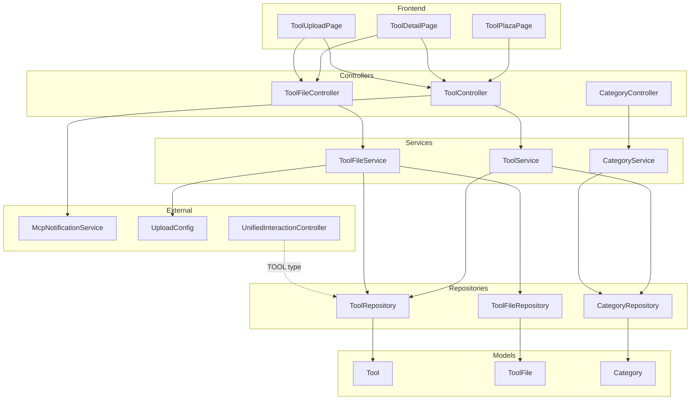

# 工具广场 ([Tool](../backend\src\main\java\com\iaihub\toolbox\model\Tool.java) Plaza)

## 1. 模块概述

工具广场是 CodingHub 的核心功能模块，为用户提供 AI 工具的上传、浏览、搜索、下载和评价能力。该模块围绕三个核心实体——**工具 ([Tool](../backend\src\main\java\com\iaihub\toolbox\model\Tool.java))**、**分类 ([Category](../backend\src\main\java\com\iaihub\toolbox\model\Category.java))**、**工具文件 ([ToolFile](../backend\src\main\java\com\iaihub\toolbox\model\ToolFile.java))**——构建了完整的工具生命周期管理，涵盖从创建发布到文件托管再到热度排序的全链路功能。

工具广场同时作为 [unified-interactions](unified-interactions.md) 的 `TOOL` 类型目标，支持用户点赞和评论互动，并通过 MCP (Model Context Protocol) 向外部 AI 客户端暴露工具搜索与浏览能力。

### 1.1 核心能力

| 能力 | 说明 |
|------|------|
| 工具 CRUD | 创建、查看详情、编辑、软删除工具 |
| 分类管理 | 按分类浏览和筛选工具列表 |
| 文件托管 | 上传附件、下载文件、管理 README |
| 热度排序 | 基于 score 公式的热门排名与管理员置顶 |
| 标签关联 | 通过统一标签系统为工具打标签 |
| 互动集成 | 点赞、评论由统一互动模块处理 |
| MCP 通知 | 工具变更时通过 SSE 推送至 MCP 客户端 |

## 2. 架构总览



## 3. 组件职责

### 3.1 Controller 层

#### [ToolController](../backend\src\main\java\com\iaihub\toolbox\controller\ToolController.java) (`/api/v1/tools`)

负责工具元数据的 REST API 端点。所有写操作均需 JWT 认证，置顶操作需要 ADMIN 或 SUPER_ADMIN 角色。

| 方法 | 端点 | HTTP 方法 | 权限 | 说明 |
|------|------|-----------|------|------|
| `getTools` | `GET /api/v1/tools` | GET | 公开 | 分页查询工具列表，支持分类、关键词过滤和排序 |
| `getToolById` | `GET /api/v1/tools/{id}` | GET | 公开 | 获取工具详情 |
| `createTool` | `POST /api/v1/tools` | POST | 认证用户 | 创建新工具，自动去重校验 |
| `updateTool` | `PUT /api/v1/tools/{id}` | PUT | 拥有者/管理员 | 更新工具信息，含标签替换 |
| `deleteTool` | `DELETE /api/v1/tools/{id}` | DELETE | 拥有者/管理员 | 软删除工具及其文件 |
| `pinTool` | `POST /api/v1/tools/{id}/pin` | POST | 管理员 | 置顶工具 |
| `unpinTool` | `DELETE /api/v1/tools/{id}/pin` | DELETE | 管理员 | 取消置顶 |
| `getHotTop5` | `GET /api/v1/tools/hot-top5` | GET | 公开 | 获取热度 Top 5 工具 ID 列表 |

#### [ToolFileController](../backend\src\main\java\com\iaihub\toolbox\controller\ToolFileController.java) (`/api/v1/tools/{toolId}/files`)

负责工具附件的文件管理 REST API 端点。所有文件路径嵌套在工具资源下，体现 RESTful 的资源层级关系。

| 方法 | 端点 | HTTP 方法 | 权限 | 说明 |
|------|------|-----------|------|------|
| `uploadFiles` | `POST /api/v1/tools/{toolId}/files` | POST | 拥有者 | 批量上传文件，可选附带 README |
| `getToolFiles` | `GET /api/v1/tools/{toolId}/files` | GET | 公开 | 获取工具文件列表 |
| `deleteToolFile` | `DELETE /api/v1/tools/{toolId}/files/{fileId}` | DELETE | 拥有者 | 删除指定文件 |
| `downloadFile` | `GET /api/v1/tools/{toolId}/files/{fileId}/download` | GET | 公开 | 下载文件流 |

#### [CategoryController](../backend\src\main\java\com\iaihub\toolbox\controller\CategoryController.java) (`/api/v1/categories`)

提供分类列表的只读端点。

| 方法 | 端点 | HTTP 方法 | 权限 | 说明 |
|------|------|-----------|------|------|
| `getAllCategories` | `GET /api/v1/categories` | GET | 公开 | 获取所有分类，按 sortOrder 升序排列 |

### 3.2 Service 层

#### [ToolService](../backend\src\main\java\com\iaihub\toolbox\service\ToolService.java)

工具业务逻辑的核心服务，协调 [Tool](../backend\src\main\java\com\iaihub\toolbox\model\Tool.java)、[Category](../backend\src\main\java\com\iaihub\toolbox\model\Category.java)、[User](../backend\src\main\java\com\iaihub\toolbox\model\User.java)、[Tag](../backend\src\main\java\com\iaihub\toolbox\model\tag\Tag.java) 等多个实体的交互。

**关键业务流程：**

1. **创建工具** — 校验同名去重 (同一用户、同一分类下不允许同名) -> 创建 [Tool](../backend\src\main\java\com\iaihub\toolbox\model\Tool.java) 实体 -> 处理标签关联 -> 返回摘要 DTO
2. **更新工具** — 权限校验 (`isOwner || isAdmin`) -> 名称/分类变更时重新校验去重 -> 全量替换标签关联 -> 返回详情 DTO
3. **删除工具** — 权限校验 -> 清理关联文件 -> 设置 `status = DELETED` (软删除)
4. **热度排序** — 支持三种排序策略：`hot` (pinned DESC, score DESC)、`latest` (createdAt DESC)、`name` (name ASC)

#### [ToolFileService](../backend\src\main\java\com\iaihub\toolbox\service\ToolFileService.java)

工具文件管理服务，处理物理文件的存储、读取和清理。

**文件约束：**

| 约束项 | 值 | 说明 |
|--------|------|------|
| 单文件大小上限 | 50 MB | 超过则抛出 `FileValidationException` |
| 批量上传总大小上限 | 200 MB | 一次请求中所有文件的总大小 |
| 文件格式 | 可配置 | 默认不限制，通过 `UploadConfig.allowedExtensions` 配置白名单 |
| 同名文件策略 | 覆盖替换 | 上传同名文件时删除旧记录再写入新文件 |

**存储结构：**
```
{uploadConfig.baseDir}/
  └── {toolId}/
      ├── readme.md (可选)
      ├── file1.zip
      ├── file2.pdf
      └── ...
```

**关键业务流程：**

1. **上传文件** — 校验工具存在和所有权 -> 校验文件大小 -> 创建工具目录 -> 逐个保存文件 -> 可选保存 README
2. **下载文件** — 校验文件记录存在 -> 校验物理文件存在 -> 返回文件输入流
3. **删除文件** — 校验所有权 -> 删除物理文件 -> 删除数据库记录
4. **清理文件** — 删除工具时调用 -> 遍历删除所有物理文件 -> 删除目录 -> 批量删除数据库记录

#### [CategoryService](../backend\src\main\java\com\iaihub\toolbox\service\CategoryService.java)

分类查询服务，逻辑简单，按 `sortOrder` 升序返回所有分类。包含一个显示名称转换：将名为 `API` 的分类在前端显示为"插件"。

### 3.3 Repository 层

#### [ToolRepository](../backend\src\main\java\com\iaihub\toolbox\repository\ToolRepository.java)

基于 Spring Data JPA 的数据访问接口，提供丰富的自定义查询方法：

| 方法 | 说明 |
|------|------|
| `findByFilters` | 按分类和关键词过滤，按创建时间倒序 (latest) |
| `findByFiltersOrderByName` | 按分类和关键词过滤，按名称升序 |
| `findByFiltersOrderByHot` | 按分类和关键词过滤，按 pinned DESC + score DESC 排序 (hot) |
| `findByIdAndStatusNormal` | 按 ID 查找且状态为 NORMAL |
| `findByIdAndStatusNormalWithRelations` | 按 ID 查找并 JOIN FETCH 关联的 category 和 uploader |
| `findByUploaderIdAndFilters` | 按上传者 ID 查询我的工具列表 |
| `existsByNameAndUploaderIdAndCategoryIdAndStatus` | 同名去重校验 |
| `findTop5ByStatusOrderByScoreDesc` | 热度 Top 5 |
| `pinById` / `unpinById` | 更新置顶状态 (`@Modifying`) |
| `findTop10ByStatusAndNameContainingIgnoreCase` | MCP Server 关键词搜索 |
| `findTop10ByStatusOrderByCreatedAtDesc` | MCP Server 最新工具 |
| `countByStatus` | 按状态统计数量 |

## 4. 数据模型

### 4.1 [Tool](../backend\src\main\java\com\iaihub\toolbox\model\Tool.java) 实体

| 字段 | 类型 | 约束 | 说明 |
|------|------|------|------|
| `id` | Long | PK, AUTO_INCREMENT | 主键 |
| `name` | String(100) | NOT NULL | 工具名称 |
| `category_id` | Long | FK -> category.id, NOT NULL | 所属分类 |
| `content` | TEXT | NOT NULL | 工具内容/正文 |
| `description` | String(200) | - | 简短描述 |
| `version` | String(50) | NOT NULL, 默认 "1.0.0" | 版本号 |
| `uploader_id` | Long | FK -> user.id, NOT NULL | 上传者 |
| `status` | Enum(NORMAL, DELETED) | NOT NULL, 默认 NORMAL | 状态 |
| `created_at` | LocalDateTime | NOT NULL, 不可更新 | 创建时间 |
| `updated_at` | LocalDateTime | NOT NULL | 更新时间 |
| `view_count` | Integer | 默认 0 | 浏览次数 |
| `like_count` | Integer | 默认 0 | 点赞数 (由 [unified-interactions](unified-interactions.md) 维护) |
| `comment_count` | Integer | 默认 0 | 评论数 (由 [unified-interactions](unified-interactions.md) 维护) |
| `score` | BigDecimal(10,2) | 默认 0 | 热度分数 |
| `pinned` | Boolean | NOT NULL, 默认 false | 是否置顶 |

**索引：**
- `idx_tool_category`: (category_id, status)
- `idx_tool_uploader`: (uploader_id, status)
- `idx_tool_name_status`: (name, status)
- `idx_tool_version`: (version)

**唯一约束：**
- `uk_tool_uploader_name_category`: (uploader_id, name, category_id, status) — 同一用户在同一分类下工具名不可重复

### 4.2 [ToolFile](../backend\src\main\java\com\iaihub\toolbox\model\ToolFile.java) 实体

| 字段 | 类型 | 约束 | 说明 |
|------|------|------|------|
| `id` | Long | PK, AUTO_INCREMENT | 主键 |
| `tool_id` | Long | NOT NULL | 所属工具 ID |
| `original_name` | String(255) | NOT NULL | 原始文件名 |
| `stored_path` | String(512) | NOT NULL, UNIQUE | 存储路径 (相对于 baseDir) |
| `file_size` | Long | NOT NULL | 文件大小 (字节) |
| `content_type` | String(100) | - | MIME 类型 |
| `status` | Enum(NORMAL, DELETED) | NOT NULL, 默认 NORMAL | 状态 |
| `created_at` | LocalDateTime | NOT NULL, 不可更新 | 上传时间 |

**索引：**
- `idx_tool_file_tool_id`: (tool_id)

### 4.3 [Category](../backend\src\main\java\com\iaihub\toolbox\model\Category.java) 实体

| 字段 | 类型 | 约束 | 说明 |
|------|------|------|------|
| `id` | Long | PK, AUTO_INCREMENT | 主键 |
| `name` | String(50) | NOT NULL, UNIQUE | 分类名称 |
| `icon` | String(255) | - | 图标 URL 或标识 |
| `sort_order` | Integer | NOT NULL, 默认 0 | 排序权重 |
| `created_at` | LocalDateTime | NOT NULL, 不可更新 | 创建时间 |

### 4.4 实体关系

```mermaid
graph LR
    subgraph ToolPlaza
        Category[Category]
        Tool[Tool]
        ToolFile[ToolFile]
    end

    subgraph User
        User[User]
    end

    subgraph Tags
        Tag[Tag]
        ToolTag[ToolTag]
    end

    subgraph Interactions
        UnifiedLike[UnifiedLike]
        UnifiedComment[UnifiedComment]
        UnifiedFavorite[UnifiedFavorite]
    end

    Category -->|1:N| Tool
    User -->|1:N| Tool
    Tool -->|1:N| ToolFile
    Tool -->|N:M via ToolTag| Tag
    Tool -.->|target_type=TOOL| UnifiedLike
    Tool -.->|target_type=TOOL| UnifiedComment
    Tool -.->|target_type=TOOL| UnifiedFavorite
```

## 5. 热度评分机制

[Tool](../backend\src\main\java\com\iaihub\toolbox\model\Tool.java) 实体内置了热度评分算法，每当浏览、点赞或评论事件发生时自动重新计算：

```
score = viewCount * 1 + likeCount * 3 + commentCount * 5
```

| 行为 | 权重 | 触发方式 |
|------|------|----------|
| 浏览 | 1 | 前端访问工具详情页时调用 `incrementViewCount()` |
| 点赞 | 3 | [unified-interactions](unified-interactions.md) 点赞切换时调用 `incrementLikeCount()` / `decrementLikeCount()` |
| 评论 | 5 | [unified-interactions](unified-interactions.md) 评论增删时调用 `incrementCommentCount()` |

管理员还可通过 `POST /api/v1/tools/{id}/pin` 将优质工具置顶，置顶工具在 hot 排序中始终优先显示。

## 6. API 请求与响应示例

### 6.1 创建工具

**请求：**
```http
POST /api/v1/tools
Authorization: Bearer <token>
Content-Type: application/json

{
  "name": "智能翻译助手",
  "categoryId": 3,
  "content": "这是一个基于大语言模型的翻译工具...",
  "description": "支持 50+ 语言的智能翻译",
  "version": "2.1.0",
  "tagIds": [1, 5, 8]
}
```

**响应：**
```json
{
  "code": 201,
  "message": "上传成功",
  "data": {
    "id": 42,
    "name": "智能翻译助手",
    "version": "2.1.0",
    "description": "支持 50+ 语言的智能翻译",
    "categoryName": "NLP",
    "categoryIcon": "translate",
    "uploaderId": 7,
    "uploaderUsername": "zhangsan",
    "uploaderNickname": "张三",
    "createdAt": "2026-01-15T10:30:00",
    "score": 0,
    "pinned": false,
    "viewCount": 0,
    "likeCount": 0,
    "commentCount": 0,
    "tags": [
      {"id": 1, "name": "翻译", "tagType": "TOOL", "usageCount": 12},
      {"id": 5, "name": "NLP", "tagType": "TOOL", "usageCount": 8}
    ]
  }
}
```

### 6.2 查询工具列表

**请求：**
```http
GET /api/v1/tools?categoryId=3&keyword=翻译&sortBy=hot&page=0&size=12
```

**响应：**
```json
{
  "code": 200,
  "message": "success",
  "data": {
    "content": [...],
    "totalElements": 25,
    "totalPages": 3,
    "page": 0,
    "size": 12
  }
}
```

### 6.3 上传工具文件

**请求：**
```http
POST /api/v1/tools/42/files
Authorization: Bearer <token>
Content-Type: multipart/form-data

files: [binary, binary]
readme: "# 智能翻译助手\n\n使用说明..."
```

**响应：**
```json
{
  "code": 200,
  "message": "文件上传成功",
  "data": {
    "toolId": 42,
    "files": [
      {
        "id": 101,
        "toolId": 42,
        "originalName": "translator-v2.1.0.zip",
        "fileSize": 5242880,
        "contentType": "application/zip",
        "createdAt": "2026-01-15T11:00:00"
      }
    ],
    "readmeSaved": true
  }
}
```

## 7. 权限控制矩阵

| 操作 | 公开 | 认证用户 | 工具拥有者 | ADMIN/SUPER_ADMIN |
|------|:----:|:--------:|:----------:|:-----------------:|
| 浏览工具列表 | Yes | Yes | Yes | Yes |
| 查看工具详情 | Yes | Yes | Yes | Yes |
| 下载工具文件 | Yes | Yes | Yes | Yes |
| 创建工具 | - | Yes | - | - |
| 更新工具 | - | - | Yes | Yes |
| 删除工具 (软删除) | - | - | Yes | Yes |
| 上传文件 | - | - | Yes | - |
| 删除文件 | - | - | Yes | - |
| 置顶/取消置顶 | - | - | - | Yes |

## 8. 业务规则与约束

### 8.1 同名去重

在同一分类下，同一用户不可上传两个同名工具。更新时若修改了名称或分类，也会重新校验。此约束同时通过数据库唯一约束 `uk_tool_uploader_name_category` 作为最终防线。

### 8.2 软删除

工具删除采用软删除策略，将 `status` 设为 `DELETED` 而非物理删除。删除工具时会同时清理关联的物理文件和 [ToolFile](../backend\src\main\java\com\iaihub\toolbox\model\ToolFile.java) 数据库记录。

### 8.3 分页限制

所有分页查询均对 `size` 参数做上限限制：`Math.min(size, 100)`，防止一次查询返回过多数据。

### 8.4 XSS 防护

工具内容 (`content`) 在存储前会经过 XSS 清洗（通过 `XssSanitizer`），详见 [backend-infra](backend-infra.md)。

### 8.5 标签生命周期

创建工具时，为每个关联标签执行 `incrementUsage()`；更新工具时先全量删除旧标签关联并 `decrementUsage()`，再建立新关联并 `incrementUsage()`。

## 9. MCP 集成

工具变更时，`ToolController` 会通过 `McpNotificationService` 发送 SSE 通知：

| 事件 | 通知方法 | 触发时机 |
|------|----------|----------|
| 工具创建 | `notifyToolCreated(id, name)` | `POST /api/v1/tools` 成功 |
| 工具更新 | `notifyToolUpdated(id, name)` | `PUT /api/v1/tools/{id}` 成功 |
| 工具删除 | `notifyToolDeleted(id)` | `DELETE /api/v1/tools/{id}` 成功 |

此外，MCP Server 通过 `ToolRepository` 的专用方法提供工具搜索和最新工具查询能力，供 AI 客户端通过 MCP 协议调用。

## 10. DTO 结构

### 10.1 [ToolSummaryDTO](../backend\src\main\java\com\iaihub\toolbox\dto\ToolSummaryDTO.java) (列表摘要)

用于工具列表展示，包含基本信息和统计数据：

```
ToolSummaryDTO
├── id, name, version, description
├── categoryName, categoryIcon
├── uploaderId, uploaderUsername, uploaderNickname
├── createdAt
├── score, pinned
├── viewCount, likeCount, commentCount
└── tags: List<TagDTO>
```

### 10.2 [ToolDetailDTO](../backend\src\main\java\com\iaihub\toolbox\dto\ToolDetailDTO.java) (详情)

继承摘要信息，额外包含完整内容和更新时间：

```
ToolDetailDTO
├── (包含 ToolSummaryDTO 全部字段)
├── content          // 工具完整正文
├── updatedAt        // 最后更新时间
└── tags: List<TagDTO>
```

## 11. 跨模块关联

| 关联模块 | 关联方式 | 说明 |
|----------|----------|------|
| [unified-interactions](unified-interactions.md) | `target_type = TOOL` | 工具的点赞、评论、收藏均通过统一互动模块实现 |
| [forum](forum.md) | 标签系统共享 | 工具标签和论坛标签共用统一的 [Tag](../backend\src\main\java\com\iaihub\toolbox\model\tag\Tag.java) 实体 |
| [video](video.md) | 互动模式一致 | 视频也通过统一互动模块处理，模式相同 |
| [backend-infra](backend-infra.md) | 基础设施依赖 | JWT 认证、XSS 防护、异常处理、文件上传配置 |
| MCP Server | `ToolRepository` 直连 | MCP 工具搜索和最新工具查询直接调用 Repository |

## 12. 关键源码文件索引

| 文件 | 路径 | 说明 |
|------|------|------|
| [ToolController](../backend\src\main\java\com\iaihub\toolbox\controller\ToolController.java) | `backend/src/main/java/com/iaihub/toolbox/controller/ToolController.java` | 工具 REST API |
| [ToolFileController](../backend\src\main\java\com\iaihub\toolbox\controller\ToolFileController.java) | `backend/src/main/java/com/iaihub/toolbox/controller/ToolFileController.java` | 文件管理 API |
| [CategoryController](../backend\src\main\java\com\iaihub\toolbox\controller\CategoryController.java) | `backend/src/main/java/com/iaihub/toolbox/controller/CategoryController.java` | 分类查询 API |
| [ToolService](../backend\src\main\java\com\iaihub\toolbox\service\ToolService.java) | `backend/src/main/java/com/iaihub/toolbox/service/ToolService.java` | 工具业务逻辑 |
| [ToolFileService](../backend\src\main\java\com\iaihub\toolbox\service\ToolFileService.java) | `backend/src/main/java/com/iaihub/toolbox/service/ToolFileService.java` | 文件管理逻辑 |
| [CategoryService](../backend\src\main\java\com\iaihub\toolbox\service\CategoryService.java) | `backend/src/main/java/com/iaihub/toolbox/service/CategoryService.java` | 分类查询逻辑 |
| [Tool](../backend\src\main\java\com\iaihub\toolbox\model\Tool.java) | `backend/src/main/java/com/iaihub/toolbox/model/Tool.java` | 工具实体 |
| [ToolFile](../backend\src\main\java\com\iaihub\toolbox\model\ToolFile.java) | `backend/src/main/java/com/iaihub/toolbox/model/ToolFile.java` | 工具文件实体 |
| [Category](../backend\src\main\java\com\iaihub\toolbox\model\Category.java) | `backend/src/main/java/com/iaihub/toolbox/model/Category.java` | 分类实体 |
| [ToolRepository](../backend\src\main\java\com\iaihub\toolbox\repository\ToolRepository.java) | `backend/src/main/java/com/iaihub/toolbox/repository/ToolRepository.java` | 数据访问层 |


<!-- crosslinks (auto-generated) -->
## Related Modules
- Depends on: [auth-user](auth-user.md), [auxiliary-services](auxiliary-services.md), [backend-infra](backend-infra.md), [mcp-service](mcp-service.md)
- Used by: [auth-user](auth-user.md), [auxiliary-services](auxiliary-services.md), [mcp-service](mcp-service.md), [unified-interactions](unified-interactions.md)
