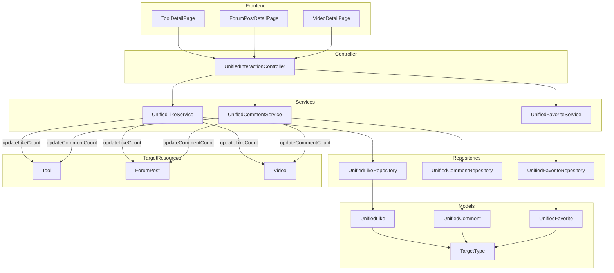
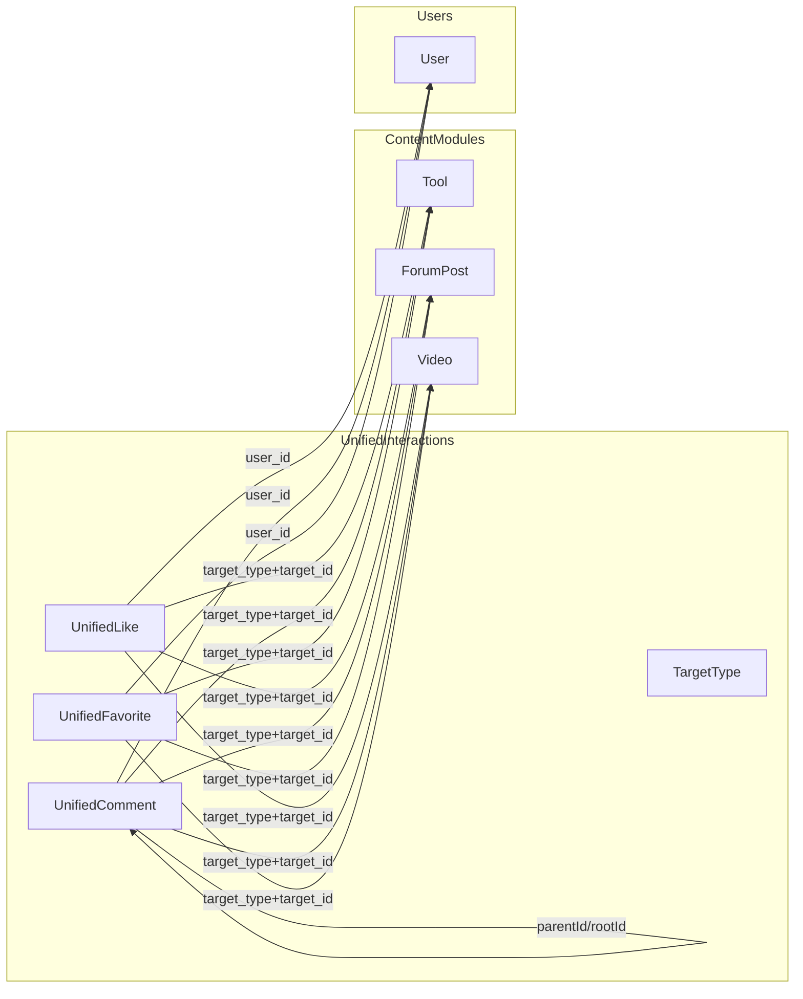
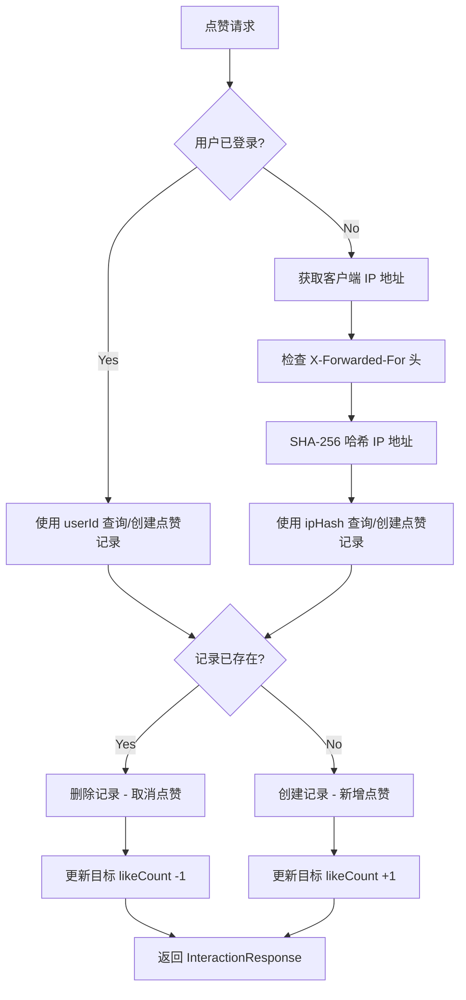
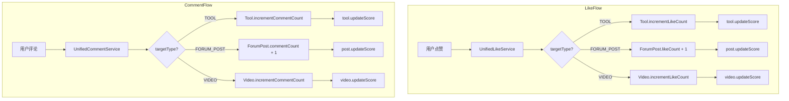

# 统一互动 (Unified Interactions)

## 1. 模块概述

统一互动模块是 CodingHub 的全局用户互动基础设施，为平台所有内容类型提供**统一的点赞、评论和收藏能力**。该模块是一个关键的架构决策产物：所有针对 `TOOL`（工具）、`FORUM_POST`（论坛帖子）和 `VIDEO`（微课视频）的互动行为，**必须且只能**通过本模块的统一接口实现，各业务模块（[tool-plaza](tool-plaza.md)、[forum](forum.md)、[video](video.md)）不再各自维护独立的互动逻辑。

### 1.1 设计决策：为何统一

在项目早期，工具、论坛、微课各自维护独立的点赞/评论表（如 `tool_like`、`tool_comment`、`forum_like`、`video_like` 等），导致以下问题：

1. **数据冗余** — 多张结构相同的表分散在数据库中
2. **逻辑重复** — 每个模块都有一套几乎相同的 toggle/增删查逻辑
3. **维护成本高** — 新增互动类型（如收藏）需要在所有模块同步实现
4. **统计困难** — 跨模块的用户互动数据难以聚合分析

统一互动模块通过 `target_type + target_id` 的多态设计，将三种互动行为收敛到三张表和一套 Service 中。未来新增内容类型时，只需在 `TargetType` 枚举中添加新值即可扩展。

### 1.2 核心能力

| 能力 | 说明 | 适用内容类型 |
|------|------|-------------|
| 点赞 (Like) | Toggle 模式，支持登录用户和匿名用户 | TOOL, FORUM_POST, VIDEO |
| 评论 (Comment) | 支持顶级评论和嵌套回复，XSS 防护 | TOOL, FORUM_POST, VIDEO |
| 收藏 (Favorite) | Toggle 模式，仅登录用户可用 | TOOL, FORUM_POST, VIDEO |

## 2. 架构总览



## 3. 组件职责

### 3.1 Controller 层

#### [UnifiedInteractionController](../backend\src\main\java\com\iaihub\toolbox\controller\UnifiedInteractionController.java) (`/api/v1/interactions`)

所有互动行为的统一入口。控制器本身不包含业务逻辑，仅负责：

1. 从 `SecurityContext` 获取当前用户
2. 为匿名用户计算 IP 哈希 (用于匿名点赞去重)
3. 委托给对应的 Service 处理

##### 点赞端点

| 方法 | 端点 | HTTP 方法 | 认证 | 说明 |
|------|------|-----------|------|------|
| `toggleLike` | `POST /api/v1/interactions/likes` | POST | 可选 | 切换点赞状态 (toggle) |
| `getLikeStatus` | `GET /api/v1/interactions/likes/status` | GET | 可选 | 查询点赞状态 |

##### 评论端点

| 方法 | 端点 | HTTP 方法 | 认证 | 说明 |
|------|------|-----------|------|------|
| `addComment` | `POST /api/v1/interactions/comments` | POST | 可选 | 发表评论或嵌套回复 |
| `getComments` | `GET /api/v1/interactions/comments` | GET | 公开 | 分页获取评论列表 |
| `deleteComment` | `DELETE /api/v1/interactions/comments/{id}` | DELETE | 必须 | 删除评论 (拥有者或管理员) |

##### 收藏端点

| 方法 | 端点 | HTTP 方法 | 认证 | 说明 |
|------|------|-----------|------|------|
| `toggleFavorite` | `POST /api/v1/interactions/favorites` | POST | 必须 | 切换收藏状态 (toggle) |
| `getMyFavorites` | `GET /api/v1/interactions/favorites` | GET | 必须 | 分页获取我的收藏列表 |
| `getFavoriteStatus` | `GET /api/v1/interactions/favorites/status` | GET | 必须 | 查询收藏状态 |

### 3.2 Service 层

#### [UnifiedLikeService](../backend\src\main\java\com\iaihub\toolbox\service\UnifiedLikeService.java)

点赞业务逻辑服务，核心特点：

**双身份模式** — 同时支持登录用户和匿名用户点赞：
- 登录用户：通过 `userId` 标识，唯一约束 `uk_like_user` (target_type, target_id, user_id)
- 匿名用户：通过 SHA-256 哈希的 IP 地址标识，唯一约束 `uk_like_anon` (target_type, target_id, ip_hash)

**Toggle 语义** — 同一点赞记录的再次请求会删除该记录（取消点赞），不存在则创建新记录。

**联动更新** — 点赞/取消点赞后，自动更新目标实体的 `likeCount` 和 `score` 字段：

| 目标类型 | Repository | 更新方式 |
|----------|-----------|----------|
| TOOL | `ToolRepository` | `tool.incrementLikeCount()` / `tool.decrementLikeCount()` |
| FORUM_POST | `ForumPostRepository` | `post.setLikeCount(post.getLikeCount() +/- 1)` + `post.updateScore()` |
| VIDEO | `VideoRepository` | `video.incrementLikeCount()` / `video.decrementLikeCount()` |

#### [UnifiedCommentService](../backend\src\main\java\com\iaihub\toolbox\service\UnifiedCommentService.java)

评论业务逻辑服务，核心特点：

**嵌套回复** — 通过 `parentId` 和 `rootId` 实现两级评论结构：
- `parentId = null`：顶级评论
- `parentId != null`：回复某条评论，自动解析 `rootId` 指向最顶层

**XSS 防护** — 评论内容经过 `XssSanitizer.sanitize()` 清洗后再存储，详见 [backend-infra](backend-infra.md)。

**用户身份解析** — 登录用户自动填充 `userId`，`userName` 字段置空；匿名用户使用前端传入的 `userName`。返回评论时自动查询用户昵称和头像。

**联动计数** — 发表评论时 `incrementCommentCount`，删除评论时 `decrementCommentCount`，并触发目标实体的 `score` 重算。

**权限控制** — 删除评论时校验 `isOwner || isAdmin`。

#### [UnifiedFavoriteService](../backend\src\main\java\com\iaihub\toolbox\service\UnifiedFavoriteService.java)

收藏业务逻辑服务，核心特点：

**仅登录用户** — 收藏功能要求必须登录，匿名请求返回 401。

**Toggle 语义** — 与点赞类似，已收藏则取消，未收藏则添加。唯一约束 `uk_fav` (user_id, target_type, target_id) 保证不会重复。

**富列表返回** — 获取收藏列表时，不是简单返回收藏记录，而是查询目标实体的完整 DTO：

| 目标类型 | 返回 DTO | 说明 |
|----------|---------|------|
| TOOL | `ToolSummaryDTO` | 包含分类、上传者、统计数据 |
| FORUM_POST | `ForumPostSummaryDTO` | 包含标题、作者、统计数据 |
| VIDEO | `VideoListItem` | 包含封面、时长、上传者信息 |

### 3.3 [TargetType](../backend\src\main\java\com\iaihub\toolbox\model\TargetType.java) 枚举

`TargetType` 是统一互动模块的多态标识核心，定义了平台支持的所有可互动内容类型：

```java
public enum TargetType {
    TOOL,        // 工具广场的工具
    FORUM_POST,  // 论坛的帖子
    VIDEO;       // 微课的视频
}
```

**校验机制** — `TargetType.fromString()` 方法在解析时做严格校验，非法值会抛出 `BusinessException(400)`：

```
Invalid targetType: XXX. Must be one of: TOOL, FORUM_POST, VIDEO
```

**扩展方式** — 当平台新增内容类型时，只需：
1. 在 `TargetType` 枚举中添加新值
2. 在各 Service 的 `switch` 分支中补充对应的 Repository 调用
3. 新增对应的验证和计数更新逻辑

## 4. 数据模型

### 4.1 [UnifiedLike](../backend\src\main\java\com\iaihub\toolbox\model\UnifiedLike.java) 实体

| 字段 | 类型 | 约束 | 说明 |
|------|------|------|------|
| `id` | Long | PK, AUTO_INCREMENT | 主键 |
| `target_type` | String(20) | NOT NULL | 目标类型: TOOL / FORUM_POST / VIDEO |
| `target_id` | Long | NOT NULL | 目标资源 ID |
| `user_id` | Long | - | 登录用户 ID (与 ip_hash 二选一) |
| `ip_hash` | String(64) | - | 匿名用户 IP 的 SHA-256 哈希 |
| `created_at` | LocalDateTime | - | 点赞时间 |

**索引与约束：**
- `uk_like_user`: UNIQUE (target_type, target_id, user_id) — 同一用户不可重复点赞
- `uk_like_anon`: UNIQUE (target_type, target_id, ip_hash) — 同一 IP 不可重复匿名点赞
- `idx_like_target`: INDEX (target_type, target_id) — 按目标查询点赞记录

### 4.2 [UnifiedComment](../backend\src\main\java\com\iaihub\toolbox\model\UnifiedComment.java) 实体

| 字段 | 类型 | 约束 | 说明 |
|------|------|------|------|
| `id` | Long | PK, AUTO_INCREMENT | 主键 |
| `target_type` | String(20) | NOT NULL | 目标类型 |
| `target_id` | Long | NOT NULL | 目标资源 ID |
| `user_id` | Long | - | 登录用户 ID |
| `user_name` | String(50) | - | 匿名用户名称 |
| `parent_id` | Long | - | 父评论 ID (嵌套回复时设置) |
| `root_id` | Long | - | 根评论 ID (最顶层) |
| `content` | TEXT | NOT NULL | 评论内容 (XSS 清洗后) |
| `like_count` | Integer | 默认 0 | 评论自身的点赞数 |
| `created_at` | LocalDateTime | - | 创建时间 |
| `updated_at` | LocalDateTime | - | 更新时间 |

**索引：**
- `idx_comment_target`: INDEX (target_type, target_id, created_at) — 按目标和时间查询评论
- `idx_comment_root`: INDEX (root_id) — 按根评论查询回复链

### 4.3 [UnifiedFavorite](../backend\src\main\java\com\iaihub\toolbox\model\UnifiedFavorite.java) 实体

| 字段 | 类型 | 约束 | 说明 |
|------|------|------|------|
| `id` | Long | PK, AUTO_INCREMENT | 主键 |
| `target_type` | String(20) | NOT NULL | 目标类型 |
| `target_id` | Long | NOT NULL | 目标资源 ID |
| `user_id` | Long | NOT NULL | 用户 ID |
| `created_at` | LocalDateTime | - | 收藏时间 |

**索引与约束：**
- `uk_fav`: UNIQUE (user_id, target_type, target_id) — 同一用户不可重复收藏同一目标
- `idx_fav_user`: INDEX (user_id, target_type) — 按用户和类型查询收藏列表

### 4.4 数据模型关系



## 5. 匿名用户点赞机制

统一互动模块的一个特色设计是支持**匿名用户点赞**，通过 IP 哈希实现去重：



**IP 哈希流程：**
1. 获取 `request.getRemoteAddr()` 的实际 IP
2. 优先使用 `X-Forwarded-For` 头的第一个 IP（兼容反向代理场景）
3. 使用 SHA-256 算法对 IP 进行哈希，生成 64 位十六进制字符串
4. 哈希后的值存储在 `ip_hash` 字段中，原始 IP 不会被记录

此设计在保护用户隐私的同时，实现了基本的匿名去重能力。

## 6. API 请求与响应示例

### 6.1 切换点赞 (登录用户)

**请求：** `POST /api/v1/interactions/likes` — Body: `{"targetType": "TOOL", "targetId": 42}`

**响应：** `{"data": {"liked": true, "likeCount": 15}}` — 匿名用户的流程见第 5 节。

### 6.2 发表评论 (嵌套回复)

**请求：** `POST /api/v1/interactions/comments` — Body: `{"targetType": "FORUM_POST", "targetId": 88, "content": "完全同意！", "parentId": 201}`

**响应：** 返回 `InteractionResponse`，包含评论 ID、用户昵称、头像、`parentId`、`rootId`、内容等完整信息。

### 6.3 获取评论列表

**请求：** `GET /api/v1/interactions/comments?targetType=TOOL&targetId=42&page=0&size=20`

**响应：** 标准分页结构，`content` 数组中每条为 `InteractionResponse`，含 `totalElements`、`totalPages` 等分页元数据。

### 6.4 收藏操作

- **切换收藏：** `POST /api/v1/interactions/favorites` — Body: `{"targetType": "VIDEO", "targetId": 15}` — 返回 `{"favorited": true}`
- **获取收藏列表：** `GET /api/v1/interactions/favorites?targetType=TOOL&page=0&size=10` — 返回目标实体的完整 DTO（如 `ToolSummaryDTO`、`VideoListItem`），而非简单的收藏记录
- **查询收藏状态：** `GET /api/v1/interactions/favorites/status?targetType=TOOL&targetId=42` — 返回 `{"favorited": true}`

## 7. 权限控制矩阵

| 操作 | 公开/匿名 | 认证用户 | 内容拥有者 | ADMIN |
|------|:---------:|:--------:|:----------:|:-----:|
| 点赞 | Yes (IP 去重) | Yes (userId 去重) | Yes | Yes |
| 查询点赞状态 | Yes | Yes | Yes | Yes |
| 发表评论 | Yes (需传 userName) | Yes (自动填充) | Yes | Yes |
| 浏览评论 | Yes | Yes | Yes | Yes |
| 删除评论 | - | - | Yes | Yes |
| 收藏 | - | Yes | Yes | Yes |
| 查询收藏状态 | - | Yes | Yes | Yes |
| 获取收藏列表 | - | Yes | Yes | Yes |

## 8. 与目标实体的联动

统一互动模块与各内容模块之间存在**双向联动**关系：



### 8.1 Score 公式联动

各目标实体的 `score` 计算方式保持一致：

```
score = viewCount * 1 + likeCount * 3 + commentCount * 5
```

由于互动模块在每次点赞和评论时都会触发 `updateScore()`，因此目标实体的热度分数始终保持实时更新。具体的 score 算法详见 [tool-plaza](tool-plaza.md) 和 [forum](forum.md)。

### 8.2 目标存在性校验

每次互动操作前，Service 层都会校验目标资源的存在性和状态：

| 目标类型 | Repository | 校验条件 |
|----------|-----------|----------|
| TOOL | `ToolRepository.findByIdAndStatusNormal` | `status = NORMAL` |
| FORUM_POST | `ForumPostRepository.findById` | `status = NORMAL` ([ForumPostStatus](../backend\src\main\java\com\iaihub\toolbox\model\forum\ForumPostStatus.java)) |
| VIDEO | `VideoRepository.findByIdAndStatus` | `status = NORMAL` ([VideoStatus](../backend\src\main\java\com\iaihub\toolbox\model\video\VideoStatus.java)) |

若目标不存在或已软删除，抛出 `ResourceNotFoundException`，阻止对已删除内容的互动操作。

## 9. [InteractionRequest](../backend\src\main\java\com\iaihub\toolbox\dto\InteractionRequest.java) / [InteractionResponse](../backend\src\main\java\com\iaihub\toolbox\dto\InteractionResponse.java) DTO

### 9.1 [InteractionRequest](../backend\src\main\java\com\iaihub\toolbox\dto\InteractionRequest.java) (请求体)

```
InteractionRequest
├── targetType: String       // 必填: TOOL / FORUM_POST / VIDEO
├── targetId: Long           // 必填: 目标资源 ID
├── content: String          // 评论时必填
├── parentId: Long           // 评论回复时可选
└── userName: String         // 匿名用户评论时可选
```

### 9.2 [InteractionResponse](../backend\src\main\java\com\iaihub\toolbox\dto\InteractionResponse.java) (响应体)

```
InteractionResponse
├── id: Long                 // 评论/收藏记录 ID
├── targetType: String       // 目标类型
├── targetId: Long           // 目标 ID
├── liked: Boolean           // 点赞状态 (点赞操作时返回)
├── likeCount: Integer       // 目标总点赞数
├── favorited: Boolean       // 收藏状态 (收藏操作时返回)
├── userId: Long             // 评论作者 ID
├── userName: String         // 匿名用户名称
├── userNickname: String     // 登录用户昵称
├── userAvatarUrl: String    // 用户头像 URL
├── parentId: Long           // 父评论 ID
├── rootId: Long             // 根评论 ID
├── content: String          // 评论内容
├── commentLikeCount: Integer // 评论自身点赞数
└── createdAt: LocalDateTime // 创建时间
```

## 10. 业务规则与约束

### 10.1 点赞唯一性

- 登录用户：`(target_type, target_id, user_id)` 数据库唯一约束
- 匿名用户：`(target_type, target_id, ip_hash)` 数据库唯一约束
- 两者互不干扰，同一 IP 的匿名点赞和同一用户的登录点赞是独立记录

### 10.2 评论内容安全

- 所有评论内容经过 `XssSanitizer.sanitize()` 处理，移除潜在的 XSS 攻击向量
- 空内容校验：`content == null || content.isBlank()` 时抛出 `BusinessException(400)`
- 详见 [backend-infra](backend-infra.md) 的安全机制

### 10.3 收藏仅登录可用

- 收藏功能在 Controller 层和 Service 层双重校验用户登录状态
- 未登录请求返回 `401` 或抛出 `BusinessException(401)`

### 10.4 评论嵌套深度

- 当前实现支持两级评论结构（通过 `rootId` 追踪到最顶层）
- 对评论的回复，其 `rootId` 会自动解析为最顶层评论的 ID
- 前端展示时可按 `rootId` 分组显示评论线程

### 10.5 计数联动一致性

- 点赞/评论的增删操作与目标实体的计数更新在同一事务内完成 (`@Transactional`)
- 删除评论时计数使用 `Math.max(0, count - 1)` 防止出现负数

## 11. 跨模块关联

| 关联模块 | 关联方式 | 说明 |
|----------|----------|------|
| [tool-plaza](tool-plaza.md) | `target_type = TOOL` | 工具的点赞数、评论数由本模块维护，并联动更新 [Tool](../backend\src\main\java\com\iaihub\toolbox\model\Tool.java) 的 score |
| [forum](forum.md) | `target_type = FORUM_POST` | 帖子的点赞数、评论数由本模块维护，并联动更新 [ForumPost](../backend\src\main\java\com\iaihub\toolbox\model\forum\ForumPost.java) 的 score |
| [video](video.md) | `target_type = VIDEO` | 视频的点赞数、评论数由本模块维护，并联动更新 [Video](../backend\src\main\java\com\iaihub\toolbox\model\video\Video.java) 的 score |
| [backend-infra](backend-infra.md) | 基础设施依赖 | JWT 认证 (SecurityContext)、XSS 防护 ([XssSanitizer](../backend\src\main\java\com\iaihub\toolbox\util\XssSanitizer.java))、统一异常处理 |

## 12. 关键源码文件索引

| 文件 | 路径 | 说明 |
|------|------|------|
| [UnifiedInteractionController](../backend\src\main\java\com\iaihub\toolbox\controller\UnifiedInteractionController.java) | `backend/src/main/java/com/iaihub/toolbox/controller/UnifiedInteractionController.java` | 统一互动 REST API |
| [UnifiedLikeService](../backend\src\main\java\com\iaihub\toolbox\service\UnifiedLikeService.java) | `backend/src/main/java/com/iaihub/toolbox/service/UnifiedLikeService.java` | 点赞业务逻辑 |
| [UnifiedCommentService](../backend\src\main\java\com\iaihub\toolbox\service\UnifiedCommentService.java) | `backend/src/main/java/com/iaihub/toolbox/service/UnifiedCommentService.java` | 评论业务逻辑 |
| [UnifiedFavoriteService](../backend\src\main\java\com\iaihub\toolbox\service\UnifiedFavoriteService.java) | `backend/src/main/java/com/iaihub/toolbox/service/UnifiedFavoriteService.java` | 收藏业务逻辑 |
| [UnifiedLike](../backend\src\main\java\com\iaihub\toolbox\model\UnifiedLike.java) | `backend/src/main/java/com/iaihub/toolbox/model/UnifiedLike.java` | 点赞实体 |
| [UnifiedComment](../backend\src\main\java\com\iaihub\toolbox\model\UnifiedComment.java) | `backend/src/main/java/com/iaihub/toolbox/model/UnifiedComment.java` | 评论实体 |
| [UnifiedFavorite](../backend\src\main\java\com\iaihub\toolbox\model\UnifiedFavorite.java) | `backend/src/main/java/com/iaihub/toolbox/model/UnifiedFavorite.java` | 收藏实体 |
| [TargetType](../backend\src\main\java\com\iaihub\toolbox\model\TargetType.java) | `backend/src/main/java/com/iaihub/toolbox/model/TargetType.java` | 目标类型枚举 |


<!-- crosslinks (auto-generated) -->
## Related Modules
- Depends on: [auth-user](auth-user.md), [backend-infra](backend-infra.md), [forum](forum.md), [tool-plaza](tool-plaza.md), [video](video.md)
- Used by: [video](video.md)
