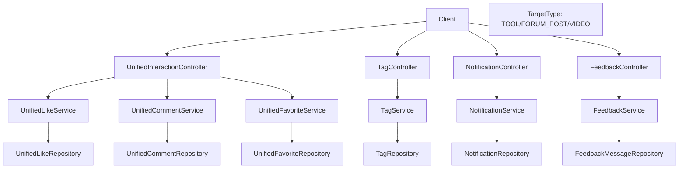

# 统一互动服务模块（Unified Interactions / Tags / Notifications / Feedback）

## 模块简介

统一互动服务模块是 CodingHub 的**横切能力层**，把“点赞 / 评论 / 收藏 / 标签 / 通知 / 留言反馈”抽象为跨内容类型（工具、论坛帖、视频）的统一机制，避免各业务模块重复实现。它通过 `TargetType`（TOOL / FORUM_POST / VIDEO）枚举将互动聚合到 `UnifiedLike` / `UnifiedComment` / `UnifiedFavorite` 三张统一表。

- 入口前缀：`/api/v1/interactions`、`/api/v1/tags`、`/api/v1/notifications`、`/api/v1/feedback`
- 核心分层：4 个 Controller（L4）→ 6 个 Service（L3）→ 多 Repository（L2）→ `UnifiedLike` / `UnifiedComment` / `UnifiedFavorite` / `Tag` / `Notification` / `FeedbackMessage`（L1）
- 被依赖方：工具/论坛/视频模块的计数（likeCount/commentCount）由本模块驱动，并反向 `updateScore()`。

## 架构图

## 核心组件职责

### UnifiedInteractionController（`controller/UnifiedInteractionController.java`）
统一交互入口，三类资源：
- **点赞**：`POST /api/v1/interactions/likes`（toggle）、`GET /api/v1/interactions/likes/status`。登录用户按 `userId` 记录，匿名用户按 `computeIpHash`（SHA-256，兼容 `X-Forwarded-For`）记录。
- **评论**：`POST /api/v1/interactions/comments`（支持 `parentId` 嵌套回复）、`GET /api/v1/interactions/comments`（分页）、`DELETE /api/v1/interactions/comments/{id}`（作者/管理员）。
- **收藏**：`POST /api/v1/interactions/favorites`（toggle，需登录）、`GET /api/v1/interactions/favorites`（按 `targetType` 返回对应资源 DTO）、`GET /api/v1/interactions/favorites/status`。

统一请求体 `InteractionRequest`（`targetType` / `targetId` / `content` / `parentId` / `userName`），统一响应 `InteractionResponse`。

### 服务层
- `UnifiedLikeService`：点赞 toggle + 状态查询；写入 `UnifiedLike` 并回写目标实体的 `likeCount`（触发 `updateScore()`）。
- `UnifiedCommentService`：评论新增（嵌套 `parentId`）、分页列表、删除（权限校验）；回写 `commentCount`。
- `UnifiedFavoriteService`（`service/UnifiedFavoriteService.java`，72 符号）：
  - `toggleFavorite`：存在则删、不存在则建；`validateTargetExists` 按 `TargetType` 校验目标存在且未删除。
  - `getMyFavorites`：按 `targetType` 分派 `buildToolFavorites` / `buildForumPostFavorites` / `buildVideoFavorites`，返回对应资源摘要 DTO（论坛用内部 `ForumPostSummaryDTO`）。
  - `getFavoriteStatus`：返回是否已收藏。

### TagService（`service/tag/TagService.java`）
统一标签服务（标签类型 `TagType`，如 TOOL / FORUM / VIDEO）：
- `createTag` / `getOrCreateTag` / `resolveOrCreateTags`：按 `(name, tagType)` 查找或创建；`resolveOrCreateTags` 在并发创建冲突时捕获 `DataIntegrityViolationException` 回退查询（幂等）。
- `incrementUsage` / `decrementUsage`：维护 `usageCount`，被工具/论坛/视频创建与编辑时调用。
- `getTagsByType` / `getHotTags`：按类型与热度获取。

### NotificationService（`service/notification/NotificationService.java`）
- 用户侧：`getNotifications`（分页）、`getUnreadCount`、`markAsRead` / `markAllAsRead`（权限校验归属）。
- 内部创建：`createCommentNotification` / `createLikeNotification`（评论/点赞他人内容时通知目标 Owner，自己不通知）、`createAdminNotification`（`ADMIN_APPROVED` / `REJECTED`，注册审批结果）。
- `NotificationType`：枚举 `COMMENT_REPLY` / `LIKE` / `ADMIN_APPROVED` / `ADMIN_REJECTED` 等。

### FeedbackService（`service/feedback/FeedbackService.java`）
留言反馈：
- `submit`：登录用户关联 `User` 并取昵称；匿名用户记录 `ipHash`；`content`/`nickname`/`contact` 全部经 `XssSanitizer.sanitize()` 清洗；`category` 非法回退 `SUGGESTION`。
- `list`：按分类/全部分页（`status = NORMAL`）。
- `reply`：管理员回复（同样 XSS 清洗）；`delete`：软删除（`status = DELETED`）。
- `FeedbackCategory`：枚举（如 `SUGGESTION` / `BUG` / `OTHER`）。

### 数据模型
- `TargetType`（`model/TargetType.java`）：TOOL / FORUM_POST / VIDEO，统一互动的目标维度。
- `UnifiedLike` / `UnifiedComment` / `UnifiedFavorite`：三张统一表，均含 `targetType` + `targetId` + `userId`（或匿名 `ipHash`）。
- `Tag`（`model/tag/Tag.java`）+ `TagType`：标签名 + 类型 + `usageCount`；`ToolTag` / `VideoTag` 为关联表。
- `Notification`（`model/notification/Notification.java`）+ `NotificationType`：接收用户、`type`、`targetType`/`targetId`、消息、操作者、已读标记。
- `FeedbackMessage`（`model/feedback/FeedbackMessage.java`）+ `FeedbackCategory`：内容、昵称、联系方式、`ipHash`、分类、管理员回复、状态。

## 关键 API

| 方法 | 路径 | 说明 | 鉴权 |
|------|------|------|------|
| POST | `/api/v1/interactions/likes` | 点赞 toggle | 可选（匿名用 IP） |
| POST | `/api/v1/interactions/comments` | 发表评论 | 可选 |
| GET | `/api/v1/interactions/comments` | 评论列表 | 否 |
| POST | `/api/v1/interactions/favorites` | 收藏 toggle | 是 |
| GET | `/api/v1/interactions/favorites` | 我的收藏 | 是 |
| GET | `/api/v1/tags?type=...` | 标签列表 | 否 |
| GET | `/api/v1/tags/hot?type=...` | 热门标签 | 否 |
| GET | `/api/v1/notifications` | 通知列表 | 是 |
| GET | `/api/v1/notifications/unread-count` | 未读计数 | 是 |
| POST | `/api/v1/feedback` | 提交留言 | 可选 |

## 依赖关系（🔗 CodeGraph 增强）

- **上游调用**：[工具广场模块](tool-plaza.md) / [论坛社区模块](forum.md) / [微课视频模块](video.md) 在创建/编辑时调用 `TagService` 维护标签；其 `likeCount`/`commentCount` 由本模块回写并触发 `updateScore()`。
- **下游依赖**：各 Service → 对应 `Unified*Repository` / `TagRepository` / `NotificationRepository` / `FeedbackMessageRepository`；`UnifiedFavoriteService` 还依赖 `ToolRepository` / `ForumPostRepository` / `VideoRepository` 还原资源 DTO；`FeedbackService` 依赖 `XssSanitizer`。
- **变更影响**：修改 `TargetType` 枚举会波及所有互动入口与计数回写；修改 `XssSanitizer` 影响反馈与评论安全；修改 `NotificationType` 影响通知中心展示。

## 相关模块

- [工具广场模块](tool-plaza.md) / [论坛社区模块](forum.md) / [微课视频模块](video.md) — 互动的载体
- [认证与用户模块](auth-user.md) — 用户主体与审批通知
- [基础设施与异常模块](infra.md) — XSS 清洗与异常
