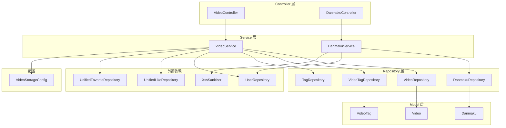
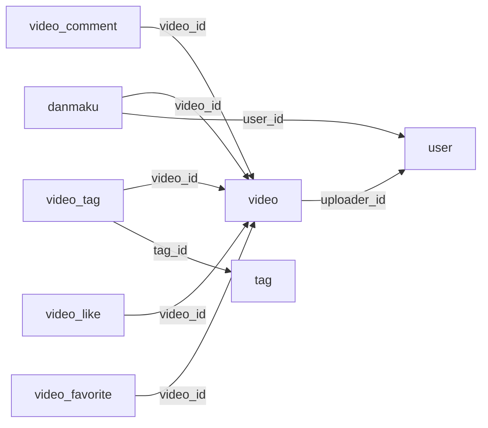
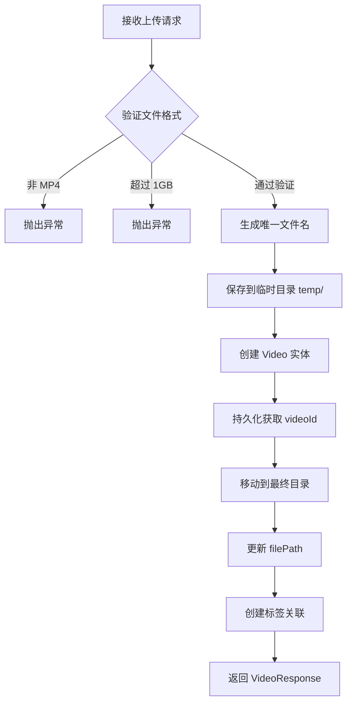

# 微课模块 ([Video](../backend\src\main\java\com\iaihub\toolbox\model\video\Video.java))

## 1. 模块概述

微课模块是 CodingHub 平台的视频内容管理系统，提供视频上传、流式播放、封面管理、弹幕互动和热度排行等完整功能。该模块支持 HTTP Range 请求的分段视频流播放，实现了高效的视频分发机制。

微课模块与 [统一互动系统](unified-interactions.md) 深度集成，通过统一互动系统实现点赞和收藏功能。视频评论同样依赖统一互动系统。用户认证与权限管理依赖 [认证与用户模块](auth-user.md)。

### 技术栈

| 层级 | 技术 |
|------|------|
| 后端框架 | Spring Boot 3.2.5 / Java 17 |
| 数据访问 | Spring Data JPA + MySQL 8.x |
| 文件存储 | 本地文件系统（`VideoStorageConfig`） |
| 视频播放 | HTTP Range + `RandomAccessFile` 流式传输 |
| 认证方式 | JWT + Spring Security |

---

## 2. 架构设计

### 2.1 模块架构图



### 2.2 依赖关系

微课模块遵循项目分层架构规范：

- **Controller 层** -> Service 层 -> Repository 层 -> Model 层
- **禁止循环依赖**：单向依赖，不可反向调用
- `VideoService` 额外依赖 `UserRepository`（上传者信息）、`UnifiedLikeRepository` 和 `UnifiedFavoriteRepository`（互动状态查询）
- `DanmakuService` 依赖 `UserRepository`（弹幕发送者信息）和 `XssSanitizer`（XSS 防护）
- 视频文件存储通过 `VideoStorageConfig` 配置存储路径

---

## 3. 组件职责

### 3.1 Controller 层

#### [VideoController](../backend\src\main\java\com\iaihub\toolbox\controller\video\VideoController.java)

- **路径前缀**: `/api/v1/videos`
- **职责**: 处理视频的上传、列表、详情、更新、删除、流式播放、封面管理和置顶管理

| 方法 | 端点 | 功能 | 认证 |
|------|------|------|------|
| `POST` | `/api/v1/videos` | 上传视频（Multipart，最大 1GB，仅 MP4） | 是 |
| `GET` | `/api/v1/videos` | 获取视频列表（支持排序） | 否 |
| `GET` | `/api/v1/videos/{id}` | 获取视频详情（自动增加浏览量） | 否* |
| `PUT` | `/api/v1/videos/{id}` | 更新视频信息（仅上传者或管理员） | 是 |
| `DELETE` | `/api/v1/videos/{id}` | 软删除视频（仅上传者或管理员） | 是 |
| `GET` | `/api/v1/videos/{id}/stream` | 视频流式播放（支持 HTTP Range） | 否 |
| `GET` | `/api/v1/videos/my` | 获取当前用户上传的视频列表 | 是 |
| `POST` | `/api/v1/videos/{id}/pin` | 置顶视频（仅管理员） | ADMIN |
| `DELETE` | `/api/v1/videos/{id}/pin` | 取消置顶（仅管理员） | ADMIN |
| `POST` | `/api/v1/videos/{id}/cover` | 上传视频封面（JPEG/PNG，最大 5MB） | 是 |
| `GET` | `/api/v1/videos/{id}/cover-image` | 获取视频封面图片 | 否 |
| `GET` | `/api/v1/videos/hot-top5` | 获取热度 Top 5 视频 ID 列表 | 否 |

> *注：视频详情接口对未登录用户也可访问，但不返回点赞/收藏状态。

#### [DanmakuController](../backend\src\main\java\com\iaihub\toolbox\controller\video\DanmakuController.java)

- **路径前缀**: `/api/v1/videos/{videoId}/danmaku`
- **职责**: 处理弹幕的发送和查询

| 方法 | 端点 | 功能 | 认证 |
|------|------|------|------|
| `GET` | `/api/v1/videos/{videoId}/danmaku` | 获取指定视频的所有弹幕 | 否 |
| `POST` | `/api/v1/videos/{videoId}/danmaku` | 发送弹幕（XSS 过滤） | 是 |

### 3.2 Service 层

#### [VideoService](../backend\src\main\java\com\iaihub\toolbox\service\video\VideoService.java)

视频业务逻辑的核心实现，负责：

1. **视频上传**：
   - 验证 MP4 格式和 1GB 大小限制
   - 采用"先临时目录、后最终目录"的两阶段存储策略
   - 存储路径格式：`uploads/videos/{userId}/{videoId}/original.mp4`
   - 上传时支持关联标签

2. **视频列表**：
   - `latest` 模式：按创建时间降序
   - `hot` 模式（默认）：按热度排序（`pinned DESC, score DESC`）
   - 每页最大 100 条限制

3. **视频详情**：
   - 自动增加浏览量并更新热度分数
   - 查询当前用户的点赞和收藏状态

4. **视频更新**：支持修改标题、描述、弹幕开关和标签
   - 标签更新时维护使用计数（递减旧标签、递增新标签）

5. **视频删除**：软删除，将状态设为 `DELETED`

6. **视频流播放**：
   - 支持 HTTP Range 请求（`206 Partial Content`）
   - 使用 `RandomAccessFile` 精确 seek
   - 每次请求最多返回 1MB 数据
   - 支持完整文件回退（无 Range 头时）

7. **封面管理**：
   - 支持 JPEG 和 PNG 格式，最大 5MB
   - 存储在 `uploads/covers/{videoId}.{ext}`
   - 自动更新视频的 `coverUrl` 字段

#### [DanmakuService](../backend\src\main\java\com\iaihub\toolbox\service\video\DanmakuService.java)

弹幕业务逻辑实现，负责：

1. **弹幕查询**：获取指定视频的所有弹幕，包含发送者的用户名和昵称
2. **弹幕发送**：
   - 通过 `XssSanitizer.sanitize()` 过滤 XSS 攻击
   - 支持自定义时间位置、颜色和弹幕类型
   - 默认颜色 `#FFFFFF`，默认类型 `SCROLL`

### 3.3 Repository 层

#### [VideoRepository](../backend\src\main\java\com\iaihub\toolbox\repository\video\VideoRepository.java)

| 方法 | 说明 |
|------|------|
| `findByStatusOrderByCreatedAtDesc` | 按时间降序查询正常状态视频 |
| `findByStatusOrderByHot` | 按热度排序查询（`pinned DESC, score DESC`） |
| `findByIdAndStatus` | 按 ID 和状态查询单个视频 |
| `findByUploaderIdAndStatusOrderByCreatedAtDesc` | 查询指定用户上传的视频 |
| `findByUploaderIdAndStatusOrderByHot` | 按热度查询指定用户的视频 |
| `findTop5ByStatusOrderByScoreDesc` | 查询热度 Top 5 视频 ID |
| `pinById` / `unpinById` | 置顶/取消置顶（`@Modifying` 批量更新） |

#### [DanmakuRepository](../backend\src\main\java\com\iaihub\toolbox\repository\video\DanmakuRepository.java)

| 方法 | 说明 |
|------|------|
| `findByVideoIdWithUser` | 查询指定视频的弹幕（预加载 [User](../backend\src\main\java\com\iaihub\toolbox\model\User.java) 关联） |

---

## 4. 数据模型

### 4.1 实体关系图



### 4.2 [Video](../backend\src\main\java\com\iaihub\toolbox\model\video\Video.java)（视频实体）

| 字段 | 类型 | 约束 | 说明 |
|------|------|------|------|
| `id` | `Long` | 主键，自增 | 视频唯一标识 |
| `title` | `String(200)` | 非空 | 视频标题 |
| `description` | `TEXT` | 可空 | 视频描述 |
| `filePath` | `String(500)` | 非空 | 文件存储相对路径 |
| `fileName` | `String(255)` | 非空 | 原始文件名 |
| `fileSize` | `Long` | 非空 | 文件大小（字节） |
| `duration` | `Integer` | 默认 0 | 视频时长（秒） |
| `coverUrl` | `String(500)` | 可空 | 封面图片 API 路径 |
| `uploaderId` | `Long` | 非空 | 上传者用户 ID |
| `status` | `VideoStatus` | 非空，默认 NORMAL | 状态（NORMAL / DELETED） |
| `viewCount` | `Integer` | 默认 0 | 播放量 |
| `likeCount` | `Integer` | 默认 0 | 点赞数 |
| `commentCount` | `Integer` | 默认 0 | 评论数 |
| `score` | `BigDecimal(10,2)` | 默认 0 | 热度分数 |
| `pinned` | `Boolean` | 非空，默认 false | 是否置顶 |
| `danmakuEnabled` | `Boolean` | 非空，默认 true | 是否开启弹幕 |
| `createdAt` | `LocalDateTime` | 不可更新 | 创建时间 |
| `updatedAt` | `LocalDateTime` | 自动更新 | 最后更新时间 |

**数据库索引**：

| 索引名 | 列 |
|--------|---|
| `idx_video_uploader` | `uploader_id, status` |
| `idx_video_status_created` | `status, created_at DESC` |

**热度分数计算公式**：

```
score = viewCount * 1 + likeCount * 3 + commentCount * 5
```

视频实体提供了自动维护分数变化的便捷方法：

- `incrementViewCount()` - 播放量 +1，同时更新 score
- `incrementLikeCount()` - 点赞数 +1，同时更新 score
- `decrementLikeCount()` - 点赞数 -1（不小于 0），同时更新 score
- `incrementCommentCount()` - 评论数 +1，同时更新 score

### 4.3 [Danmaku](../backend\src\main\java\com\iaihub\toolbox\model\video\Danmaku.java)（弹幕实体）

| 字段 | 类型 | 约束 | 说明 |
|------|------|------|------|
| `id` | `Long` | 主键，自增 | 弹幕唯一标识 |
| `videoId` | `Long` | 非空 | 所属视频 ID |
| `user` | `User` | 非空，`ManyToOne` | 发送用户（延迟加载） |
| `content` | `String(200)` | 非空 | 弹幕文本内容（已 XSS 过滤） |
| `timeSeconds` | `Double` | 非空，默认 0.0 | 弹幕出现的时间位置（秒） |
| `color` | `String(10)` | 默认 `#FFFFFF` | 弹幕颜色（十六进制） |
| `danmakuType` | `String(10)` | 默认 `SCROLL` | 弹幕类型：`SCROLL` / `TOP` / `BOTTOM` |
| `createdAt` | `LocalDateTime` | 不可更新 | 发送时间 |

**数据库索引**：

| 索引名 | 列 |
|--------|---|
| `idx_danmaku_video` | `video_id` |

**弹幕类型说明**：

| 类型 | 说明 |
|------|------|
| `SCROLL` | 滚动弹幕，从右向左移动 |
| `TOP` | 顶部固定弹幕 |
| `BOTTOM` | 底部固定弹幕 |

### 4.4 [VideoTag](../backend\src\main\java\com\iaihub\toolbox\model\tag\VideoTag.java)（视频-标签关联）

| 字段 | 类型 | 约束 | 说明 |
|------|------|------|------|
| `videoId` | `Long` | 联合主键 | 视频 ID |
| `tagId` | `Long` | 联合主键 | 标签 ID（引用全局 [Tag](../backend\src\main\java\com\iaihub\toolbox\model\tag\Tag.java)） |

采用复合主键模式，实现视频与全局统一标签的多对多关联。

### 4.5 枚举类型

#### [VideoStatus](../backend\src\main\java\com\iaihub\toolbox\model\video\VideoStatus.java)

| 值 | 说明 |
|---|------|
| `NORMAL` | 正常状态 |
| `DELETED` | 已删除（软删除） |

---

## 5. API 详细设计

### 5.1 上传视频

```
POST /api/v1/videos
Content-Type: multipart/form-data
```

**请求参数**：

| 参数 | 类型 | 必填 | 说明 |
|------|------|------|------|
| `file` | `MultipartFile` | 是 | 视频文件（仅 MP4，最大 1GB） |
| `title` | `String` | 是 | 视频标题 |
| `description` | `String` | 否 | 视频描述 |
| `tagIds` | `List<Long>` | 否 | 关联标签 ID 列表 |

**上传流程**：



**文件存储路径**：`{videoStoragePath}/{userId}/{videoId}/original.mp4`

### 5.2 获取视频列表

```
GET /api/v1/videos
```

**请求参数**：

| 参数 | 类型 | 必填 | 默认值 | 说明 |
|------|------|------|--------|------|
| `sortBy` | `String` | 否 | `hot` | 排序方式：`hot` 或 `latest` |
| `page` | `int` | 否 | `0` | 页码（从 0 开始） |
| `size` | `int` | 否 | `20` | 每页条数（上限 100） |

**响应**: `PageResponse<VideoListItem>` 分页结果

### 5.3 视频流式播放

```
GET /api/v1/videos/{id}/stream
```

**HTTP Range 支持**：

该接口实现了完整的 HTTP Range 请求支持，用于视频播放器的拖动进度条和断点续传功能：

| 场景 | 请求头 | 响应状态 | 说明 |
|------|--------|---------|------|
| 完整播放 | 无 `Range` | `200 OK` | 返回完整文件 |
| 分段请求 | `Range: bytes=start-end` | `206 Partial Content` | 返回指定范围数据 |
| 开放范围 | `Range: bytes=start-` | `206 Partial Content` | 返回 start 至末尾（最多 1MB） |
| 无效范围 | `Range: bytes=溢出值-` | `416 Range Not Satisfiable` | 请求范围超出文件长度 |

**响应头**：

```
Content-Type: video/mp4
Accept-Ranges: bytes
Cache-Control: no-cache, no-store, must-revalidate
Content-Range: bytes {start}-{end}/{total}   # 仅 206 响应
```

**实现细节**：使用 `RandomAccessFile` 进行精确文件定位（seek），避免将整个文件加载到内存，每次读取 8KB 缓冲块。

### 5.4 获取视频详情

```
GET /api/v1/videos/{id}
```

**业务流程**：

1. 查询视频（`status = NORMAL`），不存在则抛出 `ResourceNotFoundException`
2. 播放量 +1，同时更新热度分数
3. 若当前用户已登录，查询其点赞和收藏状态
4. 返回 `VideoResponse`（包含完整的视频信息和互动状态）

### 5.5 更新视频

```
PUT /api/v1/videos/{id}
```

**请求体** (`VideoUpdateRequest`)：

```json
{
  "title": "新标题",
  "description": "新描述",
  "danmakuEnabled": true,
  "tagIds": [1, 2, 3]
}
```

**权限控制**：`isOwner || isAdmin`

**标签更新**：采用"先删后增"策略，确保标签使用计数的一致性。

### 5.6 删除视频

```
DELETE /api/v1/videos/{id}
```

**权限控制**：`isOwner || isAdmin`

**软删除机制**：将 `status` 设为 `DELETED`，不从数据库中物理删除记录。视频文件保留在磁盘上。

### 5.7 封面管理

```
POST /api/v1/videos/{id}/cover       # 上传封面
GET  /api/v1/videos/{id}/cover-image  # 获取封面
```

**上传封面**：
- 支持格式：JPEG、PNG
- 最大大小：5MB
- 存储路径：`{uploadBaseDir}/uploads/covers/{videoId}.{ext}`
- 自动更新视频的 `coverUrl` 为 `/api/v1/videos/{videoId}/cover-image`

**获取封面**：
- 按优先级尝试 `.jpg` 和 `.png` 扩展名
- 设置 `Cache-Control: public, max-age=86400`（缓存 24 小时）
- 根据文件扩展名动态设置 `Content-Type`

---

## 6. DTO 结构

### [VideoResponse](../backend\src\main\java\com\iaihub\toolbox\dto\video\VideoResponse.java)

视频详情的数据传输对象：

| 字段 | 类型 | 说明 |
|------|------|------|
| `id` | `Long` | 视频 ID |
| `title` | `String` | 标题 |
| `description` | `String` | 描述 |
| `coverUrl` | `String` | 封面 API 路径 |
| `duration` | `Integer` | 时长（秒） |
| `fileSize` | `Long` | 文件大小（字节） |
| `viewCount` | `Integer` | 播放量 |
| `likeCount` | `Integer` | 点赞数 |
| `commentCount` | `Integer` | 评论数 |
| `uploaderId` | `Long` | 上传者 ID |
| `uploaderName` | `String` | 上传者用户名 |
| `uploaderNickname` | `String` | 上传者昵称 |
| `uploaderAvatarUrl` | `String` | 上传者头像 URL |
| `userLiked` | `boolean` | 当前用户是否已点赞 |
| `userFavorited` | `boolean` | 当前用户是否已收藏 |
| `danmakuEnabled` | `Boolean` | 是否开启弹幕 |
| `createdAt` | `LocalDateTime` | 创建时间 |
| `updatedAt` | `LocalDateTime` | 更新时间 |
| `tags` | `List<TagDTO>` | 关联标签列表 |

### [VideoListItem](../backend\src\main\java\com\iaihub\toolbox\dto\video\VideoListItem.java)

视频列表项的轻量级 DTO：

| 字段 | 类型 | 说明 |
|------|------|------|
| `id` | `Long` | 视频 ID |
| `title` | `String` | 标题 |
| `coverUrl` | `String` | 封面路径 |
| `duration` | `Integer` | 时长（秒） |
| `viewCount` | `Integer` | 播放量 |
| `likeCount` | `Integer` | 点赞数 |
| `commentCount` | `Integer` | 评论数 |
| `uploaderId` | `Long` | 上传者 ID |
| `uploaderName` | `String` | 上传者用户名 |
| `uploaderNickname` | `String` | 上传者昵称 |
| `uploaderAvatarUrl` | `String` | 上传者头像 URL |
| `createdAt` | `LocalDateTime` | 创建时间 |
| `score` | `BigDecimal` | 热度分数 |
| `pinned` | `Boolean` | 是否置顶 |
| `tags` | `List<TagDTO>` | 关联标签列表 |

### [DanmakuDTO](../backend\src\main\java\com\iaihub\toolbox\dto\video\DanmakuDTO.java)

| 字段 | 类型 | 说明 |
|------|------|------|
| `id` | `Long` | 弹幕 ID |
| `userId` | `Long` | 发送者用户 ID |
| `username` | `String` | 发送者用户名 |
| `nickname` | `String` | 发送者昵称 |
| `content` | `String` | 弹幕文本 |
| `timeSeconds` | `Double` | 弹幕时间位置（秒） |
| `color` | `String` | 弹幕颜色 |
| `danmakuType` | `String` | 弹幕类型 |

### [SendDanmakuRequest](../backend\src\main\java\com\iaihub\toolbox\dto\video\SendDanmakuRequest.java)

| 字段 | 类型 | 必填 | 说明 |
|------|------|------|------|
| `content` | `String` | 是 | 弹幕文本 |
| `timeSeconds` | `Double` | 否 | 时间位置（默认 0.0） |
| `color` | `String` | 否 | 颜色（默认 `#FFFFFF`） |
| `danmakuType` | `String` | 否 | 类型（默认 `SCROLL`） |

---

## 7. 权限与安全

### 7.1 认证要求

| 操作类型 | 认证要求 |
|---------|---------|
| 浏览视频列表、详情、流播放、封面 | 无需认证 |
| 上传视频、更新、删除 | 需要登录认证 + 权限校验 |
| 发送弹幕 | 需要登录认证 |
| 置顶/取消置顶 | 需要 `ADMIN` 或 `SUPER_ADMIN` 角色 |

### 7.2 权限校验模型

更新、删除和封面上传操作遵循统一的 `isOwner || isAdmin` 原则：

```java
boolean isOwner = video.getUploaderId().equals(user.getId());
boolean isAdmin = user.getRole() == Role.ADMIN || user.getRole() == Role.SUPER_ADMIN;
if (!isOwner && !isAdmin) {
    throw new ForbiddenException("无权操作此内容");
}
```

### 7.3 安全防护

| 防护措施 | 实现方式 |
|---------|---------|
| XSS 防护 | 弹幕内容通过 `XssSanitizer.sanitize()` 过滤 |
| 文件格式校验 | 上传视频仅接受 `.mp4` 格式 |
| 文件大小限制 | 视频最大 1GB，封面最大 5MB |
| Content-Type 校验 | 封面上传验证 `image/jpeg` 或 `image/png` |

### 7.4 异常处理

| 异常类型 | 触发场景 |
|---------|---------|
| `ResourceNotFoundException` | 视频不存在、已删除或文件丢失 |
| `ForbiddenException` | 无权修改/删除他人视频 |
| `IllegalArgumentException` | 文件格式不符或超出大小限制 |
| `UserNotFoundException` | 弹幕发送者用户不存在 |

---

## 8. 与其他模块的集成

### 8.1 统一互动系统

微课模块的点赞、收藏和评论功能通过 [统一互动系统](unified-interactions.md) 实现：

- **点赞**: 通过 `UnifiedLikeRepository` 查询用户的点赞状态，`targetType = "VIDEO"`
- **收藏**: 通过 `UnifiedFavoriteRepository` 查询用户的收藏状态
- **评论**: 视频评论由统一评论系统管理

`Video` 实体维护了 `likeCount` 和 `commentCount` 冗余计数字段，用于热度分数计算和列表展示。

### 8.2 统一标签系统

视频使用全局统一标签系统，通过 `VideoTag` 关联表连接到 `Tag` 实体。上传和更新视频时可关联标签，系统自动维护标签的使用计数。

### 8.3 用户模块

通过 `UserRepository` 获取视频上传者的用户名、昵称和头像 URL。弹幕通过 `@ManyToOne` JPA 关联直接引用 `User` 实体。用户认证依赖 [认证与用户模块](auth-user.md) 提供的 JWT 令牌。

### 8.4 存储配置

`VideoStorageConfig` 提供视频文件的存储根路径配置，所有视频文件存放在配置指定的目录下。详细配置说明参见 [后端基础设施](backend-infra.md)。

### 8.5 论坛模块

微课模块与 [论坛模块](forum.md) 在以下方面共享设计模式：

- 相同的热度分数计算公式（`viewCount * 1 + likeCount * 3 + commentCount * 5`）
- 相同的软删除机制（`status = DELETED`）
- 相同的置顶功能（`pinned` 字段 + 管理员权限）
- 相同的热度 Top 5 API 设计
- 统一的互动系统和标签系统集成

---

## 9. 前端组件映射

| 前端目录/组件 | 对应后端接口 | 说明 |
|-------------|------------|------|
| `pages/video/` | `VideoController` | 视频页面集合 |
| `components/video/` | - | 视频相关组件（4 个） |
| 弹幕播放器 | `DanmakuController` | 弹幕渲染与发送 |
| `TagBadge` / `TagSelector` | 统一标签 API | 标签展示与选择 |

---

## 10. 文件存储结构

```
{videoStoragePath}/
├── temp/                              # 临时上传目录
│   └── {timestamp}_{originalName}     # 上传中的临时文件
├── {userId}/
│   └── {videoId}/
│       └── original.mp4               # 最终视频文件
└── covers/                            # 封面图片目录（位于 uploadBaseDir/uploads/covers/）
    ├── {videoId}.jpg                  # JPEG 封面
    └── {videoId}.png                  # PNG 封面
```

---

## 11. 数据库迁移

微课模块相关的数据库表通过 Flyway 迁移脚本管理，迁移文件位于 `backend/src/main/resources/db/migration/`，涉及版本 V1 至 V9。

相关表：

- `video` - 视频主表
- `danmaku` - 弹幕表
- `video_tag` - 视频-标签关联表
- `video_comment` - 视频评论表（由统一互动系统管理）
- `video_like` - 视频点赞表（由统一互动系统管理）
- `video_favorite` - 视频收藏表（由统一互动系统管理）

---

## 12. 设计决策与注意事项

### 12.1 两阶段文件上传

视频上传采用"先临时、后最终"的两阶段存储策略：

1. 文件先保存到 `temp/` 临时目录
2. 创建数据库记录获取 `videoId`
3. 移动到 `uploads/videos/{userId}/{videoId}/original.mp4` 最终路径

这种设计解决了"需要 `videoId` 才能确定最终路径"的鸡生蛋问题。

### 12.2 HTTP Range 流式播放

视频播放接口通过 `RandomAccessFile` 实现 HTTP Range 请求支持，而非将整个视频加载到内存。每次 Range 请求最多返回 1MB 数据，避免单次请求传输过大数据量。这种设计支持浏览器 `<video>` 标签的原生播放和拖动进度条功能。

### 12.3 弹幕 XSS 防护

弹幕内容在存储前经过 `XssSanitizer.sanitize()` 处理，防止恶意脚本注入。结合弹幕的 200 字符长度限制，有效降低了 XSS 攻击风险。

### 12.4 封面缓存策略

封面图片响应头设置 `Cache-Control: public, max-age=86400`，允许浏览器和 CDN 缓存 24 小时。由于封面更新频率较低，这种策略可显著减少服务器负载。

### 12.5 冗余计数与分数

`Video` 实体中维护了 `viewCount`、`likeCount`、`commentCount` 和 `score` 冗余字段。这些字段在每次查看详情时由 `incrementViewCount()` 方法触发更新，避免在列表查询时进行复杂的 JOIN 聚合计算。

---

## 13. 参考链接

- [后端基础设施](backend-infra.md) - 基础设施配置、存储、异常处理、安全框架
- [认证与用户](auth-user.md) - JWT 认证、用户管理、角色权限
- [统一互动系统](unified-interactions.md) - 点赞、评论、收藏的统一实现
- [论坛模块](forum.md) - 具有相似设计模式的社区论坛模块
- [架构详情](../docs/ARCHITECTURE.md) - 项目整体架构设计
- [Agent 导航地图](../agents.md) - 项目结构总览


<!-- crosslinks (auto-generated) -->
## Related Modules
- Depends on: [auth-user](auth-user.md), [auxiliary-services](auxiliary-services.md), [backend-infra](backend-infra.md), [unified-interactions](unified-interactions.md)
- Used by: [auxiliary-services](auxiliary-services.md), [unified-interactions](unified-interactions.md)
