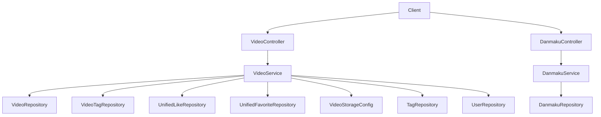

# 微课视频模块（Video / Micro-Course）

## 模块简介

微课视频模块提供 **视频上传、流式播放、封面管理、列表/详情、编辑、删除、置顶**，以及**弹幕（Danmaku）**互动能力。视频文件经 `VideoStorageConfig` 落盘，播放采用 `RandomAccessFile` 实现 HTTP Range 精确 seek。

- 入口前缀：`/api/v1/videos`
- 核心分层：`VideoController` / `DanmakuController`（L4）→ `VideoService` / `DanmakuService`（L3）→ `VideoRepository` / `DanmakuRepository`（L2）→ `Video` / `Danmaku`（L1）
- 互动统一化：点赞/收藏复用 [统一互动服务模块](unified-services.md) 的 `UnifiedLikeRepository` / `UnifiedFavoriteRepository`（`targetType = "VIDEO"`）。

## 架构图

## 核心组件职责

### VideoController（`controller/video/VideoController.java`）
- `POST /api/v1/videos` — 上传（multipart：`file` 必须为 `.mp4`，≤1GB），写入 `{videoStoragePath}/uploads/videos/{userId}/{videoId}/original.mp4`。
- `GET /api/v1/videos` — 列表（`hot` 默认 / `latest`），分页 `size` 上限 100。
- `GET /api/v1/videos/{id}` — 详情（匿名可访问，`userId` 用于返回 `userLiked`/`userFavorited`）。
- `PUT /api/v1/videos/{id}` — 更新（`isOwner || isAdmin`）；支持 `danmakuEnabled` 开关与标签替换。
- `DELETE /api/v1/videos/{id}` — 软删除（`status = DELETED`）。
- `GET /api/v1/videos/{id}/stream` — **流式播放**：解析 `Range` 头，用 `RandomAccessFile` 按字节区间返回 `SC_PARTIAL_CONTENT`（206），支持断点续传；无 Range 则返回全文件。
- `GET /api/v1/videos/my` — 我的视频。
- `POST/DELETE /api/v1/videos/{id}/pin` — 置顶（管理员）。
- `POST /api/v1/videos/{id}/cover` + `GET /api/v1/videos/{id}/cover-image` — 封面上传（JPEG/PNG ≤5MB）与读取（`Cache-Control: max-age=86400`）。
- `GET /api/v1/videos/hot-top5` — 热门前 5。

### VideoService（`service/video/VideoService.java`）
- **上传**：校验 MP4 + 1GB；先落临时目录再移动到最终路径（规避 `file_path NOT NULL`）；按 `tagIds` 建 `VideoTag` 并 `Tag.incrementUsage`。
- **详情**：`incrementViewCount()` 刷新 score；查 `UnifiedLikeRepository.existsByTargetTypeAndTargetIdAndUserId("VIDEO", ...)` 与 `UnifiedFavoriteRepository` 得到用户互动态。
- **更新/删除**：权限 `isOwner || isAdmin`；标签替换走 `decrementUsage`/`incrementUsage`。
- **封面**：保存到 `{uploadBaseDir}/uploads/covers/{videoId}.jpg|.png`，`coverUrl = /api/v1/videos/{id}/cover-image`。

### 弹幕与模型
- `DanmakuController` / `DanmakuService` / `Danmaku`：弹幕的发送与拉取（`SendDanmakuRequest` / `DanmakuDTO`），按视频维度管理，受 `Video.danmakuEnabled` 控制。
- `Video`（`model/video/Video.java`）：`title`、`description`、`filePath`、`fileName`、`fileSize`、`duration`、`coverUrl`、`uploaderId`、`status`（`NORMAL`/`DELETED`，软删除）、计数三件套、`score`（`view*1+like*3+comment*5`）、`pinned`、`danmakuEnabled`（默认 true）。
- `VideoStatus`：枚举 `NORMAL` / `DELETED`。
- `VideoTag`（`VideoTag` + `VideoTagId`）：视频—统一标签关联。

## 关键 API

| 方法 | 路径 | 说明 | 鉴权 |
|------|------|------|------|
| POST | `/api/v1/videos` | 上传视频（MP4≤1GB） | 是 |
| GET | `/api/v1/videos` | 视频列表 | 否 |
| GET | `/api/v1/videos/{id}` | 视频详情 | 否 |
| GET | `/api/v1/videos/{id}/stream` | 流式播放（支持 Range） | 否 |
| PUT | `/api/v1/videos/{id}` | 更新 | 所有者/管理员 |
| DELETE | `/api/v1/videos/{id}` | 删除 | 所有者/管理员 |
| POST | `/api/v1/videos/{id}/cover` | 上传封面 | 所有者/管理员 |
| POST | `/api/v1/videos/{id}/pin` | 置顶 | 管理员 |
| POST | `/api/v1/videos/{id}/danmaku` | 发送弹幕 | 是 |

## 依赖关系（🔗 CodeGraph 增强）

- **上游调用**：[统一互动服务模块](unified-services.md) 通过 `UnifiedLike`/`UnifiedFavorite`（`targetType=VIDEO`）驱动 `likeCount`/`commentCount`；[概览与管理模块](overview-admin.md) 复用 `hot-top5`；[MCP 服务模块](mcp-service.md) 不直连视频但可被检索。
- **下游依赖**：`VideoService` → `VideoRepository` / `VideoTagRepository` / `UnifiedLikeRepository` / `UnifiedFavoriteRepository` / `TagRepository` / `UserRepository` / `VideoStorageConfig`。
- **变更影响**：修改存储路径策略（`VideoStorageConfig` / `filePath` 约定）需同步 `streamVideo` 与 `getVideoFilePath`；修改 `score` 公式影响视频热门。

## 相关模块

- [统一互动服务模块](unified-services.md) — 点赞/收藏/评论
- [工具广场模块](tool-plaza.md) — 同构内容管理
- [概览与管理模块](overview-admin.md) — 热门排行
