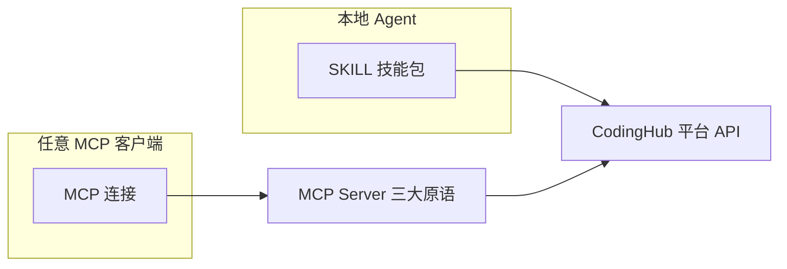

# MCP 与 SKILL 能力对等

> **一句话**：仅暴露 Tools 的 MCP Server 只发挥了 1/3 潜力；补齐 Prompts 与 Resources 三大原语后，MCP 可与 SKILL（技能包）实现完全能力对等，且天然支持远程/多客户端。

## 背景

CodingHub 同时提供 SKILL（codinghub skill：SOP 文档 + 脚本）和 MCP Server 两条接入通道。早期 MCP 只有 18 个 Tools，而 SKILL 拥有工作流指引和参考文件，能力不对等导致 MCP 用户体验明显更差。

## 对等映射

| SKILL 能力 | MCP 原语 | CodingHub 实现 |
|-----------|----------|----------------|
| 可执行操作（脚本） | Tools（model-controlled） | 18 个工具（McpSdkServerConfig 装配） |
| 场景化工作流 SOP | Prompts（user-controlled） | [McpPromptProvider](../entities/McpPromptProvider.md) 6 个模板 |
| 参考文件/上下文数据 | Resources（application-controlled） | [McpResourceHandler](../entities/McpResourceHandler.md) 3 资源 + 模板 |
| 文件更新感知 | 订阅通知 | [McpNotificationService](../entities/McpNotificationService.md) resources/updated |
| 使用手册（SKILL.md 描述） | Server `instructions` 字段 | 初始化时下发给 LLM |

## 双通道架构

两条通道等价：本地重度用户走 SKILL；远程/轻量/多客户端场景走 MCP，无需安装任何本地文件。

## 实践清单

- 建 MCP Server 时逐项自查：Tools 有了，Prompts 有吗？Resources 有吗？`instructions` 写了吗？
- Prompts 直接复用 SKILL 的 SOP 内容，一份维护两端受益
- Resources 提供 SKILL 中「参考文件」的等价物（分类、标签、统计等只读数据）

## 相关

- 源文档：[mcp-server-best-practices](../sources/mcp-server-best-practices.md)
- 所属模块：[MCP服务](../modules/MCP服务.md)
