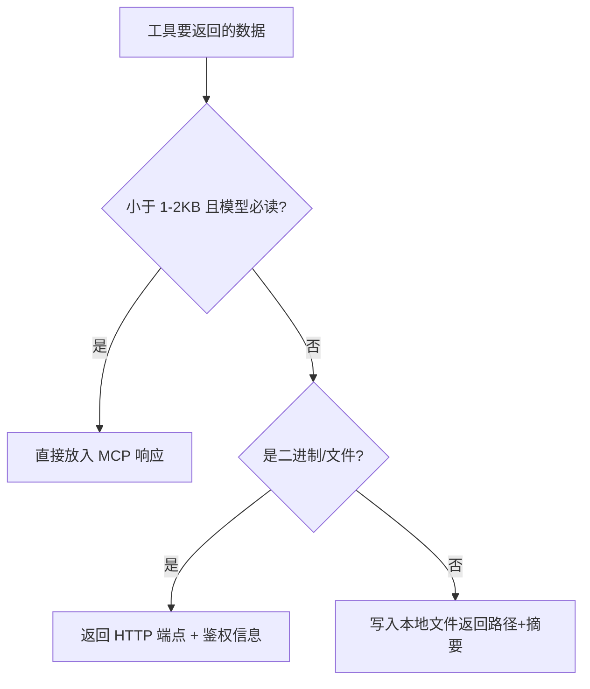

# MCP 控制通道与数据通道分离

> **一句话**：MCP 是控制通道（control plane），不是数据通道（data plane）。大数据和二进制不要塞进 MCP 消息，让它们走文件系统或 HTTP。

## 问题背景（两个真实踩坑）

### 坑 2：MCP 通道传大数据撑爆上下文（CodeWiki-CN）

早期 `read_code_components` 直接把几十 KB 源码放进 MCP 响应，`analyze_repo` 返回完整模块树 JSON——这些内容全部进入 LLM 上下文，单次调用可吃掉 50K+ tokens，Agent 很快 OOM（上下文耗尽）。

**解法 — file-side-channel 模式**：

- 大结果写入本地文件（如 `.codewiki_temp/components_xxx.md`），MCP 响应只返回**文件路径 + 摘要统计**
- Agent 按需用 `read_file` 分页读取，未用到的部分零成本
- 会话状态（`module_tree.json` 等）持久化在磁盘，跨调用共享，MCP 消息里只传引用

### 坑 3：Streamable HTTP 无法传二进制（CodingHub）

MCP 消息体是 JSON-RPC，传 ZIP 等二进制只能 base64（体积 +33%，且照样塞进上下文）。CodingHub 的解法：**MCP 返回端点信息，HTTP 执行传输**——`install_tool` 工具只返回下载 URL + 鉴权头，Agent 用 `curl` 直接下载文件，字节流完全不经过 MCP/LLM。

## 决策准则

## 在本仓库的落地

- [MCP服务](../modules/MCP服务.md)：`install_tool` / `publish_tool` 采用端点交接模式处理 ZIP
- [McpNotificationService](../entities/McpNotificationService.md)：通知只发信号不带数据本体，同一哲学

## 相关

- 源文档：[mcp-server-best-practices](../sources/mcp-server-best-practices.md)
- 传输层背景：[[Streamable-HTTP传输模式]]
