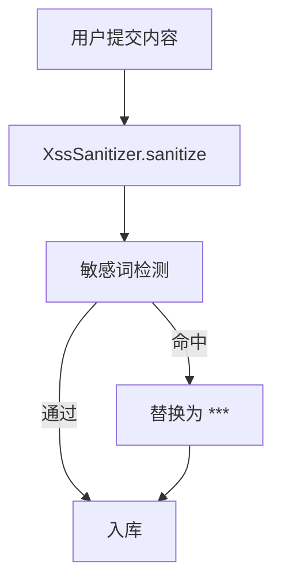

# 内容审核机制

## 定义

平台对所有用户生成内容（UGC）实施 XSS 防护 + 敏感词过滤的双重审核机制，在内容入库前进行清洗。

## 审核流程

## XSS 防护

- **工具类**: `XssSanitizer.sanitize(String input)`
- **策略**: 转义 HTML 特殊字符（<, >, &, ", '）
- **应用范围**: 所有用户输入的 String 字段（标题、内容、评论、留言、聊天消息）
- **调用时机**: Service 层入库前统一调用

## 敏感词过滤

- **词库**: 配置文件维护，支持热加载
- **算法**: AC 自动机多模式匹配
- **处理**: 命中词替换为 `***`
- **扩展**: 预留正则表达式规则接口

## 应用实体

- [ForumPost](../entities/ForumPost.md) 标题/内容
- [Tool](../entities/Tool.md) 名称/描述
- [FeedbackMessage](../entities/FeedbackMessage.md) 留言内容
- [ChatMessage](../entities/ChatMessage.md) 聊天消息
- 评论内容

## 关联页面

[ForumPost](../entities/ForumPost.md) · [Tool](../entities/Tool.md) · [ChatMessage](../entities/ChatMessage.md) · [FeedbackMessage](../entities/FeedbackMessage.md)

## 设计决策来源

- content-moderation (2026-06-09)
