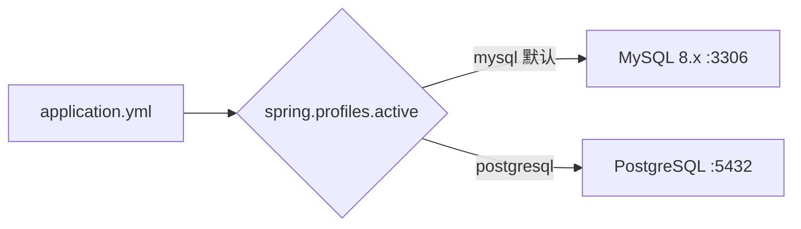

# 双数据库配置驱动

## 定义

通过 Spring Profile 实现 MySQL / PostgreSQL 双数据库共存，业务代码零改动，仅通过配置切换数据源。

## 切换机制

## 配置要点

| 项目 | 说明 |
|------|------|
| 默认 Profile | `mysql`（`spring.profiles.default: mysql`） |
| 方言 | 不硬编码，Hibernate 6 按 JDBC 连接自动探测 |
| 驱动 | 两个 JDBC 驱动共存于 build.gradle |
| Schema | Hibernate `ddl-auto: update` 自动生成 |
| 种子数据 | MySQL: `make db` / PG: `make db-pg` + `make db-pg-seed` |

## 已知坑点（实测总结）

1. **User 表名**: 保留 `@Table(name = "`user`")` 反引号；PG 下 Hibernate 归一化为 `"user"`
2. **globally_quoted_identifiers**: 仅放在 postgresql profile 段，不放 common/test
3. **columnDefinition**: 必须用小写 `"text"`，PG 全局引号会把 `TEXT` 引为无效的 `"TEXT"`
4. **H2 测试**: 不能加 globally_quoted_identifiers，否则 MODE=MySQL 把双引号当字符串
5. **种子脚本**: 不能引用实体不存在的列（如 `category.updated_at`、`forum_category.icon`）

## 关联页面

[User](../entities/User.md) · [Tool](../entities/Tool.md) · [ForumPost](../entities/ForumPost.md)

## 设计决策来源

- dual-database-config-driven (2026-07-26)
