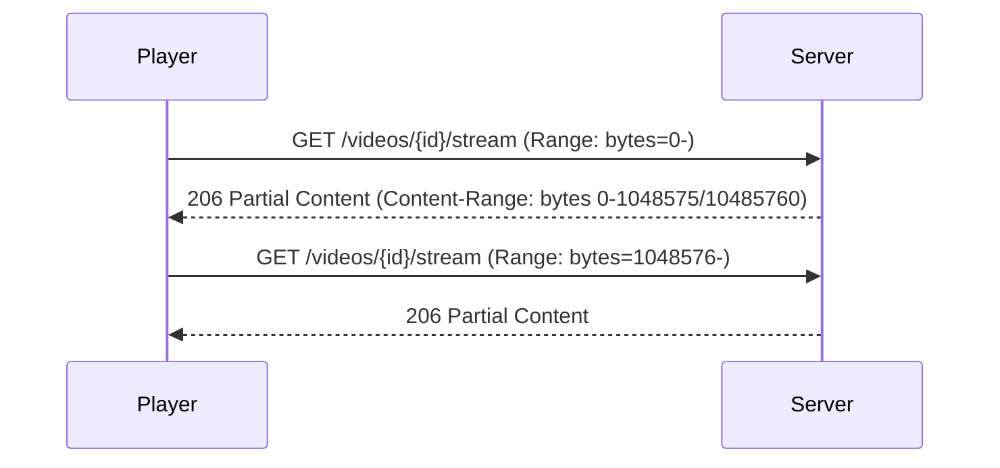

# HTTP Range 流式播放

## 定义

微课视频采用 HTTP Range 请求实现流式播放，支持断点续传和拖动进度条，无需一次性加载整个视频文件。

## 工作原理



## 实现要点

- **后端**: 解析 `Range` 头，返回 206 + `Content-Range` + `Accept-Ranges: bytes`
- **分块大小**: 默认 1MB 每块
- **MIME 类型**: 根据文件扩展名设置 Content-Type (video/mp4 等)
- **前端播放器**: HTML5 `<video>` 原生支持 Range，无需额外库
- **拖动进度**: 浏览器自动发送对应字节范围的 Range 请求

## 关键响应头

```
HTTP/1.1 206 Partial Content
Content-Range: bytes 0-1048575/10485760
Accept-Ranges: bytes
Content-Length: 1048576
Content-Type: video/mp4
```

## 关联页面

[Video](../entities/Video.md)

## 设计决策来源

- video-course-module (2026-06-11)
