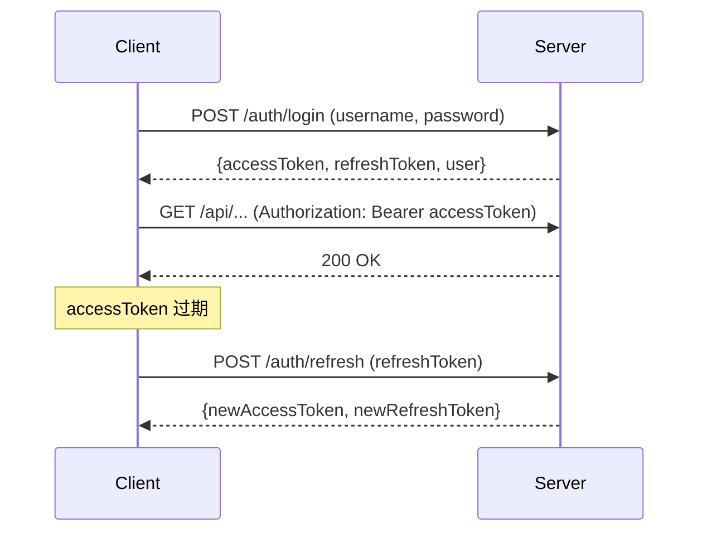

# JWT 双令牌认证

## 定义

平台采用 Access Token + Refresh Token 双令牌机制实现无状态认证。Access Token 短命周期保证安全性，Refresh Token 长命周期保证用户体验。

## 设计参数

| 参数 | 值 | 说明 |
|------|------|------|
| Access Token 过期 | 15 分钟 | 用于 API 认证 |
| Refresh Token 过期 | 7 天 | 用于无感续期 |
| 算法 | HS256 | HMAC-SHA256 签名 |
| 存储 | 内存 | 无 Redis，单机部署 |

## 工作流程

## 实现要点

- **JwtUtil**: 生成/验证/解析 token，提取 userId 和 role
- **JwtAuthenticationFilter**: OncePerRequestFilter，拦截每个请求验证 token
- **SecurityConfig**: 白名单路径（/auth/**, /mcp/health）无需认证
- **前端拦截器**: axios 响应 401 时自动调用 refresh，失败则跳转登录

## 安全约束

- 密码 BCrypt 加密存储
- Token 不包含敏感信息（仅 userId + role）
- Refresh Token 单次使用后失效（旋转）
- XSS 防护避免 token 被窃取

## 关联页面

[User](../entities/User.md) · [[rbac-permission]] · [McpServer](../entities/McpServer.md)

## 设计决策来源

- auth-field-alignment (2026-06-03)
- user-role-approval (2026-06-19)
