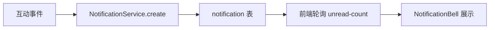

# 消息通知系统

## 定义

平台级消息通知系统，在用户互动事件发生时自动创建通知记录，前端通过轮询展示未读消息数。

## 触发事件

| 事件 | 通知类型 | 接收者 |
|------|---------|--------|
| 帖子被点赞 | LIKE | 帖子作者 |
| 帖子被评论 | COMMENT | 帖子作者 |
| 帖子被收藏 | FAVORITE | 帖子作者 |
| 工具被点赞 | LIKE | 工具作者 |
| 视频被评论 | COMMENT | 视频作者 |
| 系统公告 | SYSTEM | 全体/指定用户 |

## 架构

## 设计决策

### 为什么用轮询而非 WebSocket？

- 通知实时性要求低（分钟级可接受）
- 轮询实现简单，无需维护长连接
- 聊天室已用 WebSocket，通知无需重复建设
- 未来可升级为 SSE 推送

### 去重规则

- 同一用户对同一目标的重复互动不产生多条通知
- 取消互动后通知保留（历史记录）

## 前端实现

- **NotificationBell.vue**: 导航栏铃铛图标 + 未读数徽章
- **轮询间隔**: 30 秒
- **下拉面板**: 最近 10 条通知 + 全部已读按钮

## 关联页面

[Notification](../entities/Notification.md) · [unified-interaction](unified-interaction.md) · [User](../entities/User.md) · [ForumPost](../entities/ForumPost.md) · [Tool](../entities/Tool.md) · [Video](../entities/Video.md)

## 设计决策来源

- integrate-message-center-notifications (2026-07-21)
