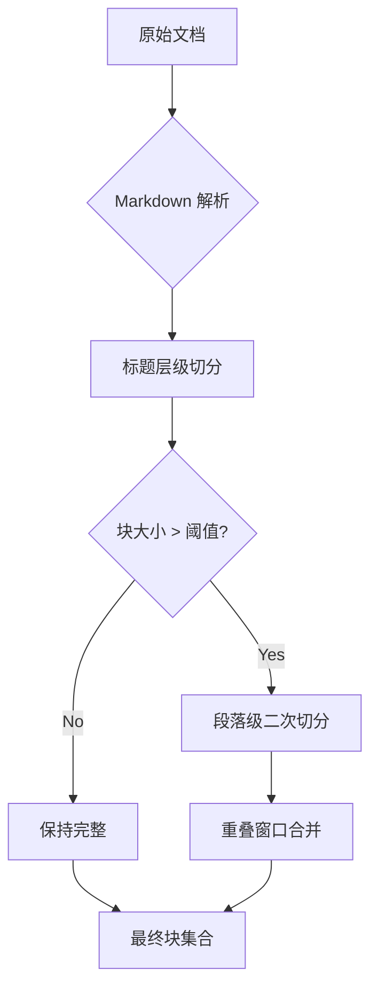

# RAG 自适应分块

## 定义

根据文档结构（标题、段落、代码块、列表）智能切分文档为语义完整的块，而非固定长度切分，提升检索精度。

## 分块策略

## 参数配置

| 参数 | 默认值 | 说明 |
|------|--------|------|
| max_chunk_size | 1000 tokens | 单块上限 |
| min_chunk_size | 100 tokens | 单块下限（低于则合并） |
| overlap | 200 tokens | 相邻块重叠 |
| heading_split | true | 按标题层级切分 |
| code_block_keep | true | 代码块不拆分 |

## 混合检索

分块后的检索采用混合策略：

1. **向量检索**: Qwen3-Embedding 编码 → zvec 相似度搜索 (Top-K=20)
2. **BM25 关键词**: 经典 TF-IDF 检索 (Top-K=20)
3. **RRF 融合**: Reciprocal Rank Fusion 合并排序
4. **重排序**: 可选 Cross-Encoder 精排

## 关联页面

[RagService](../entities/RagService.md) · [KnowledgeBase](../entities/KnowledgeBase.md)

## 设计决策来源

- rag-adaptive-chunking (2026-07-26)
