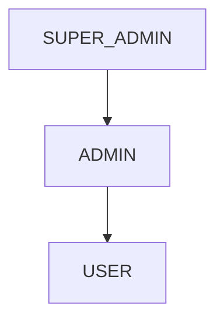
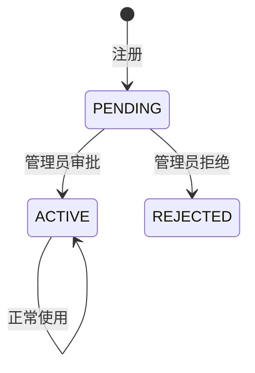

# RBAC 三级权限模型

## 定义

平台采用基于角色的访问控制（RBAC），定义 USER / ADMIN / SUPER_ADMIN 三级角色，配合内容级权限检查实现细粒度权限控制。

## 角色层级



| 角色 | 权限范围 |
|------|----------|
| USER | 创建/编辑/删除自己的内容，互动 |
| ADMIN | USER + 审批用户、管理所有内容、回复留言 |
| SUPER_ADMIN | ADMIN + 角色分配、系统配置 |

## 内容级权限

所有内容操作（编辑/删除）遵循统一规则：

```
canModify = isOwner(currentUser, content) || isAdmin(currentUser)
```

- **isOwner**: 内容的 author.id == currentUser.id
- **isAdmin**: currentUser.role in (ADMIN, SUPER_ADMIN)

## 审批流



- 新用户注册后状态为 PENDING，无法登录
- ADMIN 在管理后台审批/拒绝
- SUPER_ADMIN 可分配角色

## 实现要点

- **SecurityConfig**: URL 级别权限（/api/v1/admin/** 需 ADMIN）
- **服务层检查**: 内容操作在 Service 层二次校验 isOwner||isAdmin
- **前端控制**: 根据 role 显示/隐藏管理按钮
- **MCP 权限**: [McpServer](../entities/McpServer.md) 写操作需 ADMIN

## 关联页面

[User](../entities/User.md) · [jwt-dual-token-auth](jwt-dual-token-auth.md) · [soft-delete](soft-delete.md) · [McpServer](../entities/McpServer.md)

## 设计决策来源

- user-role-approval (2026-06-19)
