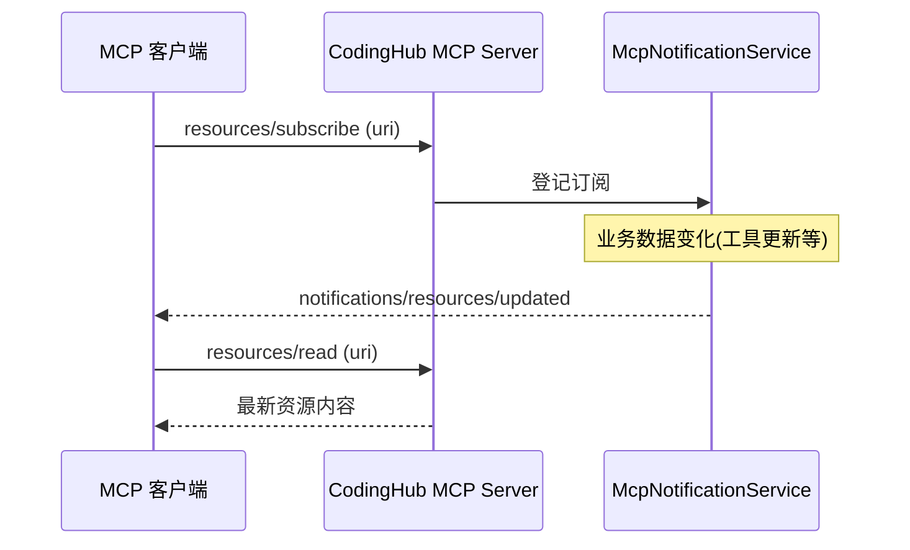

# McpNotificationService（MCP 资源订阅通知）

> 代码：`backend/src/main/java/com/iaihub/toolbox/mcp/McpNotificationService.java`

## 职责

实现 MCP 资源订阅-通知机制：客户端 `resources/subscribe` 订阅某个资源后，当服务端数据变化（如工具更新、分类调整）时推送 `notifications/resources/updated`，客户端再拉取最新内容。

## 工作流程

## 设计要点（来自 [mcp-server-best-practices](../sources/mcp-server-best-practices.md)）

- 通知只发「变了」信号，不携带数据本体——符合 [[MCP控制通道与数据通道分离]] 的哲学
- 依赖 [[Streamable-HTTP传输模式]] 的服务端推送能力（升级 SSE 流）
- 订阅关系随连接生命周期管理，连接断开即清理，避免泄漏（吸取坑 1 教训）

## 关联

- 所属模块：[MCP服务](../modules/MCP服务.md)
- 服务对象：[McpResourceHandler](McpResourceHandler.md) 暴露的资源
