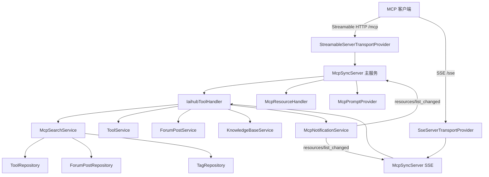

# MCP服务

## 模块概述

MCP（Model Context Protocol）服务是 CodingHub 平台面向 AI Agent 的标准化接入层。基于 **Java MCP SDK**（`io.modelcontextprotocol`）构建，让外部 AI 客户端（CodeBuddy、QoderWork、Claude Code 等）通过统一协议访问平台全部能力：

- **工具管理（8 个 tool）**：搜索、详情、文件列表、下载、创建、修改、文件上传/删除
- **社区论坛（3 个 tool）**：帖子搜索、帖子详情、发帖
- **知识库 RAG（9 个 tool）**：知识库 CRUD、语义搜索、文档上传、状态查询、配置管理
- **工作流引导（6 个 Prompt）**：search-tools / install-tool / check-versions / publish-tool / update-tool / forum-post
- **上下文资源（3 类 Resource）**：`codinghub://tools/catalog`、`codinghub://tools/recent`、`codinghub://tool/{id}`

共 **20 个 MCP 工具**，同时支持 **Streamable HTTP**（MCP 2025-03-26 规范，`/mcp`）与 **SSE**（旧客户端兼容，`/sse` + `/sse/message`）两种传输协议。

## 架构总览

**数据流**：
1. 客户端通过 `/mcp`（Streamable HTTP）或 `/sse`（SSE）建立连接并完成 `initialize` 握手
2. `McpSyncServer` 接收 `tools/call` 请求，路由到 `IaihubToolHandler` 对应的处理方法
3. `IaihubToolHandler` 调用 Service 层（`McpSearchService` / `ToolService` / `KnowledgeBaseService` 等）完成业务
4. 写操作（工具创建/修改/文件变更）完成后，`McpNotificationService` 向所有已连接客户端推送 `notifications/resources/list_changed`

## 核心组件

### [McpSdkServerConfig](../../../backend/src/main/java/com/iaihub/toolbox/mcp/McpSdkServerConfig.java)

**路径**: `backend/src/main/java/com/iaihub/toolbox/mcp/McpSdkServerConfig.java`（约 1180 行）

MCP Server 的核心配置类，职责：

- 注册两个 `McpSyncServer` Bean：主服务（Streamable HTTP）与 SSE 兼容服务，共享同一套 tool/resource/prompt 规格
- 定义全部 20 个工具的 JSON Schema（名称、描述、输入参数），统一 `h3_coding_hub_` 前缀
- 将工具调用绑定到 `IaihubToolHandler` 的处理方法
- 注册 `McpResourceHandler` 的资源规格与 `McpPromptProvider` 的 6 个 Prompt
- 通过 `ServletRegistrationBean` 将 SDK 的 Transport Servlet 挂载到 `/mcp` 与 `/sse`

**工具清单**：

| 分类 | 工具名 |
|------|--------|
| 工具广场 | `h3_coding_hub_tool_search` / `tool_get` / `tool_files` / `tool_download` / `tool_create` / `tool_modify` / `tool_file_upload` / `tool_file_delete` |
| 论坛 | `h3_coding_hub_post_search` / `post_get` / `post_create` |
| 知识库 | `h3_coding_hub_kb_list` / `kb_search` / `kb_create` / `kb_update` / `kb_delete` / `kb_upload_document` / `kb_document_status` / `kb_get_config` / `kb_configure` |

### [IaihubToolHandler](../../../backend/src/main/java/com/iaihub/toolbox/mcp/IaihubToolHandler.java)

**路径**: `backend/src/main/java/com/iaihub/toolbox/mcp/IaihubToolHandler.java`（约 1500 行）

所有 MCP 工具调用的实际执行者：

- 每个工具对应一个 `handleXxx(Map<String,Object> args)` 方法，解析参数 → 调用 Service → 组装 `CallToolResult`
- 写操作需要 `apiKey` 参数完成用户身份认证（映射到平台账号）
- 搜索/详情等读操作委托 [McpSearchService](#mcpsearchservice)，知识库操作委托 `KnowledgeBaseService`（见 [知识库与RAG](知识库与RAG.md)）
- 发布/修改工具后调用 `McpNotificationService` 推送资源变更通知
- 返回统一 JSON 文本内容，出错时返回 `isError=true` 的结果而非抛异常

### [McpSearchService](../../../backend/src/main/java/com/iaihub/toolbox/service/McpSearchService.java)

**路径**: `backend/src/main/java/com/iaihub/toolbox/service/McpSearchService.java`

MCP 专用查询服务，聚合多个 Repository：

- `ToolRepository` + `ToolTagRepository` + `TagRepository`：关键词搜索工具（名称/描述/标签），返回 `ToolSearchResult`
- `ToolFileRepository`：列出工具文件清单
- `ForumPostRepository` + `UserRepository`：论坛帖子搜索与详情，返回 `PostSearchResult`
- 仅暴露 `PUBLISHED` 状态的内容，软删除内容不可见

### [McpResourceHandler](../../../backend/src/main/java/com/iaihub/toolbox/mcp/McpResourceHandler.java)

**路径**: `backend/src/main/java/com/iaihub/toolbox/mcp/McpResourceHandler.java`

MCP Resource 提供者，暴露三类资源：

| URI | 说明 |
|-----|------|
| `codinghub://tools/catalog` | 工具广场全量目录（摘要列表） |
| `codinghub://tools/recent` | 最近更新/新增的前 20 个工具 |
| `codinghub://tool/{id}` | 单个工具详情（资源模板） |

### [McpPromptProvider](../../../backend/src/main/java/com/iaihub/toolbox/mcp/McpPromptProvider.java)

**路径**: `backend/src/main/java/com/iaihub/toolbox/mcp/McpPromptProvider.java`

将 QuickStart 页面的工作流提示词封装为 6 个标准 MCP Prompt：`search-tools`（参数 query）、`install-tool`（参数 toolName）、`check-versions`、`publish-tool`、`update-tool`、`forum-post`。客户端可直接引用这些 Prompt 引导 Agent 完成端到端工作流。

### [McpNotificationService](../../../backend/src/main/java/com/iaihub/toolbox/mcp/McpNotificationService.java)

**路径**: `backend/src/main/java/com/iaihub/toolbox/mcp/McpNotificationService.java`

资源变更通知服务。当工具新增/更新/删除时，向所有已连接客户端广播：

- `notifications/resources/list_changed` — 工具列表整体变化
- `notifications/resources/updated` — 指定 URI 资源内容更新

通过 `@Lazy` 注入 `List<McpSyncServer>` 打破循环依赖（`streamableMcpServer → IaihubToolHandler → McpNotificationService → List<McpSyncServer>`）。

### [McpController](../../../backend/src/main/java/com/iaihub/toolbox/controller/McpController.java)

**路径**: `backend/src/main/java/com/iaihub/toolbox/controller/McpController.java`

轻量辅助控制器，仅提供 `GET /mcp/health` 健康检查端点（返回服务状态、工具数量）。协议消息本身由 SDK Transport Servlet 直接处理，不经过 Spring MVC。

### 已废弃组件

- `McpConnectionManager`（`@Deprecated`）：早期手写的 SSE 连接管理器，已被 SDK `HttpServletSseServerTransportProvider` 取代，保留仅为兼容
- `McpServerConfig`（config 包）：早期手写 JSON-RPC 实现的配置类，功能已迁移至 `McpSdkServerConfig`

## 关键 DTO

| DTO | 用途 |
|-----|------|
| `ToolSearchResult` | 工具搜索结果（id、名称、描述、分类、标签、版本、统计） |
| `PostSearchResult` | 论坛帖子搜索结果（id、标题、摘要、作者、分类） |
| `McpSearchRequest` | 搜索入参（keyword、category、page、size） |

## 端点一览

| 端点 | 协议 | 说明 |
|------|------|------|
| `POST /mcp` | Streamable HTTP | MCP 2025-03-26 主端点（JSON-RPC 2.0） |
| `GET /sse` | SSE | 旧客户端 SSE 握手 |
| `POST /sse/message` | HTTP | SSE 模式下的消息回传端点 |
| `GET /mcp/health` | REST | 健康检查 |

## 认证与安全

- 读操作（搜索/详情/下载/资源）无需认证
- 写操作（发布/修改工具、发帖、知识库管理）需在参数中提供 `apiKey`，由服务端映射到平台用户并校验权限（内容操作 `isOwner || isAdmin`）
- 所有入参经 `XssSanitizer` 清洗后入库

## 与其他模块的关系

- 依赖 [工具广场](工具广场.md) 的 `ToolService`/`ToolFileService` 完成工具 CRUD 与文件管理
- 依赖 [论坛社区](论坛社区.md) 的 `ForumPostService` 完成发帖
- 依赖 [知识库与RAG](知识库与RAG.md) 的 `KnowledgeBaseService` 转发 RAG 请求
- 依赖 [用户与认证](用户与认证.md) 的 apiKey → [User](../../../backend/src/main/java/com/iaihub/toolbox/model/User.java) 映射完成身份识别

<!-- crosslinks (auto-generated) -->
## Related Modules
- Depends on: [工具广场](工具广场.md), [用户与认证](用户与认证.md), [知识库与RAG](知识库与rag.md), [论坛社区](论坛社区.md)
- Used by: [工具广场](工具广场.md)
