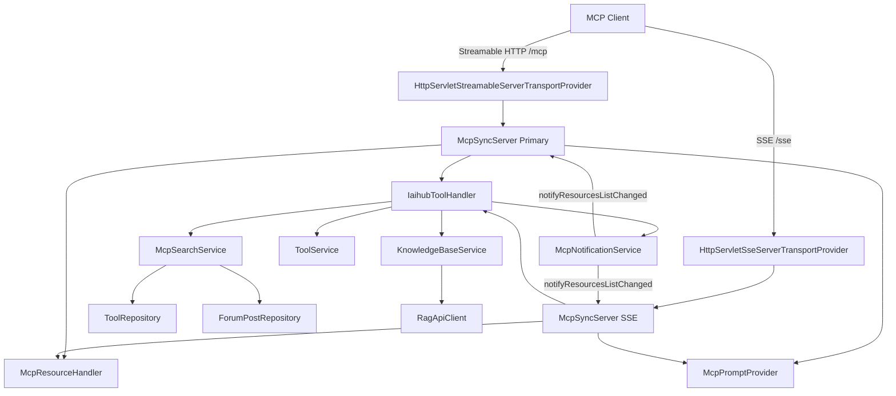

# MCP服务

## 模块概述

MCP（Model Context Protocol）服务是 CodingHub 平台面向 AI Agent 的标准化接入层。它实现了 MCP 协议规范，让外部 AI 客户端（如 CodeBuddy、QoderWork 等）能够通过统一协议访问工具广场的全部能力，包括：

- **工具管理**：搜索、获取详情、创建、修改工具，文件上传/下载/删除
- **社区论坛**：帖子搜索、获取、创建
- **知识库 (RAG)**：知识库 CRUD、语义搜索、文档上传与状态查询
- **工作流引导**：6 个 Prompt 模板指导 Agent 完成安装、发布、更新等操作
- **上下文资源**：通过 MCP Resource 暴露工具目录和详情

该模块基于 Java MCP SDK 2.0.0 构建，同时支持 **Streamable HTTP**（MCP 2025-03-26 规范）和 **SSE**（兼容旧客户端）两种传输协议。

## 架构总览



**数据流说明**：
1. MCP 客户端通过 `/mcp`（Streamable HTTP）或 `/sse`（SSE）建立连接
2. `McpSyncServer` 接收 `tools/call` 请求并路由到 `IaihubToolHandler`
3. `IaihubToolHandler` 调用底层 Service 层完成业务逻辑
4. 写操作完成后，`McpNotificationService` 向所有已连接客户端推送资源变更通知

## 核心组件

### [McpSdkServerConfig](../../../backend/src/main/java/com/iaihub/toolbox/mcp/McpSdkServerConfig.java)

**路径**: `com.iaihub.toolbox.mcp.McpSdkServerConfig`

MCP Server 的核心配置类，职责包括：

| 职责 | 说明 |
|------|------|
| 传输层注册 | 通过 `ServletRegistrationBean` 注册 Streamable HTTP (`/mcp`) 和 SSE (`/sse`, `/sse/message`) 两个 Servlet |
| Server 实例创建 | 构建两个 `McpSyncServer` 实例（`@Primary` 标注 Streamable 实例） |
| 工具注册 | 调用 `registerAllTools()` 注册 18 个 MCP 工具 |
| 资源注册 | 调用 `registerAllResources()` 注册 3 个 MCP Resource |
| Prompt 注册 | 调用 `registerAllPrompts()` 注册 6 个工作流模板 |
| Server Instructions | 在 initialize 握手时向 Agent 发送全局使用指南 |

Server 声明的能力（Capabilities）：
- `tools`: true
- `resources`: true（支持 listChanged 通知）
- `prompts`: true
- `logging`: true

### [IaihubToolHandler](../../../backend/src/main/java/com/iaihub/toolbox/mcp/IaihubToolHandler.java)

**路径**: `com.iaihub.toolbox.mcp.IaihubToolHandler`

MCP 工具调用的核心处理器，实现了 18 个工具的业务逻辑。每个 `handle*` 方法：
1. 接收从 MCP 请求中解析的参数
2. 调用对应 Service 层方法
3. 将结果序列化为 JSON
4. 封装为 `McpSchema.CallToolResult`（含 `structuredContent`）返回

**认证机制**：写操作（创建/修改/删除）需要 `username` + `password` 参数，Handler 内部调用 `UserService.login()` 完成身份验证。

**依赖注入**：
- `McpSearchService` — 搜索与查询
- `ToolService` — 工具 CRUD
- `ToolFileService` — 文件管理
- `ForumPostService` — 帖子管理
- `KnowledgeBaseService` — 知识库操作
- `RagApiClient` — RAG 服务通信
- `McpNotificationService` — 变更通知
- `TagService` — 标签解析与创建

### [McpPromptProvider](../../../backend/src/main/java/com/iaihub/toolbox/mcp/McpPromptProvider.java)

**路径**: `com.iaihub.toolbox.mcp.McpPromptProvider`

提供 6 个标准 MCP Prompt 模板，将常见工作流封装为可复用的提示词：

| Prompt 名称 | 功能 | 参数 |
|-------------|------|------|
| `search-tools` | 搜索工具广场 | query（可选） |
| `install-tool` | 安装工具到本地项目 | toolName（必填） |
| `check-versions` | 检查工具版本更新 | 无 |
| `publish-tool` | 发布本地 Skill 到广场 | skillName（必填） |
| `update-tool` | 更新已发布的工具 | skillName（必填），version（可选） |
| `forum-post` | 发帖到论坛 | filePath（可选），title（可选） |

每个 Prompt 返回包含完整操作步骤的 `USER` 角色消息，引导 Agent 按序调用 MCP 工具完成任务。

### [McpResourceHandler](../../../backend/src/main/java/com/iaihub/toolbox/mcp/McpResourceHandler.java)

**路径**: `com.iaihub.toolbox.mcp.McpResourceHandler`

将工具广场数据暴露为标准 MCP Resource：

| URI | 类型 | 说明 |
|-----|------|------|
| `codinghub://tools/catalog` | 静态资源 | 全量工具摘要目录（最多 200 条） |
| `codinghub://tools/recent` | 静态资源 | 最近更新的工具（前 20 条） |
| `codinghub://tool/{id}` | Resource Template | 单个工具完整详情 |

### [McpNotificationService](../../../backend/src/main/java/com/iaihub/toolbox/mcp/McpNotificationService.java)

**路径**: `com.iaihub.toolbox.mcp.McpNotificationService`

工具变更时向已连接 MCP 客户端推送通知：
- 工具新增/更新/删除 → `notifications/resources/list_changed`
- 特定资源变更 → `notifications/resources/updated`（携带 URI）

使用 `@Lazy` 注入 `List<McpSyncServer>` 打破循环依赖。

### [McpConnectionManager](../../../backend/src/main/java/com/iaihub/toolbox/mcp/McpConnectionManager.java)（已废弃）

**路径**: `com.iaihub.toolbox.mcp.McpConnectionManager`

标记为 `@Deprecated`，原用于手动管理 SSE 连接。现已被 MCP SDK 的 `HttpServletSseServerTransportProvider` 内部连接管理替代。

### [McpController](../../../backend/src/main/java/com/iaihub/toolbox/controller/McpController.java)

**路径**: `com.iaihub.toolbox.controller.McpController`

仅提供 `/mcp/health` 健康检查端点，返回服务状态、版本和时间戳。实际 MCP 协议交互由 TransportProvider Servlet 处理。

## 工具定义

MCP Server 共暴露 18 个工具，按功能分为四组：

### 工具管理（7 个）

| 工具名 | 说明 | 需认证 |
|--------|------|--------|
| `h3_coding_hub_tool_search` | 按关键词/分类搜索工具列表 | 否 |
| `h3_coding_hub_tool_get` | 获取工具详情（含完整 markdown 文档） | 否 |
| `h3_coding_hub_tool_files` | 获取工具文件列表及下载链接 | 否 |
| `h3_coding_hub_tool_download` | 获取指定文件下载信息 | 否 |
| `h3_coding_hub_tool_create` | 创建新工具 | 是 |
| `h3_coding_hub_tool_modify` | 修改工具（版本自动递增） | 是 |
| `h3_coding_hub_tool_file_upload` | 获取文件上传 REST API 信息 | 否 |

### 文件管理（1 个）

| 工具名 | 说明 | 需认证 |
|--------|------|--------|
| `h3_coding_hub_tool_file_delete` | 删除工具文件 | 是 |

### 社区论坛（3 个）

| 工具名 | 说明 | 需认证 |
|--------|------|--------|
| `h3_coding_hub_post_search` | 搜索社区帖子 | 否 |
| `h3_coding_hub_post_get` | 获取帖子完整内容 | 否 |
| `h3_coding_hub_post_create` | 创建新帖子 | 是 |

### 知识库 RAG（7 个）

| 工具名 | 说明 | 需认证 |
|--------|------|--------|
| `h3_coding_hub_kb_list` | 获取知识库列表（分页） | 否 |
| `h3_coding_hub_kb_search` | 语义搜索知识库内容 | 否 |
| `h3_coding_hub_kb_create` | 创建知识库 | 是 |
| `h3_coding_hub_kb_update` | 更新知识库配置 | 是 |
| `h3_coding_hub_kb_delete` | 删除知识库 | 是 |
| `h3_coding_hub_kb_upload_document` | 获取文档批量上传 API 信息 | 否 |
| `h3_coding_hub_kb_document_status` | 查询文档处理状态 | 否 |

### 工具参数示例

以 `h3_coding_hub_tool_search` 为例：

**输入 Schema**:
```json
{
  "type": "object",
  "properties": {
    "query": {"type": "string", "description": "搜索关键词"},
    "category": {"type": "string", "description": "分类名称"},
    "limit": {"type": "integer", "description": "返回数量限制，默认200"}
  }
}
```

**输出 Schema**:
```json
{
  "type": "object",
  "properties": {
    "tools": {"type": "array", "items": {"type": "object"}},
    "count": {"type": "integer"}
  },
  "required": ["tools", "count"]
}
```

## 搜索与推荐

### [McpSearchService](../../../backend/src/main/java/com/iaihub/toolbox/service/McpSearchService.java)

**路径**: `com.iaihub.toolbox.service.McpSearchService`

搜索服务封装了工具和帖子的检索逻辑：

**工具搜索流程**：
1. 调用 `ToolRepository.findApprovedToolsWithCategory()` 执行数据库查询（仅返回已审核工具）
2. 批量获取所有结果工具的标签（`resolveTagsForTools`），避免 N+1 查询
3. 组装 `ToolSearchResult` DTO（含 id、name、description 截取前 100 字符、category、version、tags）

**帖子搜索流程**：
1. 有关键词时调用 `ForumPostRepository.searchByTitle()` 按标题搜索
2. 无关键词时按创建时间倒序返回
3. 仅返回状态为 NORMAL 且可见性为 PUBLIC 的帖子
4. 关联查询作者用户名

**性能优化**：
- 标签批量查询避免 N+1 问题
- 使用 `@Transactional(readOnly = true)` 优化只读事务
- 搜索结果描述截取前 100 字符减少传输量

### 知识库语义搜索

知识库搜索通过 `KnowledgeBaseService.search()` 委托给 RAG 服务：
- 支持 `topK` 控制返回数量（默认 5）
- 支持 `rerank` 重排序提升相关性
- 支持 `expandContext` 上下文扩展

## 配置

### [McpServerConfig](../../../backend/src/main/java/com/iaihub/toolbox/config/McpServerConfig.java)

**路径**: `com.iaihub.toolbox.config.McpServerConfig`

配置前缀: `mcp.server`

| 配置项 | 类型 | 默认值 | 说明 |
|--------|------|--------|------|
| `mcp.server.port` | int | 8082 | MCP Server 监听端口 |
| `mcp.server.host` | String | 0.0.0.0 | 绑定地址 |
| `mcp.server.enabled` | boolean | true | 是否启用 MCP Server |
| `mcp.server.maxConnections` | int | 10 | 最大连接数 |
| `mcp.server.connectionTimeoutMs` | int | 30000 | 连接超时（毫秒） |

### 传输端点

| 协议 | 端点 | 说明 |
|------|------|------|
| Streamable HTTP | `/mcp` | MCP 2025-03-26 规范，主传输通道 |
| SSE | `/sse` + `/sse/message` | 兼容旧版客户端 |
| 健康检查 | `/mcp/health` | 服务状态探测 |

### 关键约束

- **文件传输**: MCP 通道不传输二进制文件，上传/下载通过返回的 REST 端点执行（HTTP Multipart POST）
- **认证**: 写操作需 username + password，对应 CodingHub 平台账号
- **版本号**: 遵循 SemVer，修改时不传则自动递增最后一位（如 1.0.0 → 1.0.1）
- **分类 ID**: Skill(1), MCP(2), 插件(3), Prompt(4), 其他(5)

## 交叉引用

- [工具广场](工具广场.md) — MCP 服务暴露的核心业务实体，[ToolService](../../../backend/src/main/java/com/iaihub/toolbox/service/ToolService.java) 和 [ToolFileService](../../../backend/src/main/java/com/iaihub/toolbox/service/ToolFileService.java) 的具体实现
- [知识库与RAG](知识库与RAG.md) — 知识库 MCP 工具依赖 [KnowledgeBaseService](../../../backend/src/main/java/com/iaihub/toolbox/service/kb/KnowledgeBaseService.java) 和 [RagApiClient](../../../backend/src/main/java/com/iaihub/toolbox/service/RagApiClient.java) 的底层实现


<!-- crosslinks (auto-generated) -->
## Related Modules
- Depends on: [工具广场](工具广场.md), [用户与认证](用户与认证.md), [知识库与RAG](知识库与rag.md), [论坛社区](论坛社区.md)
- Used by: [前端应用](前端应用.md), [工具广场](工具广场.md), [用户与认证](用户与认证.md), [知识库与RAG](知识库与rag.md), [统一互动](统一互动.md), [论坛社区](论坛社区.md)
