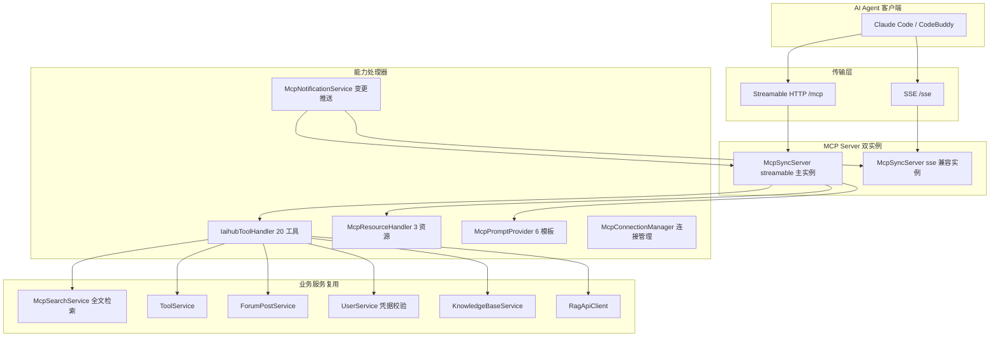
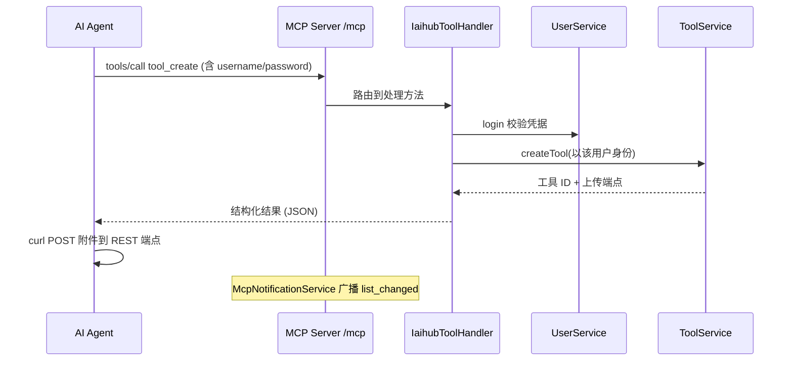

# MCP服务

## 模块概述

MCP 服务模块将 CodingHub 平台能力以 Model Context Protocol（MCP）标准暴露给 AI Agent（Claude Code、CodeBuddy 等），支持工具搜索/发布、论坛发帖、知识库语义搜索等 20 个工具、3 个资源、6 个 Prompt 模板。基于官方 Java MCP SDK 2.0.0，随 Spring Boot 应用启动。

- **代码位置**: `mcp/`（IaihubToolHandler、McpSdkServerConfig、McpResourceHandler、McpPromptProvider、McpNotificationService、McpConnectionManager）+ `McpSearchService` + 搜索 DTO
- **组件数量**: 150 个
- **端点**: `/mcp`（Streamable HTTP，MCP 协议 2025-03-26）与 `/sse` + `/sse/message`（旧版 SSE 兼容）——两端点在 SecurityConfig 中 **permitAll**（MCP 调用不需要 JWT）

## 架构图

## 双传输设计（McpSdkServerConfig）

| 传输 | 端点 | 协议版本 | 用途 |
|------|------|---------|------|
| Streamable HTTP | `/mcp`（POST+GET 单端点） | 2025-03-26 | 主通道，`@Primary` 实例 |
| SSE | `/sse`（事件流）+ `/sse/message`（消息） | 旧版 | 兼容不支持 streamable 的客户端 |

两个 `McpSyncServer` 实例注册**相同**的 20 个工具，任一通道均可完整调用。initialize 握手时下发 `SERVER_INSTRUCTIONS`（能力概览 + 认证约定 + 推荐流程），Agent 无需外部文档即可上手。

## 20 个 MCP 工具（IaihubToolHandler）

### 工具管理（8）

| 工具 | 认证 | 说明 |
|------|------|------|
| `h3_coding_hub_tool_search` | 无 | 关键词搜索工具（McpSearchService 全文检索） |
| `h3_coding_hub_tool_get` | 无 | 工具详情（Markdown 正文 + 元数据） |
| `h3_coding_hub_tool_files` | 无 | 工具附件列表 |
| `h3_coding_hub_tool_download` | 无 | 生成文件下载 REST 链接 |
| `h3_coding_hub_tool_create` | 需要 | 创建工具（版本 SemVer，分类 Skill/MCP/插件/Prompt/其他） |
| `h3_coding_hub_tool_modify` | 需要 | 修改工具（版本号不传自动递增末位） |
| `h3_coding_hub_tool_file_upload` | 无 | 返回文件上传 REST 端点信息 |
| `h3_coding_hub_tool_file_delete` | 需要 | 删除附件 |

### 论坛（3）

`post_search` / `post_get` / `post_create`（发帖需认证）

### 知识库 RAG（9）

`kb_list` / `kb_get` / `kb_search`（语义搜索）/ `kb_create` / `kb_update` / `kb_delete` / `kb_upload_document` / `kb_document_status` / `kb_config`（分块配置读写）——内部经 `KnowledgeBaseService` + `RagApiClient` 代理到 [知识库与RAG](知识库与RAG.md) 的 Python 服务。

### 认证模型

MCP 通道本身无 JWT。写类工具在参数中携带 `username` + `password`，内部调用 `UserService.login` 校验（复用 [用户与认证](用户与认证.md) 逻辑），校验通过即以该用户身份执行业务。

### 文件传输约定

MCP 通道不传二进制。上传/下载工具返回 REST 端点描述（HTTP Multipart POST / GET 链接），Agent 用 curl 等完成实际传输。

## 资源与 Prompt

### 3 个资源（McpResourceHandler）

| URI | 内容 |
|-----|------|
| `codinghub://tools/catalog` | 全量工具目录（含分类） |
| `codinghub://tools/recent` | 最近更新工具 |
| `codinghub://tool/{id}` | 单工具详情（资源模板） |

### 6 个 Prompt 模板（McpPromptProvider）

`install-tool`、`publish-tool`、`update-tool` 等工作流指引，Agent 调用后获得逐步操作说明（含调用哪些工具、REST 上传步骤）。

## 资源变更通知（McpNotificationService）

[工具广场](工具广场.md) 的工具创建/修改/删除会调用本服务，向两个 McpServer 实例的所有已连接客户端广播 `resources/list_changed`，Agent 可即时感知目录变化。`McpConnectionManager` 维护活跃连接会话。

## 调用时序（发布工具示例）

## 已知问题

- **`kb_document_status` 单文档分支 schema 校验失败**: 传 `docId` 时返回裸文档对象，与输出 schema 声明的列表结构（`kbId`/`documents`/`totalCount`）不匹配，触发 `output validation failed`。列表分支正常。修复方向：单文档分支也包装成列表响应形状，或放宽输出 schema（位置 `IaihubToolHandler.handleKbDocumentStatus`）

## 依赖关系

- **依赖**: [工具广场](工具广场.md)（ToolService / ToolFileService / 搜索）、[论坛社区](论坛社区.md)（ForumPostService）、[用户与认证](用户与认证.md)（UserService 凭据校验）、[知识库与RAG](知识库与RAG.md)（KnowledgeBaseService / RagApiClient）、[统一互动与通知](统一互动与通知.md)（TagService 标签解析）
- **被依赖**: 工具广场在内容变更时反向调用 McpNotificationService（唯一的 L4 内部横向调用，属事件通知性质）

## 设计要点

1. **双实例同能力**: 两传输协议独立 Server 实例但注册同一组 handler，升级/兼容两不误
2. **凭据即会话**: 无状态认证——每次写调用独立校验，无 token 管理负担；默认密码 123456（内网工具平台的低摩擦取舍）
3. **指令内置**: SERVER_INSTRUCTIONS 把使用手册塞进握手响应，Agent 零上下文启动
4. **REST 逃生门**: 二进制走 REST 而非 MCP，规避协议不擅长的大负载场景
