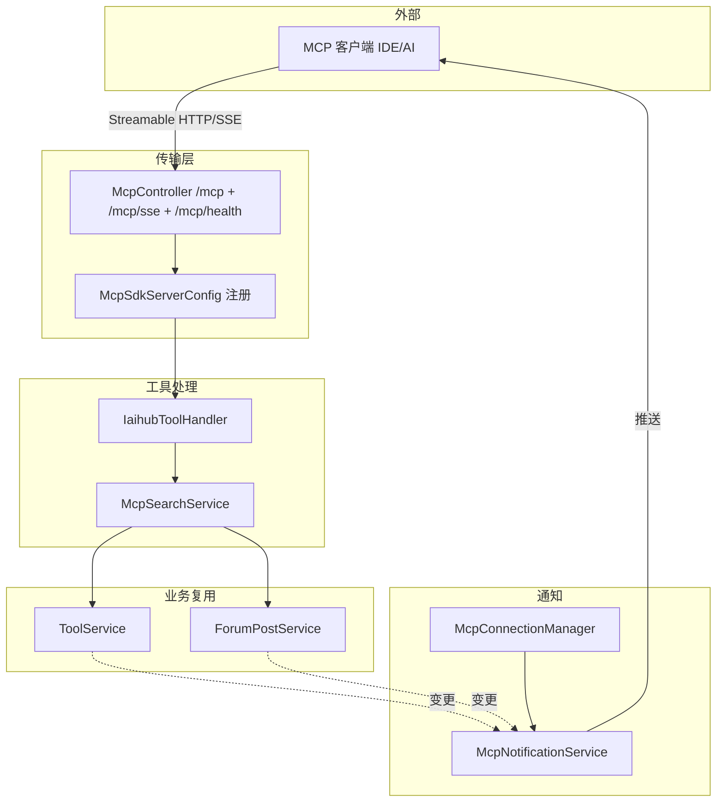
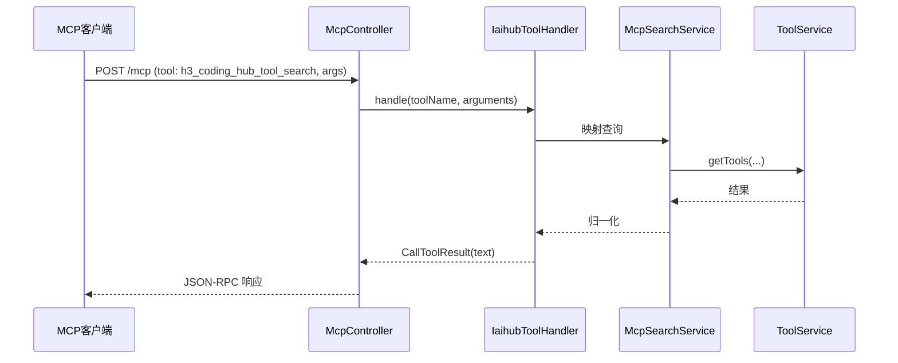

# MCP服务

MCP 服务在 CodingHub 后端内嵌了一个符合 Model Context Protocol 的服务器，使外部 AI 客户端（如 Claude/Cursor 等支持 MCP 的 IDE）能通过标准协议检索平台资源。它注册了 5 个工具（`h3_coding_hub_tool_search/get/files`、`h3_coding_hub_post_search/get`），对外暴露 `Streamable HTTP` 与 `SSE` 两种传输，并在工具/帖子发生变更时主动推送资源通知。入口为 `/mcp`（JSON-RPC）、`/mcp/sse`、`/mcp/health`。

## Component Constraint Index

| Component | Constraints | Risks | Summary |
|-----------|-------------|-------|---------|
| IaihubToolHandler | 3 | 1 | 5 工具分发，参数 schema 校验 |
| McpSdkServerConfig | 2 | 0 | 注册工具/资源/提示，双传输 |
| McpConnectionManager | 1 | 0 | 维护客户端会话 |
| McpNotificationService | 2 | 0 | 变更 → 推送 clients |
| McpController | 2 | 0 | /mcp JSON-RPC + SSE + health |
| McpSearchService | 2 | 0 | 工具/帖子检索共享逻辑 |

## 架构总览 (Architecture Overview)

## 组件职责 (Component Responsibilities)

### McpSdkServerConfig

基于 MCP SDK 构建 `McpServer`，注册：
- 5 个 `Tool`（`h3_coding_hub_tool_search`、`h3_coding_hub_tool_get`、`h3_coding_hub_tool_files`、`h3_coding_hub_post_search`、`h3_coding_hub_post_get`），每个含 `name/description/inputSchema(JSON Schema)`。
- 资源（Resource）与提示（Prompt）模板（如适用）。
- 传输：`Streamable HTTP`（`/mcp`）+ `SSE`（`/mcp/sse`），由 `McpController` 暴露端点。

### IaihubToolHandler

工具调用分发器：解析 `tool name` 与 `arguments`，按名称 `switch` 到对应处理分支，返回 `CallToolResult`（文本内容）：
- `h3_coding_hub_tool_search`：关键词/分类检索工具列表。
- `h3_coding_hub_tool_get`：按 id 取工具详情。
- `h3_coding_hub_tool_files`：取工具附件清单。
- `h3_coding_hub_post_search` / `h3_coding_hub_post_get`：论坛帖子检索/详情（复用 [论坛社区](论坛社区.md) 的 `ForumPostService`）。

**Business Constraints — IaihubToolHandler**

- 工具参数先按 inputSchema 校验，缺失/类型错直接返回错误结果 (confidence: 0.9)
  > Evidence: 每个分支先读取并校验 `arguments.getString(...)`/`getLong(...)`，非法时返回带 `isError=true` 的 `CallToolResult`。
- 帖子类工具复用论坛 Service，不重复实现检索逻辑 (confidence: 0.95)
  > Evidence: `h3_coding_hub_post_*` 分支调用 `forumPostService.getPostList/getPostById`，与 REST 共用同一业务层。

### McpSearchService

被 `IaihubToolHandler` 调用的共享检索逻辑：把 MCP 入参映射为 `ToolService`/`ForumPostService` 的查询条件，归一化结果结构（标题、摘要、URL、id）后返回，屏蔽后端 DTO 差异。

### McpConnectionManager / McpNotificationService

- `McpConnectionManager`：维护当前已连接的 MCP 客户端会话集合（按 session/transport 索引）。
- `McpNotificationService`：提供 `notifyToolCreated/Updated/Deleted` 等；当 [工具广场](工具广场.md) 的 `ToolService` 或 [论坛社区](论坛社区.md) 的 `ForumPostService` 发生写操作时调用，向所有连接客户端推送资源变更通知（`resources/updated` 风格），让客户端刷新上下文。

**Business Constraints**

- 业务写操作完成后再触发通知，避免半状态推送 (confidence: 0.85)
  > Evidence: `ToolService.createTool` 在 `save` 之后才 `mcpNotificationService.notifyToolCreated(id,name)`。
- 通知面向“所有在线连接”，单客户端掉线不阻塞主流程 (confidence: 0.9)
  > Evidence: `McpNotificationService` 遍历 `McpConnectionManager` 会话逐个推送，单条失败 catch 记日志继续。

### McpController

暴露三个端点：
- `POST /mcp`：JSON-RPC 2.0 入口（initialize/tools/list/tools/call/resources/...）。
- `GET /mcp/sse`：SSE 流式传输（用于不支持 Streamable HTTP 的客户端）。
- `GET /mcp/health`：健康检查，返回服务状态。

## 数据流：MCP 工具调用

## 接口契约与副作用

- 协议层遵循 MCP（JSON-RPC 2.0），与业务 `ApiResponse` 无关；工具结果以 `CallToolResult` 文本返回。
- 副作用：业务写操作会触发 `McpNotificationService` 推送（见上）；工具调用本身为只读检索。

## 依赖关系 (Cross-References)

- [工具广场](工具广场.md) — `ToolService` 提供检索并被通知；`McpNotificationService` 被其调用。
- [论坛社区](论坛社区.md) — `h3_coding_hub_post_*` 复用 `ForumPostService`。
- [用户与认证](用户与认证.md) — MCP 通道自带独立鉴权，与 `/api/v1/auth` 不共享会话。
- [平台基础](平台基础.md) — 异常兜底；MCP 内部错误也会收敛记录。
- [前端应用](前端应用.md) — 前端不直接消费 MCP（由外部 IDE 客户端消费）。

## 约束、假设与边界情况

- 当前注册 5 个工具（工具×3 + 帖子×2）；新增资源类型需同步改 `McpSdkServerConfig` 与 `IaihubToolHandler` 的 `switch`。
- 通知为“尽力推送”：客户端离线/会话不存在则跳过，不持久化离线消息。
- `/mcp/health` 仅反映服务存活，不校验 Python RAG 等下游依赖。
- 传输层同时提供 Streamable HTTP 与 SSE，客户端可二选一；SSE 主要用于旧式兼容。
