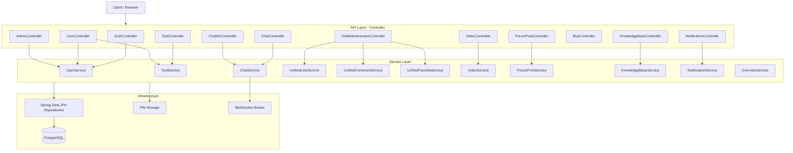
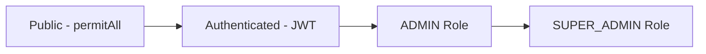

# backend-api 模块

## 模块简介

`backend-api` 是 CodingHub 平台的 REST API 层，位于 `backend/src/main/java/com/iaihub/toolbox/controller/` 和 `dto/` 目录。作为所有 HTTP 端点的统一入口，该模块负责：

- 接收和校验 HTTP 请求（含 REST 和 WebSocket 两种协议）
- 将请求委派给 Service 层处理业务逻辑
- 统一响应格式封装（`ApiResponse<T>` 泛型包装）
- 认证鉴权（JWT + Spring Security 方法级权限控制）
- 文件上传/下载、视频流式传输等 I/O 密集型端点

**规模统计**（基于 codebase-memory 图分析）：

| 指标 | 数值 |
|------|------|
| Controller 类 | 23 个 |
| DTO 类 | 67 个 |
| HTTP 路由 | 96 条 |
| 处理方法 | 111 个 |
| 图节点总数 | 316 |
| 图边总数 | 491 |

## 架构分层



## 按业务域分组的 API 端点清单

### 1. 用户认证（AuthController）

基础路径：`/api/v1/auth`

| 方法 | 路径 | 说明 | 权限 |
|------|------|------|------|
| POST | `/register` | 用户注册（ADMIN 角色需审批） | 公开 |
| POST | `/login` | 用户登录，返回 JWT Token | 公开 |
| POST | `/refresh` | 刷新 Access Token | 公开 |

### 2. 用户管理（UserController）

基础路径：`/api/v1/users`

| 方法 | 路径 | 说明 | 权限 |
|------|------|------|------|
| GET | `/me` | 获取当前用户信息 | 已认证 |
| GET | `/me/tools` | 获取我上传的工具列表（分页） | 已认证 |
| POST | `/me/avatar` | 上传头像（multipart） | 已认证 |
| DELETE | `/me/avatar` | 删除头像 | 已认证 |
| PUT | `/me/profile` | 更新个人资料 | 已认证 |
| PUT | `/me/password` | 修改密码 | 已认证 |
| GET | `/{id}` | 获取用户公开主页 | 公开 |

### 3. 工具管理（ToolController + ToolFileController）

基础路径：`/api/v1/tools`

| 方法 | 路径 | 说明 | 权限 |
|------|------|------|------|
| GET | `/` | 工具列表（支持分类/关键词/标签/排序/分页） | 公开 |
| GET | `/{id}` | 工具详情 | 公开 |
| POST | `/` | 创建工具（触发 MCP 通知） | 已认证 |
| PUT | `/{id}` | 更新工具（触发 MCP 通知） | 已认证（所有者） |
| DELETE | `/{id}` | 删除工具（触发 MCP 通知） | 已认证（所有者/管理员） |
| POST | `/{id}/logo` | 更新工具 Logo | 已认证 |
| POST | `/{id}/pin` | 置顶工具 | ADMIN/SUPER_ADMIN |
| DELETE | `/{id}/pin` | 取消置顶 | ADMIN/SUPER_ADMIN |
| GET | `/hot-top5` | 热门工具 Top5 | 公开 |

**工具文件子资源**（`/api/v1/tools/{toolId}/files`）：

| 方法 | 路径 | 说明 | 权限 |
|------|------|------|------|
| POST | `/` | 上传工具附件（多文件 + readme） | 公开 |
| GET | `/` | 获取工具文件列表 | 公开 |
| DELETE | `/{fileId}` | 删除文件 | 已认证 |
| GET | `/{fileId}/download` | 下载文件（流式） | 公开 |

### 4. 社交互动（UnifiedInteractionController）

基础路径：`/api/v1/interactions`

统一的点赞/评论/收藏接口，通过 `targetType` 参数区分目标类型（工具、帖子、视频等）。

**点赞**：

| 方法 | 路径 | 说明 | 权限 |
|------|------|------|------|
| POST | `/likes` | 切换点赞状态（支持匿名 IP 哈希） | 公开 |
| GET | `/likes/status` | 查询点赞状态 | 公开 |
| GET | `/likes/mine` | 我的点赞列表 | 已认证 |

**评论**：

| 方法 | 路径 | 说明 | 权限 |
|------|------|------|------|
| POST | `/comments` | 发表评论（支持匿名 + 嵌套回复） | 公开 |
| GET | `/comments` | 获取评论列表（分页） | 公开 |
| GET | `/comments/mine` | 我的评论列表 | 已认证 |
| DELETE | `/comments/{id}` | 删除评论（本人或管理员） | 已认证 |

**收藏**：

| 方法 | 路径 | 说明 | 权限 |
|------|------|------|------|
| POST | `/favorites` | 切换收藏状态 | 已认证 |
| GET | `/favorites` | 我的收藏列表 | 已认证 |
| GET | `/favorites/status` | 查询收藏状态 | 已认证 |

### 5. 实时聊天（ChatController + ChatWsController）

**REST 端点**（`/api/v1/chat`）：

| 方法 | 路径 | 说明 | 权限 |
|------|------|------|------|
| GET | `/messages` | 获取聊天历史（按房间） | 公开 |
| DELETE | `/messages/{id}` | 删除消息（软删除） | ADMIN/SUPER_ADMIN |

**WebSocket 端点**（STOMP over `/ws`）：

| MessageMapping | 说明 |
|----------------|------|
| `/chat.send` | 发送消息 |
| `/chat.react` | 消息表情回应 |
| `/chat.edit` | 编辑消息 |
| `/chat.recall` | 撤回消息 |
| `/chat.typing` | 输入状态广播 |

WebSocket 通过 `ChatPrincipal`（存储在 session attributes）识别用户身份。

### 6. 视频模块（VideoController + DanmakuController）

基础路径：`/api/v1/videos`

| 方法 | 路径 | 说明 | 权限 |
|------|------|------|------|
| POST | `/` | 上传视频（multipart） | 已认证 |
| GET | `/` | 视频列表（排序/分页） | 公开 |
| GET | `/{id}` | 视频详情 | 公开 |
| PUT | `/{id}` | 更新视频信息 | 已认证（所有者） |
| DELETE | `/{id}` | 删除视频 | 已认证（所有者/管理员） |
| GET | `/{id}/stream` | 视频流播放（HTTP Range） | 公开 |
| GET | `/my` | 我上传的视频 | 已认证 |
| POST | `/{id}/pin` | 置顶视频 | ADMIN/SUPER_ADMIN |
| DELETE | `/{id}/pin` | 取消置顶 | ADMIN/SUPER_ADMIN |
| POST | `/{id}/cover` | 上传封面 | 已认证 |
| GET | `/{id}/cover-image` | 获取封面图片 | 公开 |
| GET | `/hot-top5` | 热门视频 Top5 | 公开 |

**弹幕子资源**（`/api/v1/videos/{videoId}/danmaku`）：

| 方法 | 路径 | 说明 | 权限 |
|------|------|------|------|
| GET | `/` | 获取视频弹幕列表 | 公开 |
| POST | `/` | 发送弹幕 | 已认证 |

视频流播放使用 `RandomAccessFile` 实现精确 seek，支持 HTTP Range 请求（206 Partial Content），默认每次最多传输 1MB。

### 7. 论坛模块（ForumPostController + ForumCategoryController + ForumTagController）

基础路径：`/api/forum/posts`

| 方法 | 路径 | 说明 | 权限 |
|------|------|------|------|
| GET | `/` | 帖子列表（分类/标签/关键词/排序） | 公开 |
| GET | `/my` | 我的帖子 | 已认证 |
| GET | `/{id}` | 帖子详情 | 公开 |
| POST | `/` | 创建帖子 | 已认证 |
| PUT | `/{id}` | 编辑帖子 | 已认证（作者） |
| DELETE | `/{id}` | 删除帖子 | 已认证（作者/管理员） |
| POST | `/{id}/pin` | 置顶帖子 | ADMIN/SUPER_ADMIN |
| DELETE | `/{id}/pin` | 取消置顶 | ADMIN/SUPER_ADMIN |
| GET | `/hot-top5` | 热门帖子 Top5 | 公开 |

### 8. 知识库（KnowledgeBaseController）

基础路径：`/api/v1/knowledge`

| 方法 | 路径 | 说明 | 权限 |
|------|------|------|------|
| GET | `/` | 知识库列表（分页/排序） | 公开 |
| GET | `/{id}` | 知识库详情 | 公开 |
| POST | `/` | 创建知识库 | 已认证 |
| PUT | `/{id}` | 更新知识库 | 已认证（所有者） |
| DELETE | `/{id}` | 删除知识库 | 已认证（所有者） |
| POST | `/{id}/search` | 语义搜索（Java 代理） | 公开 |

### 9. MCP 协议端点（McpController）

基础路径：`/mcp`

| 方法 | 路径 | 说明 | 权限 |
|------|------|------|------|
| GET | `/health` | MCP 服务健康检查 | 公开 |

实际 MCP 协议交互（SSE + Streamable HTTP）由 `HttpServletSseServerTransportProvider` 通过 `ServletRegistrationBean` 注册到 `/sse` 和 `/mcp/message` 路径处理，不经过 Spring MVC DispatcherServlet。详见 [backend-mcp](backend-mcp.md)。

### 10. 后台管理（AdminController）

基础路径：`/api/v1/admin`

| 方法 | 路径 | 说明 | 权限 |
|------|------|------|------|
| GET | `/pending-users` | 待审批用户列表 | SUPER_ADMIN |
| POST | `/approve/{id}` | 审批通过 | SUPER_ADMIN |
| POST | `/reject/{id}` | 审批拒绝 | SUPER_ADMIN |
| GET | `/users` | 用户管理列表（角色/状态/关键词筛选） | ADMIN/SUPER_ADMIN |
| PUT | `/users/{id}/status` | 封禁/解禁用户 | SUPER_ADMIN |
| DELETE | `/users/{id}` | 删除用户 | SUPER_ADMIN |

### 11. 通知（NotificationController）

基础路径：`/api/v1/notifications`

| 方法 | 路径 | 说明 | 权限 |
|------|------|------|------|
| GET | `/` | 通知列表（分页） | 已认证 |
| GET | `/unread-count` | 未读通知数量 | 已认证 |
| PUT | `/{id}/read` | 标记单条已读 | 已认证 |
| PUT | `/read-all` | 全部标记已读 | 已认证 |

### 12. 其他端点

**分类管理**（`/api/v1/categories`）：

| 方法 | 路径 | 说明 | 权限 |
|------|------|------|------|
| GET | `/` | 获取所有分类 | 公开 |
| PUT | `/{id}/logo` | 更新分类 Logo | ADMIN/SUPER_ADMIN |

**标签管理**（`/api/v1/tags`）：

| 方法 | 路径 | 说明 | 权限 |
|------|------|------|------|
| GET | `/` | 按类型获取标签列表 | 公开 |
| GET | `/hot` | 热门标签 | 公开 |
| POST | `/` | 创建标签 | 已认证 |

**反馈留言**（`/api/v1/feedback`）：

| 方法 | 路径 | 说明 | 权限 |
|------|------|------|------|
| GET | `/` | 反馈列表 | 公开 |
| POST | `/` | 提交反馈 | 公开 |
| PUT | `/{id}/reply` | 管理员回复 | ADMIN/SUPER_ADMIN |
| DELETE | `/{id}` | 删除反馈 | ADMIN/SUPER_ADMIN |

**数据总览**（`/api/overview`）：

| 方法 | 路径 | 说明 | 权限 |
|------|------|------|------|
| GET | `/stats` | 平台统计数据 | 公开 |
| GET | `/tool-ranks` | 工具排行榜 | 公开 |
| GET | `/post-ranks` | 帖子排行榜 | 公开 |
| GET | `/video-ranks` | 视频排行榜 | 公开 |

**静态资源**：`StaticController`（工具文件静态服务）、`AvatarStaticController`（头像静态服务）、`ImageUploadController`（图片上传与访问）。

## DTO 设计模式

### 统一响应封装

所有 API 响应使用 `ApiResponse<T>` 泛型包装：

```java
@Data
@Builder
@JsonInclude(JsonInclude.Include.NON_NULL)
public class ApiResponse<T> {
    private int code;       // 业务状态码（200/201/4xx/5xx）
    private String message; // 人类可读消息
    private T data;         // 业务数据载荷
}
```

提供静态工厂方法：`success(data)`、`success(msg, data)`、`created(data)`、`error(code, msg)`。

### 分页封装

`PageResponse<T>` 统一分页结构：

```java
@Data
@Builder
public class PageResponse<T> {
    private List<T> content;      // 当前页数据
    private long totalElements;   // 总记录数
    private int totalPages;       // 总页数
    private int page;             // 当前页码（0-based）
    private int size;             // 每页大小
}
```

### Request/Response 分离

DTO 按职责严格分离：

| 类型 | 命名规范 | 示例 |
|------|----------|------|
| 创建请求 | `Create*Request` | `CreateToolRequest`, `KbCreateRequest` |
| 更新请求 | `Update*Request` | `UpdateToolRequest`, `VideoUpdateRequest` |
| 查询请求 | `*SearchRequest` | `McpSearchRequest`, `KbSearchRequest` |
| 详情响应 | `*DetailDTO` | `ToolDetailDTO` |
| 摘要响应 | `*SummaryDTO` / `*ListItem` | `ToolSummaryDTO`, `VideoListItem` |
| 列表响应 | `*Response` | `LoginResponse`, `KbResponse` |

### 子包组织

DTO 按业务域分子包管理，与 Controller 子包一一对应：

```
dto/
├── (根包) ─── 通用 DTO（ApiResponse, PageResponse, 工具/用户/聊天相关）
├── feedback/ ── 反馈模块
├── forum/   ── 论坛模块
├── kb/      ── 知识库模块
├── notification/ ── 通知模块
├── tag/     ── 标签模块
└── video/   ── 视频模块
```

## 认证与权限控制

### JWT 无状态认证

系统采用 JWT（JSON Web Token）无状态认证方案：

1. **登录流程**：`POST /api/v1/auth/login` 返回 `accessToken` + `refreshToken`
2. **请求携带**：`Authorization: Bearer <accessToken>` 请求头
3. **Token 刷新**：`POST /api/v1/auth/refresh` 使用 refreshToken 换取新 Token
4. **过滤器链**：`JwtAuthenticationFilter` 在 `UsernamePasswordAuthenticationFilter` 之前执行，解析 Token 并设置 SecurityContext

### 权限层级



| 层级 | 机制 | 典型场景 |
|------|------|----------|
| 公开访问 | `permitAll()` | 浏览工具/视频/帖子列表、聊天历史 |
| 已认证 | `authenticated()` | 创建/编辑/删除自己的内容、收藏 |
| 管理员 | `@PreAuthorize` hasAnyRole | 置顶内容、回复反馈 |
| 超级管理员 | `hasRole(SUPER_ADMIN)` | 用户审批、封禁、删除用户 |

### 匿名互动支持

`UnifiedInteractionController` 的点赞和评论支持匿名访问：
- 已登录用户：通过 `userId` 标识
- 匿名用户：通过 `X-Forwarded-For` 或 `remoteAddr` 计算 SHA-256 IP 哈希标识

### 特殊认证场景

- **ADMIN 注册审批**：ADMIN 角色注册后处于 PENDING 状态，需 SUPER_ADMIN 审批
- **WebSocket 认证**：通过 STOMP 连接握手时的 session attributes 传递 `ChatPrincipal`
- **MCP 端点**：`/sse` 和 `/mcp/**` 完全公开，无认证要求

## 热点方法分析

基于 codebase-memory 调用图分析，Controller 层的高扇入方法：

| 方法 | 所属类 | 扇入 | 说明 |
|------|--------|------|------|
| `getCurrentUser()` | UnifiedInteractionController | 9 | 从 SecurityContext 提取当前用户 |
| `resolvePrincipal()` | ChatWsController | 6 | 从 WS session 解析聊天身份 |
| `computeIpHash()` | UnifiedInteractionController | 2 | 匿名用户 IP 哈希计算 |
| `getExtension()` | ImageUploadController | 2 | 文件扩展名提取 |

## 设计要点与约定

1. **构造器注入**：所有 Controller 使用 `@RequiredArgsConstructor`（Lombok）实现不可变依赖注入
2. **参数校验**：请求体使用 `@Valid` + Jakarta Validation 注解校验
3. **MCP 联动**：工具的创建/更新/删除操作会触发 `McpNotificationService` 通知 MCP 客户端
4. **统一异常处理**：认证失败返回结构化 JSON（`TOKEN_EXPIRED` / `TOKEN_REQUIRED`）
5. **CORS 配置**：允许所有来源，支持凭证，预检缓存 3600 秒
6. **文件传输**：视频流使用 `RandomAccessFile` + HTTP Range；文件下载使用 `InputStreamResource`

## 交叉引用

- [backend-service](backend-service.md) — Service 层业务逻辑实现，Controller 的直接下游依赖
- [backend-mcp](backend-mcp.md) — MCP 协议实现，ToolController 通过 McpNotificationService 与其联动
