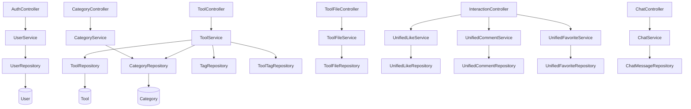
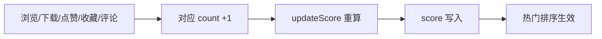
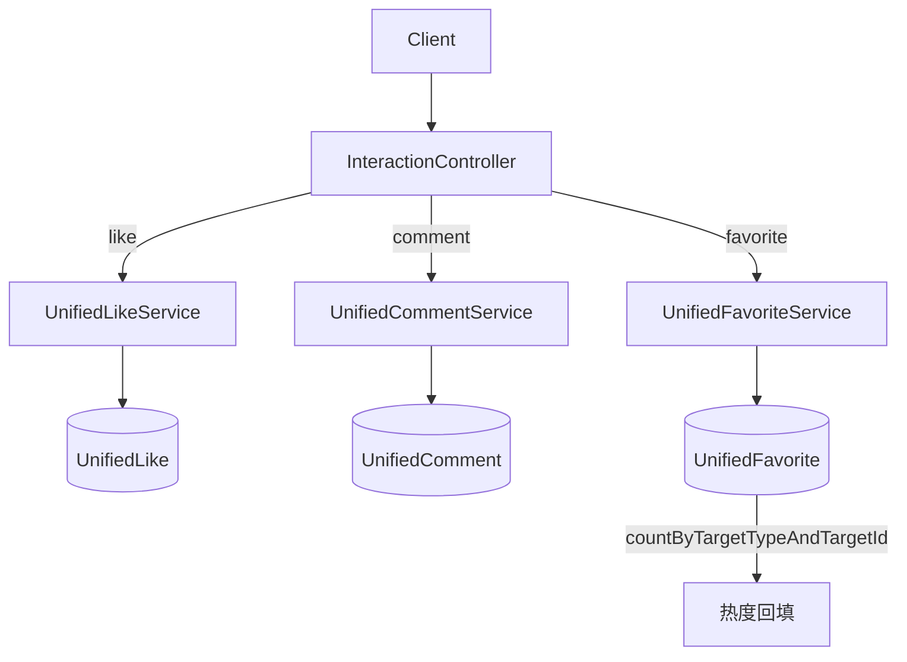

# 核心模块 (backend-core)

核心模块是 CodingHub 后端的基础领域，承载平台最核心的业务能力：用户认证、AI 工具的上传/检索/管理、分类体系、文件托管，以及跨领域的「统一互动」抽象（点赞、评论、收藏）和实时聊天（Chat）。

所有核心实体遵循软删除约定（`status = DELETED`），内容写操作强制 `isOwner || isAdmin` 权限校验，所有写操作禁止返回 `null`（缺失即抛异常）。

## 组件清单

| 层 | 组件 | 职责 |
|----|------|------|
| Controller | `AuthController` | 注册 / 登录 / 刷新令牌 |
| Controller | `ToolController` | 工具 CRUD、置顶、Logo、热门 Top5 |
| Controller | `CategoryController` | 分类管理 |
| Controller | `ToolFileController` | 工具文件上传 / 下载 |
| Controller | `InteractionController` | 统一互动入口（点赞/评论/收藏） |
| Controller | `ChatController` | 实时聊天消息收发 |
| Service | `UserService` | 用户注册、登录、JWT 签发、资料 |
| Service | `ToolService` | 工具检索、增删改、热度分计算 |
| Service | `CategoryService` | 分类树维护 |
| Service | `ToolFileService` | 文件存储、下载计数、清理 |
| Service | `UnifiedLikeService` / `UnifiedCommentService` / `UnifiedFavoriteService` | 统一互动三件套 |
| Service | `ChatService` | 聊天消息持久化与反应 |
| Repository | `UserRepository` / `ToolRepository` / `CategoryRepository` 等 | 数据访问 |
| Model | `User` / `Tool` / `Category` / `ToolFile` / `UnifiedLike` / `UnifiedComment` / `UnifiedFavorite` / `ChatMessage` / `ChatReaction` 等 | 实体 |

## 分层架构



## 关键流程

### 1. 工具热度分（score）

`Tool` 实体在每次互动计数变化时重算 `score`，公式为：

```
score = view ×1 + download ×2 + like ×3 + favorite ×4 + comment ×5
```

`ToolService.getTools(sortBy="hot")` 默认按 `pinned DESC, score DESC` 排序，管理员可置顶（`pinTool` / `unpinTool`，需 `ADMIN` 或 `SUPER_ADMIN`）。



### 2. 工具创建与鉴权

`ToolController.createTool` 校验 `@Valid` 请求体 + `@AuthenticationPrincipal User`，调用 `ToolService.createTool`：

1. 检查同用户同分类下是否重名（`DuplicateResourceException`）
2. 关联 `Category` 与 `Uploader`
3. 处理标签关联（`ToolTag` + `Tag.usageCount++`）
4. 通过 `McpNotificationService.notifyToolCreated` 广播 MCP 事件

更新 / 删除 / 改 Logo 均执行 `isOwner || isAdmin` 校验，删除为软删除（`status = DELETED`）。

### 3. 统一互动抽象

点赞 / 评论 / 收藏通过 `TargetType`（TOOL / FORUM / VIDEO）复用同一套 Repository，实现跨域互动统计：



### 4. 认证与令牌

`AuthController` 暴露 `/register`、`/login`、`/refresh`。注册 ADMIN 角色时返回空 `accessToken` 表示「等待超级管理员审批」。登录签发 JWT（`JwtUtil`，15min 过期，refresh 7 天），令牌经 `JwtAuthenticationFilter` 校验。

## 跨模块依赖

- 标签关联依赖 [标签模块](backend-tag.md) 的 `Tag` / `ToolTag`
- 创建 / 更新工具时调用 [MCP模块](backend-mcp.md) 的 `McpNotificationService` 广播事件
- 文件托管由基础设施层的 `UploadConfig` 提供存储路径
- 实时聊天建立在基础设施层 `WebSocketConfig` 之上

## 约束与约定

- **软删除**：`Tool` / 互动实体删除仅置 `status=DELETED`
- **权限**：`isOwner || isAdmin`，写操作 `@PreAuthorize` 双重保护
- **热度**：所有互动计数变化必须触发 `updateScore()`
- **XSS**：请求体经 [基础设施层](backend-infra.md) 的 `XssSanitizer` 过滤
- **禁止 null**：查询缺失抛 `ResourceNotFoundException` 等
