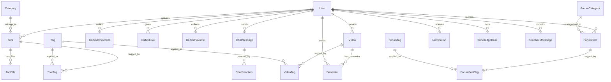

# backend-data 模块文档

## 模块简介

`backend-data` 是 CodingHub 平台的数据持久层模块，位于 `backend/src/main/java/com/iaihub/toolbox/` 下的 `model/` 和 `repository/` 两个包中。该模块基于 **Java Spring Boot + Spring Data JPA (Hibernate)** 构建，负责定义所有业务实体（Entity）及其数据库访问接口（Repository）。

模块共包含 **218 个组件**（33 个 Java 源文件），覆盖以下业务域：

| 业务域 | 包路径 | 核心实体 |
|--------|--------|----------|
| 工具市场 | `model/` | [Tool](../../../backend/src/main/java/com/iaihub/toolbox/model/Tool.java), [Category](../../../backend/src/main/java/com/iaihub/toolbox/model/Category.java), [ToolFile](../../../backend/src/main/java/com/iaihub/toolbox/model/ToolFile.java) |
| 用户系统 | `model/` | [User](../../../backend/src/main/java/com/iaihub/toolbox/model/User.java) |
| 统一互动 | `model/` | [UnifiedComment](../../../backend/src/main/java/com/iaihub/toolbox/model/UnifiedComment.java), [UnifiedLike](../../../backend/src/main/java/com/iaihub/toolbox/model/UnifiedLike.java), [UnifiedFavorite](../../../backend/src/main/java/com/iaihub/toolbox/model/UnifiedFavorite.java) |
| 实时聊天 | `model/` | [ChatMessage](../../../backend/src/main/java/com/iaihub/toolbox/model/ChatMessage.java), [ChatReaction](../../../backend/src/main/java/com/iaihub/toolbox/model/ChatReaction.java) |
| 视频模块 | `model/video/` | [Video](../../../backend/src/main/java/com/iaihub/toolbox/model/video/Video.java), [Danmaku](../../../backend/src/main/java/com/iaihub/toolbox/model/video/Danmaku.java) |
| 论坛模块 | `model/forum/` | [ForumPost](../../../backend/src/main/java/com/iaihub/toolbox/model/forum/ForumPost.java), [ForumCategory](../../../backend/src/main/java/com/iaihub/toolbox/model/forum/ForumCategory.java), [ForumTag](../../../backend/src/main/java/com/iaihub/toolbox/model/forum/ForumTag.java), [ForumPostTag](../../../backend/src/main/java/com/iaihub/toolbox/model/forum/ForumPostTag.java) |
| 标签系统 | `model/tag/` | [Tag](../../../backend/src/main/java/com/iaihub/toolbox/model/tag/Tag.java), [ToolTag](../../../backend/src/main/java/com/iaihub/toolbox/model/tag/ToolTag.java), [VideoTag](../../../backend/src/main/java/com/iaihub/toolbox/model/tag/VideoTag.java) |
| 通知系统 | `model/notification/` | [Notification](../../../backend/src/main/java/com/iaihub/toolbox/model/notification/Notification.java) |
| 知识库 | `model/kb/` | [KnowledgeBase](../../../backend/src/main/java/com/iaihub/toolbox/model/kb/KnowledgeBase.java) |
| 反馈系统 | `model/feedback/` | [FeedbackMessage](../../../backend/src/main/java/com/iaihub/toolbox/model/feedback/FeedbackMessage.java) |

**技术栈**：Jakarta Persistence (JPA 3.x) + Lombok + Spring Data JPA + MySQL

---

## 核心实体关系图 (ER Diagram)



---

## 按业务域分组的实体清单

### 1. 工具市场域

#### Tool（工具）

工具市场的核心实体，代表一个可下载的 AI 工具/Prompt。

| 字段 | 类型 | 约束 | 说明 |
|------|------|------|------|
| id | Long | PK, 自增 | 主键 |
| name | String(100) | NOT NULL | 工具名称 |
| category | [Category](../../../backend/src/main/java/com/iaihub/toolbox/model/Category.java) | FK, NOT NULL, LAZY | 所属分类 |
| content | TEXT | NOT NULL | 工具内容（Prompt 正文） |
| description | String(200) | 可空 | 简短描述 |
| logoUrl | String(512) | 可空 | Logo 图片地址 |
| version | String(50) | NOT NULL, 默认 "1.0.0" | 版本号 |
| uploader | [User](../../../backend/src/main/java/com/iaihub/toolbox/model/User.java) | FK, NOT NULL, LAZY | 上传者 |
| status | [Status](../../../backend/src/main/java/com/iaihub/toolbox/model/Tool.java) 枚举 | NOT NULL, 默认 NORMAL | 软删除标记 |
| viewCount | Integer | 默认 0 | 浏览次数 |
| likeCount | Integer | 默认 0 | 点赞次数 |
| commentCount | Integer | 默认 0 | 评论次数 |
| downloadCount | Integer | 默认 0 | 下载次数 |
| favoriteCount | Integer | 默认 0 | 收藏次数 |
| score | BigDecimal(10,2) | 默认 0 | 综合热度分 |
| pinned | Boolean | NOT NULL, 默认 false | 是否置顶 |
| createdAt | LocalDateTime | NOT NULL, 不可更新 | 创建时间 |
| updatedAt | LocalDateTime | NOT NULL | 更新时间 |

**唯一约束**：`(uploader_id, name, category_id, status)` 联合唯一，防止同一用户在同一分类下重复上传同名工具。

**热度算法**：`score = viewCount*1 + downloadCount*2 + likeCount*3 + favoriteCount*4 + commentCount*5`

**索引**：
- `idx_tool_category` -> (category_id, status)
- `idx_tool_uploader` -> (uploader_id, status)
- `idx_tool_name_status` -> (name, status)
- `idx_tool_version` -> (version)

#### Category（工具分类）

| 字段 | 类型 | 约束 | 说明 |
|------|------|------|------|
| id | Long | PK, 自增 | 主键 |
| name | String(50) | NOT NULL, UNIQUE | 分类名称 |
| icon | String(255) | 可空 | 图标标识 |
| logoUrl | String(512) | 可空 | 分类 Logo |
| sortOrder | Integer | NOT NULL, 默认 0 | 排序权重 |
| createdAt | LocalDateTime | NOT NULL, 不可更新 | 创建时间 |

#### ToolFile（工具附件）

| 字段 | 类型 | 约束 | 说明 |
|------|------|------|------|
| id | Long | PK, 自增 | 主键 |
| toolId | Long | NOT NULL | 关联工具 ID |
| originalName | String(255) | NOT NULL | 原始文件名 |
| storedPath | String(512) | NOT NULL, UNIQUE | 存储路径 |
| fileSize | Long | NOT NULL | 文件大小（字节） |
| contentType | String(100) | 可空 | MIME 类型 |
| downloadCount | Integer | 默认 0 | 下载次数 |
| status | [Status](../../../backend/src/main/java/com/iaihub/toolbox/model/Tool.java) 枚举 | NOT NULL, 默认 NORMAL | 软删除标记 |
| createdAt | LocalDateTime | NOT NULL, 不可更新 | 创建时间 |

---

### 2. 用户系统域

#### User（用户）

| 字段 | 类型 | 约束 | 说明 |
|------|------|------|------|
| id | Long | PK, 自增 | 主键 |
| username | String(100) | NOT NULL, UNIQUE | 登录用户名 |
| password | String(255) | NOT NULL | 加密密码 |
| nickname | String(50) | UNIQUE | 显示昵称 |
| avatarUrl | String(255) | 可空 | 头像地址 |
| bio | String(500) | 可空 | 个人简介 |
| role | [Role](../../../backend/src/main/java/com/iaihub/toolbox/model/Role.java) 枚举 | NOT NULL, 默认 USER | 角色：USER / ADMIN / SUPER_ADMIN |
| status | [AccountStatus](../../../backend/src/main/java/com/iaihub/toolbox/model/AccountStatus.java) 枚举 | NOT NULL, 默认 ACTIVE | 状态：ACTIVE / PENDING / REJECTED / DISABLED |
| lastLoginAt | LocalDateTime | 可空 | 最后登录时间 |
| createdAt | LocalDateTime | NOT NULL, 不可更新 | 创建时间 |
| updatedAt | LocalDateTime | NOT NULL | 更新时间 |

**索引**：
- `idx_user_username` -> (username) UNIQUE
- `idx_user_nickname` -> (nickname) UNIQUE

---

### 3. 统一互动域（多态设计）

本域采用 **多态目标（Polymorphic Target）** 设计，通过 `targetType + targetId` 组合实现对 [Tool](../../../backend/src/main/java/com/iaihub/toolbox/model/Tool.java)、[ForumPost](../../../backend/src/main/java/com/iaihub/toolbox/model/forum/ForumPost.java)、[Video](../../../backend/src/main/java/com/iaihub/toolbox/model/video/Video.java) 三种内容类型的统一评论/点赞/收藏，避免为每种内容类型创建独立的互动表。

`TargetType` 枚举值：`TOOL`、`FORUM_POST`、`VIDEO`

#### UnifiedComment（统一评论）

| 字段 | 类型 | 约束 | 说明 |
|------|------|------|------|
| id | Long | PK, 自增 | 主键 |
| targetType | String(20) | NOT NULL | 目标类型 |
| targetId | Long | NOT NULL | 目标 ID |
| userId | Long | 可空 | 评论者 ID（匿名可空） |
| userName | String(50) | 可空 | 评论者昵称（冗余） |
| parentId | Long | 可空 | 父评论 ID（二级回复） |
| rootId | Long | 可空 | 根评论 ID（楼中楼） |
| content | TEXT | NOT NULL | 评论内容 |
| likeCount | Integer | 默认 0 | 点赞数 |
| createdAt / updatedAt | LocalDateTime | - | 时间戳 |

**索引**：
- `idx_comment_target` -> (target_type, target_id, created_at)
- `idx_comment_root` -> (root_id)

#### UnifiedLike（统一点赞）

| 字段 | 类型 | 约束 | 说明 |
|------|------|------|------|
| id | Long | PK, 自增 | 主键 |
| targetType | String(20) | NOT NULL | 目标类型 |
| targetId | Long | NOT NULL | 目标 ID |
| userId | Long | 可空 | 点赞用户（登录用户） |
| ipHash | String(64) | 可空 | IP 哈希（匿名用户） |
| createdAt | LocalDateTime | - | 创建时间 |

**唯一约束**：
- `uk_like_user` -> (target_type, target_id, user_id) — 登录用户去重
- `uk_like_anon` -> (target_type, target_id, ip_hash) — 匿名用户去重

#### UnifiedFavorite（统一收藏）

| 字段 | 类型 | 约束 | 说明 |
|------|------|------|------|
| id | Long | PK, 自增 | 主键 |
| targetType | String(20) | NOT NULL | 目标类型 |
| targetId | Long | NOT NULL | 目标 ID |
| userId | Long | NOT NULL | 收藏用户（仅登录用户） |
| createdAt | LocalDateTime | - | 创建时间 |

**唯一约束**：`uk_fav` -> (user_id, target_type, target_id)

---

### 4. 实时聊天域

#### ChatMessage（聊天消息）

| 字段 | 类型 | 约束 | 说明 |
|------|------|------|------|
| id | Long | PK, 自增 | 主键 |
| roomId | String(50) | NOT NULL, 默认 "global" | 聊天室 ID |
| userId | Long | 可空 | 发送者 ID |
| displayName | String(100) | NOT NULL | 显示名称 |
| avatarUrl | String(255) | 可空 | 头像 |
| content | TEXT | NOT NULL | 消息内容 |
| status | String(20) | NOT NULL, 默认 "ACTIVE" | 状态（软删除） |
| replyTo | Long | 可空 | 回复的消息 ID |
| edited | Boolean | NOT NULL, 默认 false | 是否已编辑 |
| deletedType | String(10) | 可空 | 删除类型：ADMIN / SELF |
| createdAt | LocalDateTime | NOT NULL, 不可更新 | 创建时间 |

**索引**：`idx_chat_room_status_created` -> (room_id, status, created_at)

#### ChatReaction（消息表情回应）

| 字段 | 类型 | 约束 | 说明 |
|------|------|------|------|
| id | Long | PK, 自增 | 主键 |
| messageId | Long | NOT NULL | 关联消息 ID |
| ownerKey | String(64) | NOT NULL | 操作用户标识 |
| emoji | String(16) | NOT NULL | 表情符号 |
| createdAt | LocalDateTime | NOT NULL, 不可更新 | 创建时间 |

**唯一约束**：`uk_reaction_msg_owner_emoji` -> (message_id, owner_key, emoji)

---

### 5. 视频模块域

#### Video（视频）

| 字段 | 类型 | 约束 | 说明 |
|------|------|------|------|
| id | Long | PK, 自增 | 主键 |
| title | String(200) | NOT NULL | 视频标题 |
| description | TEXT | 可空 | 视频描述 |
| filePath | String(500) | NOT NULL | 文件存储路径 |
| fileName | String(255) | NOT NULL | 文件名 |
| fileSize | Long | NOT NULL | 文件大小 |
| duration | Integer | 默认 0 | 时长（秒） |
| coverUrl | String(500) | 可空 | 封面图 |
| uploaderId | Long | NOT NULL | 上传者 ID |
| status | [VideoStatus](../../../backend/src/main/java/com/iaihub/toolbox/model/video/VideoStatus.java) 枚举 | NOT NULL, 默认 NORMAL | 状态 |
| viewCount / likeCount / commentCount | Integer | 默认 0 | 互动计数 |
| score | BigDecimal(10,2) | 默认 0 | 热度分 |
| pinned | Boolean | NOT NULL, 默认 false | 是否置顶 |
| danmakuEnabled | Boolean | NOT NULL, 默认 true | 是否开启弹幕 |
| createdAt / updatedAt | LocalDateTime | - | 时间戳 |

**热度算法**：`score = viewCount*1 + likeCount*3 + commentCount*5`

**索引**：
- `idx_video_uploader` -> (uploader_id, status)
- `idx_video_status_created` -> (status, created_at DESC)

#### Danmaku（弹幕）

| 字段 | 类型 | 约束 | 说明 |
|------|------|------|------|
| id | Long | PK, 自增 | 主键 |
| videoId | Long | NOT NULL | 关联视频 ID |
| user | [User](../../../backend/src/main/java/com/iaihub/toolbox/model/User.java) | FK, NOT NULL, LAZY | 发送者 |
| content | String(200) | NOT NULL | 弹幕内容 |
| timeSeconds | Double | NOT NULL, 默认 0.0 | 出现时间点（秒） |
| color | String(10) | 默认 "#FFFFFF" | 颜色 |
| danmakuType | String(10) | 默认 "SCROLL" | 类型：SCROLL / TOP / BOTTOM |
| createdAt | LocalDateTime | NOT NULL, 不可更新 | 创建时间 |

---

### 6. 论坛模块域

#### ForumPost（论坛帖子）

| 字段 | 类型 | 约束 | 说明 |
|------|------|------|------|
| id | Long | PK, 自增 | 主键 |
| title | String(200) | NOT NULL | 标题 |
| content | TEXT | NOT NULL | 正文 |
| authorId | Long | NOT NULL | 作者 ID |
| categoryId | Long | NOT NULL | 分类 ID |
| viewCount / likeCount / commentCount | Integer | 默认 0 | 互动计数 |
| status | [ForumPostStatus](../../../backend/src/main/java/com/iaihub/toolbox/model/forum/ForumPostStatus.java) 枚举 | NOT NULL, 默认 NORMAL | 状态：NORMAL / DELETED / HIDDEN |
| visibility | [ForumPostVisibility](../../../backend/src/main/java/com/iaihub/toolbox/model/forum/ForumPostVisibility.java) 枚举 | NOT NULL, 默认 PUBLIC | 可见性：PUBLIC / PRIVATE |
| score | BigDecimal(10,2) | 默认 0 | 热度分 |
| pinned | Boolean | NOT NULL, 默认 false | 是否置顶 |
| createdAt / updatedAt | LocalDateTime | - | 时间戳 |

**索引**：
- `idx_forum_post_author` -> (author_id)
- `idx_forum_post_category` -> (category_id)
- `idx_forum_post_created` -> (created_at)

#### ForumCategory（论坛分类）

| 字段 | 类型 | 约束 | 说明 |
|------|------|------|------|
| id | Long | PK, 自增 | 主键 |
| name | String(50) | NOT NULL, UNIQUE | 分类名 |
| description | String(255) | 可空 | 描述 |
| sortOrder | Integer | 默认 0 | 排序 |
| createdAt | LocalDateTime | - | 创建时间 |

#### ForumTag / ForumPostTag（论坛标签 + 关联表）

- `ForumTag`：id, name (UNIQUE), postCount, isSystem, createdAt
- `ForumPostTag`：复合主键 (post_id, tag_id)，使用 `@IdClass`

---

### 7. 标签系统域

#### Tag（全局标签）

| 字段 | 类型 | 约束 | 说明 |
|------|------|------|------|
| id | Long | PK, 自增 | 主键 |
| name | String(50) | NOT NULL | 标签名 |
| tagType | [TagType](../../../backend/src/main/java/com/iaihub/toolbox/model/tag/TagType.java) 枚举 | NOT NULL | 类型：TOOL / FORUM / VIDEO |
| usageCount | Integer | NOT NULL, 默认 0 | 使用次数 |
| createdAt | LocalDateTime | NOT NULL, 不可更新 | 创建时间 |

**唯一约束**：`uk_name_type` -> (name, tag_type)

#### ToolTag / VideoTag（关联表）

- `ToolTag`：复合主键 (tool_id, tag_id)，`@IdClass`
- `VideoTag`：复合主键 (video_id, tag_id)，`@IdClass`

---

### 8. 通知系统域

#### Notification（通知）

| 字段 | 类型 | 约束 | 说明 |
|------|------|------|------|
| id | Long | PK, 自增 | 主键 |
| user | [User](../../../backend/src/main/java/com/iaihub/toolbox/model/User.java) | FK, NOT NULL, LAZY | 接收者 |
| type | [NotificationType](../../../backend/src/main/java/com/iaihub/toolbox/model/notification/NotificationType.java) 枚举 | NOT NULL | 类型：COMMENT_REPLY / LIKE / ADMIN_APPROVED / ADMIN_REJECTED |
| targetType | String(30) | NOT NULL | 目标类型：TOOL / FORUM_POST / VIDEO |
| targetId | Long | NOT NULL | 目标 ID |
| message | String(500) | NOT NULL | 通知消息 |
| actorId | Long | 可空 | 触发者 ID |
| actorName | String(100) | 可空 | 触发者名称 |
| isRead | Boolean | NOT NULL, 默认 false | 是否已读 |
| createdAt | LocalDateTime | NOT NULL, 不可更新 | 创建时间 |

**索引**：
- `idx_notification_user` -> (user_id)
- `idx_notification_read` -> (is_read)

---

### 9. 知识库域

#### KnowledgeBase（知识库）

| 字段 | 类型 | 约束 | 说明 |
|------|------|------|------|
| id | Long | PK, 自增 | 主键 |
| name | String(100) | NOT NULL | 知识库名称 |
| description | String(500) | 可空 | 描述 |
| ownerId | Long | NOT NULL | 所有者 ID |
| ragCollection | String(100) | NOT NULL | RAG 向量集合标识 |
| status | [KbStatus](../../../backend/src/main/java/com/iaihub/toolbox/model/kb/KbStatus.java) 枚举 | NOT NULL, 默认 NORMAL | 状态 |
| createdAt / updatedAt | LocalDateTime | - | 时间戳 |

**索引**：
- `idx_kb_owner_status` -> (owner_id, status)
- `idx_kb_status_created` -> (status, created_at DESC)
- `idx_kb_name_status` -> (name, status)

---

### 10. 反馈系统域

#### FeedbackMessage（反馈消息）

| 字段 | 类型 | 约束 | 说明 |
|------|------|------|------|
| id | Long | PK, 自增 | 主键 |
| content | TEXT | NOT NULL | 反馈内容 |
| nickname | String(50) | 可空 | 昵称（匿名） |
| contact | String(100) | 可空 | 联系方式 |
| category | [FeedbackCategory](../../../backend/src/main/java/com/iaihub/toolbox/model/feedback/FeedbackCategory.java) 枚举 | NOT NULL, 默认 SUGGESTION | 分类：SUGGESTION / BUG_REPORT / PRAISE / OTHER |
| user | [User](../../../backend/src/main/java/com/iaihub/toolbox/model/User.java) | FK, LAZY | 提交用户（可空） |
| ipHash | String(64) | 可空 | IP 哈希 |
| status | [Status](../../../backend/src/main/java/com/iaihub/toolbox/model/Tool.java) 枚举 | NOT NULL, 默认 NORMAL | 状态 |
| adminReply | TEXT | 可空 | 管理员回复 |
| repliedBy | [User](../../../backend/src/main/java/com/iaihub/toolbox/model/User.java) | FK, LAZY | 回复管理员 |
| repliedAt | LocalDateTime | 可空 | 回复时间 |
| createdAt / updatedAt | LocalDateTime | - | 时间戳 |

**索引**：
- `idx_feedback_status_created` -> (status, created_at DESC)
- `idx_feedback_category_status` -> (category, status, created_at DESC)

---

## Repository 查询模式

### 派生查询（Derived Query Methods）

Spring Data JPA 根据方法名自动生成 SQL，适用于简单条件查询：

```java
// UserRepository
Optional<User> findByUsername(String username);
boolean existsByUsername(String username);
List<User> findByStatus(AccountStatus status);
List<User> findByStatusAndRole(AccountStatus status, Role role);

// UnifiedLikeRepository
boolean existsByTargetTypeAndTargetIdAndUserId(String targetType, Long targetId, Long userId);
void deleteByTargetTypeAndTargetIdAndUserId(String targetType, Long targetId, Long userId);

// VideoRepository
Page<Video> findByStatusOrderByCreatedAtDesc(VideoStatus status, Pageable pageable);
Optional<Video> findByIdAndStatus(Long id, VideoStatus status);
List<Video> findTop20ByStatusOrderByViewCountDesc(VideoStatus status);
```

### @Query 自定义查询

复杂查询使用 JPQL `@Query` 注解，支持动态参数和排序：

```java
// ToolRepository - 多条件筛选 + 分页
@Query("SELECT t FROM Tool t WHERE t.status = 'NORMAL' " +
       "AND (:categoryId IS NULL OR t.category.id = :categoryId) " +
       "AND (:keyword IS NULL OR t.name LIKE %:keyword%) " +
       "ORDER BY t.createdAt DESC")
Page<Tool> findByFilters(@Param("categoryId") Long categoryId,
                          @Param("keyword") String keyword,
                          Pageable pageable);

// ToolRepository - EXISTS 子查询关联标签
@Query("SELECT t FROM Tool t WHERE t.status = 'NORMAL' " +
       "AND EXISTS (SELECT 1 FROM ToolTag tt WHERE tt.toolId = t.id AND tt.tagId = :tagId) " +
       "ORDER BY t.pinned DESC, t.score DESC")
Page<Tool> findByFiltersWithTagOrderByHot(...);

// JOIN FETCH 预加载关联
@Query("SELECT t FROM Tool t JOIN FETCH t.category JOIN FETCH t.uploader " +
       "WHERE t.id = :id AND t.status = 'NORMAL'")
Optional<Tool> findByIdAndStatusNormalWithRelations(@Param("id") Long id);
```

### @Modifying 批量更新

```java
// 置顶/取消置顶
@Modifying @Transactional
@Query("UPDATE Tool t SET t.pinned = true WHERE t.id = :id")
int pinById(@Param("id") Long id);

// 软删除
@Modifying
@Query("UPDATE ChatMessage m SET m.status = 'DELETED' WHERE m.id = :id")
int softDeleteById(@Param("id") Long id);

// 批量标记已读
@Modifying
@Query("UPDATE Notification n SET n.isRead = true WHERE n.user.id = :userId AND n.isRead = false")
void markAllAsRead(@Param("userId") Long userId);
```

### 分页与排序

所有列表查询统一使用 `Pageable` 参数实现分页，排序策略包括：
- **时间排序**：`ORDER BY createdAt DESC`（最新优先）
- **热度排序**：`ORDER BY pinned DESC, score DESC`（置顶优先 + 热度分）
- **名称排序**：`ORDER BY name ASC`（字母序）

### 聚合查询

```java
// 批量统计收藏数
@Query("SELECT f.targetId, COUNT(f) FROM UnifiedFavorite f " +
       "WHERE f.targetType = :targetType AND f.targetId IN :targetIds GROUP BY f.targetId")
List<Object[]> countByTargetTypeAndTargetIdIn(...);

// 未读通知数
@Query("SELECT COUNT(n) FROM Notification n WHERE n.user.id = :userId AND n.isRead = false")
long countUnreadByUserId(@Param("userId") Long userId);
```

---

## 数据库设计要点

### 1. 软删除策略（Status 字段）

所有核心业务实体均采用 **枚举 status 字段** 实现软删除，而非物理删除：

| 实体 | 状态枚举 | 值 |
|------|----------|-----|
| [Tool](../../../backend/src/main/java/com/iaihub/toolbox/model/Tool.java) | [Tool](../../../backend/src/main/java/com/iaihub/toolbox/model/Tool.java).[Status](../../../backend/src/main/java/com/iaihub/toolbox/model/Tool.java) | NORMAL, DELETED |
| [Video](../../../backend/src/main/java/com/iaihub/toolbox/model/video/Video.java) | [VideoStatus](../../../backend/src/main/java/com/iaihub/toolbox/model/video/VideoStatus.java) | NORMAL, DELETED |
| [ForumPost](../../../backend/src/main/java/com/iaihub/toolbox/model/forum/ForumPost.java) | [ForumPostStatus](../../../backend/src/main/java/com/iaihub/toolbox/model/forum/ForumPostStatus.java) | NORMAL, DELETED, HIDDEN |
| [KnowledgeBase](../../../backend/src/main/java/com/iaihub/toolbox/model/kb/KnowledgeBase.java) | [KbStatus](../../../backend/src/main/java/com/iaihub/toolbox/model/kb/KbStatus.java) | NORMAL, DELETED |
| [FeedbackMessage](../../../backend/src/main/java/com/iaihub/toolbox/model/feedback/FeedbackMessage.java) | [FeedbackMessage](../../../backend/src/main/java/com/iaihub/toolbox/model/feedback/FeedbackMessage.java).[Status](../../../backend/src/main/java/com/iaihub/toolbox/model/Tool.java) | NORMAL, DELETED |
| [ChatMessage](../../../backend/src/main/java/com/iaihub/toolbox/model/ChatMessage.java) | String status | "ACTIVE", "DELETED" |
| [User](../../../backend/src/main/java/com/iaihub/toolbox/model/User.java) | [AccountStatus](../../../backend/src/main/java/com/iaihub/toolbox/model/AccountStatus.java) | ACTIVE, PENDING, REJECTED, DISABLED |

查询时统一附加 `status = 'NORMAL'` 条件，确保已删除数据不会被返回。

### 2. 统一时间戳管理

通过 JPA 生命周期回调自动维护时间戳：

```java
@PrePersist
protected void onCreate() {
    createdAt = LocalDateTime.now();
    updatedAt = LocalDateTime.now();
}

@PreUpdate
protected void onUpdate() {
    updatedAt = LocalDateTime.now();
}
```

- `createdAt`：标记 `updatable = false`，创建后不可修改
- `updatedAt`：每次更新自动刷新
- 仅创建型实体（如 [Notification](../../../backend/src/main/java/com/iaihub/toolbox/model/notification/Notification.java)、[Danmaku](../../../backend/src/main/java/com/iaihub/toolbox/model/video/Danmaku.java)）只有 `createdAt`

### 3. 关联策略

| 策略 | 使用场景 | 示例 |
|------|----------|------|
| `@ManyToOne(LAZY)` + `@JoinColumn` | 强关联、需 JOIN 查询 | [Tool](../../../backend/src/main/java/com/iaihub/toolbox/model/Tool.java) -> [Category](../../../backend/src/main/java/com/iaihub/toolbox/model/Category.java), [Tool](../../../backend/src/main/java/com/iaihub/toolbox/model/Tool.java) -> [User](../../../backend/src/main/java/com/iaihub/toolbox/model/User.java), [Notification](../../../backend/src/main/java/com/iaihub/toolbox/model/notification/Notification.java) -> [User](../../../backend/src/main/java/com/iaihub/toolbox/model/User.java) |
| 冗余 ID 字段（无 FK） | 弱关联、多态目标 | [UnifiedComment](../../../backend/src/main/java/com/iaihub/toolbox/model/UnifiedComment.java).userId, [ForumPost](../../../backend/src/main/java/com/iaihub/toolbox/model/forum/ForumPost.java).authorId, [Video](../../../backend/src/main/java/com/iaihub/toolbox/model/video/Video.java).uploaderId |
| `@IdClass` 复合主键 | 多对多关联表 | [ToolTag](../../../backend/src/main/java/com/iaihub/toolbox/model/tag/ToolTag.java)(toolId, tagId), [VideoTag](../../../backend/src/main/java/com/iaihub/toolbox/model/tag/VideoTag.java)(videoId, tagId), [ForumPostTag](../../../backend/src/main/java/com/iaihub/toolbox/model/forum/ForumPostTag.java)(postId, tagId) |

**设计原则**：
- 需要 `JOIN FETCH` 预加载的场景使用 `@ManyToOne` 关联（如 [Tool](../../../backend/src/main/java/com/iaihub/toolbox/model/Tool.java) 详情页需同时加载 [Category](../../../backend/src/main/java/com/iaihub/toolbox/model/Category.java) 和 Uploader）
- 仅需 ID 引用的场景使用冗余字段（如 [UnifiedComment](../../../backend/src/main/java/com/iaihub/toolbox/model/UnifiedComment.java) 只需 userId 做查询条件，无需加载完整 [User](../../../backend/src/main/java/com/iaihub/toolbox/model/User.java) 对象）
- 多态互动表（[UnifiedLike](../../../backend/src/main/java/com/iaihub/toolbox/model/UnifiedLike.java)/Comment/Favorite）通过 `targetType + targetId` 字符串组合实现，避免外键约束限制多态扩展

### 4. 热度分与计数器冗余

[Tool](../../../backend/src/main/java/com/iaihub/toolbox/model/Tool.java)、[Video](../../../backend/src/main/java/com/iaihub/toolbox/model/video/Video.java)、[ForumPost](../../../backend/src/main/java/com/iaihub/toolbox/model/forum/ForumPost.java) 三个内容实体均维护 **冗余计数器**（viewCount, likeCount, commentCount）和 **综合热度分**（score），通过实体方法（如 `incrementViewCount()`）在业务操作时同步更新，避免列表查询时的 COUNT 聚合开销。

### 5. 唯一约束防重

| 约束 | 作用 |
|------|------|
| `uk_tool_uploader_name_category` | 防止同用户同分类下重复工具名 |
| `uk_like_user` / `uk_like_anon` | 防止重复点赞（登录/匿名双通道） |
| `uk_fav` | 防止重复收藏 |
| `uk_reaction_msg_owner_emoji` | 防止重复表情回应 |
| `uk_name_type`（[Tag](../../../backend/src/main/java/com/iaihub/toolbox/model/tag/Tag.java)） | 同类型下标签名唯一 |

---

## 架构热点分析

基于 codebase-memory 的调用图分析（479 节点 / 811 边），模型层的核心热点方法：

| 方法 | Fan-in | 说明 |
|------|--------|------|
| `TargetType.fromString()` | 10 | 多态目标类型解析，被所有互动服务调用 |
| `Tool.updateScore()` | 8 | 热度分计算，被所有计数器方法调用 |
| `Tag.incrementUsage()` | 7 | 标签使用计数，被标签关联服务调用 |
| `ForumPost.updateScore()` | 4 | 论坛帖子热度计算 |
| `Video.updateScore()` | 4 | 视频热度计算 |

---

## 交叉引用

- **[backend-service](backend-service.md)**：Service 层调用本模块的 Repository 接口完成业务逻辑，包括 [ToolService](../../../backend/src/main/java/com/iaihub/toolbox/service/ToolService.java)、[UserService](../../../backend/src/main/java/com/iaihub/toolbox/service/UserService.java)、CommentService、LikeService、FavoriteService、[VideoService](../../../backend/src/main/java/com/iaihub/toolbox/service/video/VideoService.java)、ForumService、[NotificationService](../../../backend/src/main/java/com/iaihub/toolbox/service/notification/NotificationService.java) 等
- 本模块的 Entity 同时作为 Service 层 DTO 转换的数据源，部分场景直接透传实体到 Controller 层

---

## 文件清单

### model/ 目录（33 个文件）

```
model/
├── AccountStatus.java          # 用户账户状态枚举
├── Category.java               # 工具分类实体
├── ChatMessage.java            # 聊天消息实体
├── ChatReaction.java           # 消息表情回应实体
├── Role.java                   # 用户角色枚举
├── TargetType.java             # 多态目标类型枚举
├── Tool.java                   # 工具实体（核心）
├── ToolComment.java            # 工具评论（旧版，已被 UnifiedComment 替代）
├── ToolFile.java               # 工具附件实体
├── ToolLike.java               # 工具点赞（旧版，已被 UnifiedLike 替代）
├── UnifiedComment.java         # 统一评论实体
├── UnifiedFavorite.java        # 统一收藏实体
├── UnifiedLike.java            # 统一点赞实体
├── User.java                   # 用户实体
├── feedback/
│   ├── FeedbackCategory.java   # 反馈分类枚举
│   └── FeedbackMessage.java    # 反馈消息实体
├── forum/
│   ├── ForumCategory.java      # 论坛分类实体
│   ├── ForumPost.java          # 论坛帖子实体
│   ├── ForumPostStatus.java    # 帖子状态枚举
│   ├── ForumPostTag.java       # 帖子-标签关联表
│   ├── ForumPostVisibility.java # 帖子可见性枚举
│   └── ForumTag.java           # 论坛标签实体
├── kb/
│   ├── KbStatus.java           # 知识库状态枚举
│   └── KnowledgeBase.java      # 知识库实体
├── notification/
│   ├── Notification.java       # 通知实体
│   └── NotificationType.java   # 通知类型枚举
├── tag/
│   ├── Tag.java                # 全局标签实体
│   ├── TagType.java            # 标签类型枚举
│   ├── ToolTag.java            # 工具-标签关联表
│   └── VideoTag.java           # 视频-标签关联表
└── video/
    ├── Danmaku.java            # 弹幕实体
    ├── Video.java              # 视频实体
    └── VideoStatus.java        # 视频状态枚举
```

### repository/ 目录（21 个文件）

```
repository/
├── CategoryRepository.java
├── ChatMessageRepository.java
├── ChatReactionRepository.java
├── ToolCommentRepository.java
├── ToolFileRepository.java
├── ToolLikeRepository.java
├── ToolRepository.java
├── UnifiedCommentRepository.java
├── UnifiedFavoriteRepository.java
├── UnifiedLikeRepository.java
├── UserRepository.java
├── feedback/
│   └── FeedbackMessageRepository.java
├── forum/
│   ├── ForumCategoryRepository.java
│   ├── ForumPostRepository.java
│   ├── ForumPostTagRepository.java
│   └── ForumTagRepository.java
├── kb/
│   └── KnowledgeBaseRepository.java
├── notification/
│   └── NotificationRepository.java
├── tag/
│   ├── TagRepository.java
│   ├── ToolTagRepository.java
│   └── VideoTagRepository.java
└── video/
    ├── DanmakuRepository.java
    └── VideoRepository.java
```
