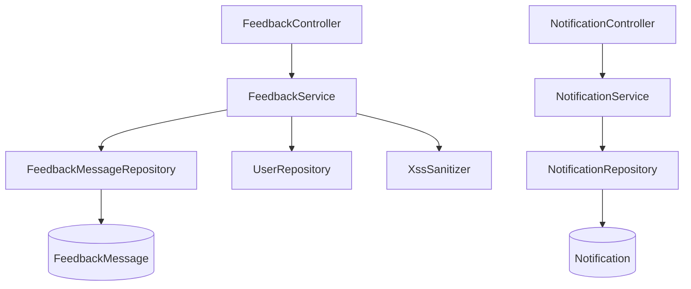

# 反馈与通知模块 (backend-feedback)

该模块包含两个相对独立的能力：**留言反馈**（`feedback` 包）与**通知**（`notification` 包）。反馈允许用户匿名或登录提交留言，管理员可回复；通知负责站内消息推送与未读计数。

## 组件清单

| 层 | 组件 | 职责 |
|----|------|------|
| Controller | `FeedbackController` | `/api/v1/feedback` 留言提交/列表 |
| Controller | `NotificationController` | `/api/v1/notifications` 通知查询/已读 |
| Service | `FeedbackService` | 留言提交、XSS 过滤、IP 哈希、回复 |
| Service | `NotificationService` | 通知创建、未读计数 |
| Repository | `FeedbackMessageRepository` / `NotificationRepository` | 数据访问 |
| Model | `FeedbackMessage` / `Notification` / `FeedbackCategory` | 实体 |

## 分层架构

## 关键设计

### 反馈提交

`FeedbackService.submit` 对所有文本字段（content / nickname / contact）执行 `XssSanitizer.sanitize()`。已登录用户关联 `userId` 并取昵称；匿名用户计算 `ipHash`（SHA-256 of `X-Forwarded-For` 或 remote addr）以限流/去重。`category` 非法时回退为 `SUGGESTION`。

### 管理员回复

`reply(id, adminReply, admin)` 软校验存在性后写入 `adminReply` / `repliedBy` / `repliedAt`，供前端 `FeedbackCard` 展示。

### 通知

`NotificationController` 暴露分页列表、`unread-count`、单条/全部已读。`NotificationService` 在工具被点赞、评论、收藏等互动时由各领域 Service 调用创建。

## 跨模块依赖

- 文本过滤依赖 [基础设施层](backend-infra.md) 的 `XssSanitizer`
- 用户关联依赖 [核心模块](backend-core.md) 的 `User` / `UserRepository`

## 约束

- 提交与列表公开（`SecurityConfig` 中 `permitAll`）
- 列表仅返回 `Status.NORMAL`，删除置 `DELETED`
- 所有用户输入经 XSS 过滤
