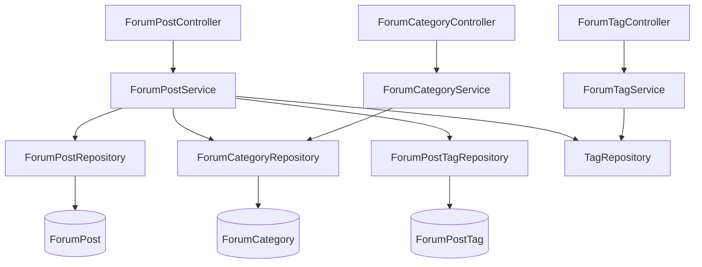

# 论坛模块 (backend-forum)

论坛模块提供社区发帖能力：`ForumPostController` 暴露帖子列表、详情、增删改、置顶与热门 Top5 接口；`ForumPostService` 负责业务编排，依赖 `ForumPostRepository`、`ForumCategoryRepository`、`ForumPostTagRepository` 与共享的 `TagRepository`。

## 组件清单

| 层 | 组件 | 职责 |
|----|------|------|
| Controller | `ForumPostController` | `/api/forum/posts` 帖子 REST 接口 |
| Controller | `ForumCategoryController` | 论坛分类 |
| Controller | `ForumTagController` | 论坛标签 |
| Controller | `PostFavoriteController` | 帖子收藏（`/api/post-favorites`） |
| Service | `ForumPostService` | 帖子检索、增删改、标签关联 |
| Service | `ForumCategoryService` / `ForumTagService` | 分类与标签维护 |
| Repository | `ForumPostRepository` / `ForumCategoryRepository` / `ForumTagRepository` / `ForumPostTagRepository` | 数据访问 |
| Model | `ForumPost` / `ForumCategory` / `ForumTag` / `ForumPostTag` | 实体 |

## 分层架构



## 关键设计

### 热度分公式

`ForumPost.updateScore()` 与核心模块 `Tool` 略有不同（无下载/收藏权重）：

```
score = viewCount ×1 + likeCount ×3 + commentCount ×5
```

`getPostList(sortBy="hot")` 默认按 `score DESC` 排序；`latest` 按创建时间倒序。

### 可见性控制

`ForumPost` 含 `ForumPostVisibility`（PUBLIC / PRIVATE）。私有帖子仅作者与 ADMIN 可查看（`getPostById` 中校验）。软删除通过 `ForumPostStatus.DELETED` 实现。

### 标签关联

发帖/改帖复用 [标签模块](backend-tag.md) 的 `Tag`，通过 `ForumPostTag` 中间表关联，并在变更时维护 `Tag.usageCount`（旧标签 `--`、新标签 `++`）。

## 跨模块依赖

- 标签复用 [标签模块](backend-tag.md) 的 `Tag` / `TagRepository`
- 点赞 / 评论 / 收藏复用 [核心模块](backend-core.md) 的统一互动（`TargetType=FORUM`）
- 置顶操作需 `ADMIN` / `SUPER_ADMIN`（`@PreAuthorize`）

## 约束

- 写操作强制 `isOwner || isAdmin`
- 软删除：`status=DELETED`
- 禁止 null：缺失抛 `ResourceNotFoundException`
