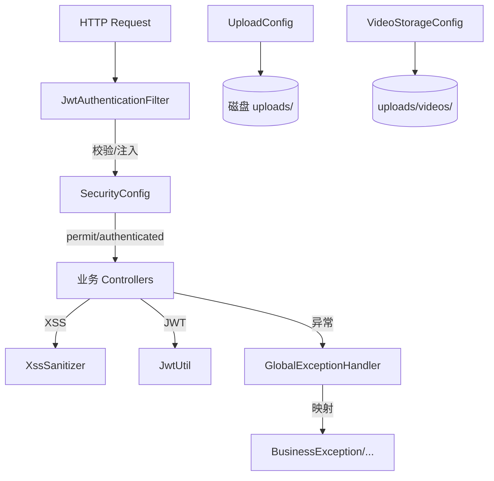

# 基础设施层 (backend-infra)

基础设施层为所有业务模块提供横切能力：Web 安全、JWT 认证、XSS 净化、统一异常处理、文件/视频存储配置、WebSocket 与聊天握手。它是 L0 层（可被任意上层依赖，自身不依赖业务）。

## 组件清单

| 类别 | 组件 | 职责 |
|------|------|------|
| Security | `SecurityConfig` | 过滤器链、CORS、端点授权 |
| Security | `JwtAuthenticationFilter` | 校验 Bearer Token 注入 Principal |
| Config | `McpServerConfig` / `RagClientConfig` / `UploadConfig` / `VideoStorageConfig` / `WebSocketConfig` | 各领域配置 Bean |
| Config | `DataInitializer` | 启动种子数据 |
| Util | `JwtUtil` / `XssSanitizer` / `AvatarUtil` | 工具类 |
| Exception | `GlobalExceptionHandler` + 8 个异常类型 | 统一异常 → HTTP 响应 |

## 分层架构

## 关键设计

### 安全模型

`SecurityConfig` 关闭 CSRF、启用 CORS（允许凭据）、`SessionCreationPolicy.STATELESS`。公开端点（工具/视频/论坛/知识库读、MCP、反馈、聊天历史）`permitAll`；写操作 `authenticated`；审批类 `hasRole("SUPER_ADMIN")`。认证失败返回 `TOKEN_EXPIRED` / `TOKEN_REQUIRED` 区分态。

### JWT

`JwtUtil` 用 HS256（`app.jwt.secret`），签发 access（15min）与 refresh（7d）两类令牌，claim 含 `type`。`JwtAuthenticationFilter` 在 `UsernamePasswordAuthenticationFilter` 前校验并注入 `User` Principal。

### XSS 防护

所有文本写入经 `XssSanitizer.sanitize()`（见 [反馈模块](backend-feedback.md) 等）。

### 异常体系

`GlobalExceptionHandler` 将 `BusinessException`(400) / `ResourceNotFoundException`(404) / `UnauthorizedException`(401) / `ForbiddenException`(403) / `DuplicateResourceException`(409) / `FileValidationException` / `AvatarValidationException` / `UserNotFoundException` 映射为统一 JSON。

## 跨模块依赖

- 被所有业务模块依赖（L0）
- JWT 由 [核心模块](backend-core.md) 的 `UserService` 签发
- 存储配置被 [核心模块](backend-core.md)/[微课模块](backend-video.md) 使用

## 约束

- 全局 STATELESS，无 HttpSession
- CORS 允许凭据，前端同源受限场景需注意
- 所有用户输入必须 XSS 净化
