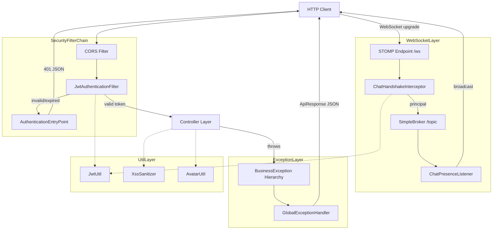
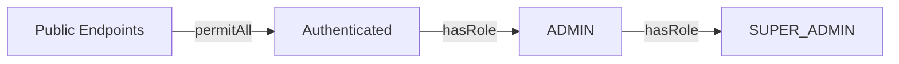
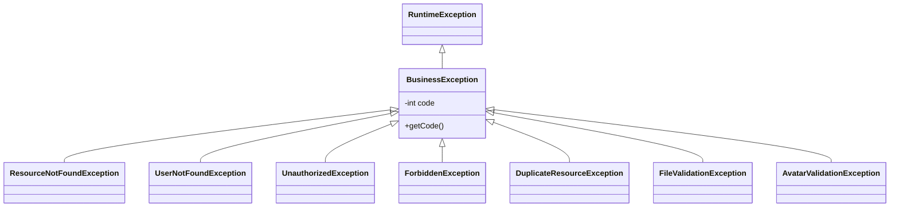

# backend-infra 模块

## 模块简介

`backend-infra` 是 CodingHub 后端的基础设施层，位于 `backend/src/main/java/com/iaihub/toolbox/` 下的 `config/`、`util/`、`exception/` 三个包中，共计 23 个组件。该层为上层业务（[backend-api](backend-api.md)、[backend-service](backend-service.md)）提供横切关注点的统一实现：

- **安全配置**：基于 Spring Security + JWT 的无状态认证过滤链，支持三级权限（USER / ADMIN / SUPER_ADMIN）
- **WebSocket 实时通信**：STOMP 协议聊天系统，支持认证用户与匿名访客
- **全局异常处理**：`@RestControllerAdvice` 统一拦截并标准化错误响应
- **通用工具类**：JWT 令牌操作、XSS 防护、头像文件校验
- **存储与外部服务配置**：文件上传目录管理、MCP Server、RAG 客户端

## 架构总览



## 安全配置详解

### SecurityConfig

**文件**: `config/SecurityConfig.java`

核心设计决策：

| 配置项 | 值 | 说明 |
|--------|------|------|
| CSRF | 禁用 | 无状态 JWT 架构无需 CSRF 保护 |
| Session | STATELESS | 不创建 HttpSession |
| 密码编码 | BCrypt | `PasswordEncoder` Bean |
| CORS | 全放行 | `allowedOriginPatterns("*")`，允许凭证，预检缓存 3600s |

### 权限层级



**公开端点**（无需认证）：
- `/api/v1/auth/**` — 注册/登录/刷新令牌
- `GET /api/v1/tools`、`GET /api/v1/categories`、`GET /api/v1/videos` — 资源浏览
- `/sse/**`、`/mcp/**` — MCP 协议端点
- `/ws/**` — WebSocket 连接
- `GET/POST /api/v1/interactions/likes|comments` — 匿名互动

**ADMIN 端点**：`/api/v1/admin/**`（用户管理）

**SUPER_ADMIN 专属**：`/api/v1/admin/approve/**`、`/api/v1/admin/reject/**`、用户状态变更与删除

### JWT 过滤器链

**文件**: `config/JwtAuthenticationFilter.java`

继承 `OncePerRequestFilter`，执行流程：

1. 从 `Authorization: Bearer <token>` 提取 JWT
2. 调用 `JwtUtil.validateToken()` 校验签名与有效期
3. 若令牌过期 → 设置 `request.setAttribute("jwt.expired", true)`，由 `AuthenticationEntryPoint` 返回 `TOKEN_EXPIRED`
4. 校验 `type` claim 必须为 `"access"`（拒绝 refresh token 直接访问 API）
5. 查询数据库确认用户存在且状态为 `ACTIVE`
6. 构建 `UsernamePasswordAuthenticationToken`，权限为 `ROLE_{role.name()}`

**AuthenticationEntryPoint** 返回结构化 JSON：
- 令牌过期：`{"error":"TOKEN_EXPIRED","message":"Token has expired"}`
- 未认证：`{"error":"TOKEN_REQUIRED","message":"Authentication required"}`

## WebSocket 配置

### WebSocketConfig

**文件**: `config/WebSocketConfig.java`

| 配置 | 值 |
|------|------|
| 协议 | STOMP over WebSocket |
| 端点 | `/ws`（允许所有 Origin） |
| 消息代理 | SimpleBroker，订阅前缀 `/topic` |
| 应用前缀 | `/app`（客户端发送消息目标） |
| 握手处理 | 自定义 `DefaultHandshakeHandler`，从 attributes 提取 `ChatPrincipal` |

### ChatHandshakeInterceptor

**文件**: `config/ChatHandshakeInterceptor.java`

握手阶段完成身份识别：

1. 从 URL 参数 `?token=` 获取 JWT（WebSocket 无法使用 Header 认证）
2. 提取客户端 IP（支持 `X-Forwarded-For`），计算 SHA-256 哈希作为匿名标识
3. 若 JWT 有效且用户 ACTIVE → 构建已认证 `ChatPrincipal`（含 userId、displayName、avatarUrl、admin 标志）
4. 否则 → 构建匿名 Guest Principal（`getName()` 返回 `"guest:{sessionId}"`）
5. 将 principal 和 ipHash 存入 WebSocket session attributes

### ChatPresenceListener

**文件**: `config/ChatPresenceListener.java`

监听 `SessionConnectEvent` / `SessionDisconnectEvent`，维护 `ConcurrentHashMap` 在线会话集合，每次变更向 `/topic/chat.presence` 广播在线人数。

### ChatPrincipal

**文件**: `config/ChatPrincipal.java`

实现 `java.security.Principal`，字段：`userId`、`displayName`、`avatarUrl`、`ipHash`、`admin`、`sessionId`。

## 全局异常处理

### GlobalExceptionHandler

**文件**: `exception/GlobalExceptionHandler.java`

`@RestControllerAdvice` 统一返回 `ApiResponse<Void>` 结构：

| 异常类型 | HTTP 状态码 | 处理方式 |
|----------|------------|----------|
| `BusinessException` | `ex.getCode()` | 直接使用业务码 |
| `MethodArgumentNotValidException` | 400 | 拼接所有 FieldError 消息 |
| `ForbiddenException` | 403 | 权限不足 |
| `IllegalArgumentException` | 400 | 参数非法 |
| `Exception`（兜底） | 500 | 记录 error 日志，返回通用消息 |

### 业务异常体系



| 异常类 | 默认码 | 典型场景 |
|--------|--------|----------|
| `ResourceNotFoundException` | 404 | 工具/视频/帖子不存在 |
| `UserNotFoundException` | 404 | 用户 ID 无效 |
| `UnauthorizedException` | 401 | 令牌无效或权限校验失败 |
| `ForbiddenException` | 403 | 非资源所有者操作 |
| `DuplicateResourceException` | 409 | 用户名/邮箱重复 |
| `FileValidationException` | 400 | 上传文件格式/大小不合规 |
| `AvatarValidationException` | 400 | 头像文件校验失败 |

## 工具类清单

| 类名 | 包 | 职责 |
|------|------|------|
| `JwtUtil` | util | JWT 生成（access/refresh）、解析、校验、过期判断；密钥与过期时间从 `app.jwt.*` 配置注入 |
| `XssSanitizer` | util | HTML 转义 + 移除 `javascript:` / `on*=` 模式，防止存储型 XSS |
| `AvatarUtil` | util | 头像文件扩展名白名单校验（jpg/png/webp/gif）、危险扩展名黑名单（svg/html/js）、MIME 一致性检查、路径安全校验 |

## 其他配置组件

| 类名 | 职责 |
|------|------|
| `UploadConfig` | 文件上传根目录（默认 `~/aifiles`）、大小限制、扩展名白名单、头像子目录自动创建 |
| `VideoStorageConfig` | 视频存储路径（`{baseDir}/uploads/videos`），启动时自动创建目录 |
| `McpServerConfig` | MCP Server 连接参数（端口 8082、最大连接数、超时），绑定 `mcp.server.*` 配置 |
| `RagClientConfig` | 为 RAG 服务创建 HTTP/1.1 `HttpClient` Bean（规避 uvicorn 不支持 HTTP/2 的问题） |
| `DataInitializer` | `CommandLineRunner`，启动时确保 SUPER_ADMIN 账户存在（默认 admin / Cloud@1234） |

## 配置属性速查

```yaml
app:
  jwt:
    secret: <hmac-sha-key>
    access-token-expiration: <ms>
    refresh-token-expiration: <ms>
  upload:
    base-dir: ~/aifiles
    max-file-size: 50MB
    max-request-size: 200MB
    avatar-subdir: avatars
    avatar-max-file-size: 2MB
  super-admin:
    username: admin
    password: Cloud@1234

mcp:
  server:
    port: 8082
    host: 0.0.0.0
    enabled: true
    max-connections: 10
    connection-timeout-ms: 30000
```

## 交叉引用

- [backend-api](backend-api.md) — Controller 层依赖本模块的安全过滤链与异常处理
- [backend-service](backend-service.md) — Service 层抛出 `BusinessException` 子类，由本模块统一捕获
- `JwtUtil` 被 `JwtAuthenticationFilter` 和 `ChatHandshakeInterceptor` 共同依赖
- `UploadConfig` / `VideoStorageConfig` 为文件上传 Service 提供路径与限制参数
