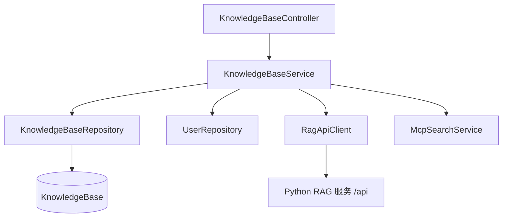
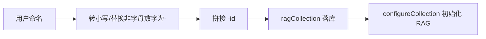

# 知识库模块 (backend-kb)

知识库模块是 CodingHub 与 [RAG服务](rag.md) 的桥接层。后端仅持久化知识库的元数据（`KnowledgeBase`），真实的向量集合、文档切分与语义检索由外部 Python RAG 服务承担，通过 `RagApiClient` 调用。

## 组件清单

| 层 | 组件 | 职责 |
|----|------|------|
| Controller | `KnowledgeBaseController` | `/api/v1/knowledge` 知识库 REST 接口 |
| Service | `KnowledgeBaseService` | CRUD、集合配置、搜索代理 |
| Service | `RagApiClient` | 调用 Python RAG HTTP API |
| Service | `McpSearchService` | 供 MCP 工具调用的搜索代理 |
| Repository | `KnowledgeBaseRepository` | 元数据持久化 |
| Model | `KnowledgeBase` / `KbDocument` / `KbStatus` | 实体 |

## 分层架构

## 关键设计

### 集合命名

创建知识库时，`KnowledgeBaseService` 将中文名转换为 ASCII 安全的 `ragCollection`（zvec 拒绝非 ASCII 名），并追加 `-{id}` 保证唯一：

### 搜索代理

`search(kbId, request)` 经 `RagApiClient` 转发到 RAG 服务，返回 `text / source / score / chunkIndex / contextHeader`，支持 `topK`、`rerank`、`expandContext` 参数。

### RAG 配置容错

`createKnowledgeBase` / `updateKnowledgeBase` 调用 RAG 配置时以 `try/catch` 容忍失败（仅 `log.warn`），保证 MySQL 元数据写入成功。

## 跨模块依赖

- 文档上传/切分/检索在 [RAG服务](rag.md) 完成
- 集合配置可被 [MCP模块](backend-mcp.md) 的 `McpSearchService` 复用
- 权限 `isOwner || isAdmin`

## 约束

- `ragCollection` 必须 ASCII（自动转换）
- 软删除：`status=DELETED`（删除时 best-effort 删除 RAG 集合）
- 禁止 null：缺失抛 `ResourceNotFoundException`
