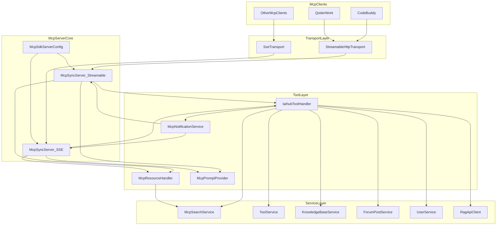

# backend-mcp 模块

## 模块简介

`backend-mcp` 是 CodingHub 后端的 **MCP (Model Context Protocol) 服务端实现**，为 AI Agent（如 CodeBuddy、QoderWork 等 MCP 客户端）提供标准化的工具调用能力。该模块基于 Java MCP SDK 2.0.0 构建，将 CodingHub 工具广场的核心功能（工具搜索/安装/发布、社区论坛、知识库 RAG）封装为 MCP 协议原语，使 AI Agent 无需了解底层 REST API 即可完成复杂的工具管理和知识检索工作流。

**核心能力：**
- 20 个 MCP 工具（Tools）：覆盖工具管理、社区论坛、知识库三大领域
- 3 个 MCP 资源（Resources）：工具目录、最近更新、单工具详情
- 6 个 MCP Prompt 模板：预置工作流引导（安装、发布、更新等）
- 双传输协议支持：Streamable HTTP（/mcp）+ SSE（/sse），兼容新旧客户端
- 实时变更通知：工具增删改时推送 `resources/list_changed` 和 `resources/updated`

**包路径：** `com.iaihub.toolbox.mcp`（6 个 Java 文件，283 个代码节点，854 条依赖边）

## 架构概览

## 核心组件职责

### McpSdkServerConfig（服务器配置与工具注册）

Spring `@Configuration` 类，是整个 MCP 模块的入口和组装中心：

| 职责 | 说明 |
|------|------|
| 传输层配置 | 注册 Streamable HTTP（`/mcp`）和 SSE（`/sse` + `/sse/message`）两种 Servlet |
| 服务器实例化 | 创建两个 `McpSyncServer` Bean（`@Primary` 为 streamable 实例） |
| 工具注册 | `registerAllTools()` 将 20 个工具以 JSON Schema 定义 + Lambda Handler 注册 |
| 资源注册 | `registerAllResources()` 注册 2 个静态资源 + 1 个 Resource Template |
| Prompt 注册 | `registerAllPrompts()` 委托 `McpPromptProvider.buildAll()` 注册 6 个模板 |
| Server Instructions | 在 initialize 握手时向 Agent 发送全局使用指南 |

**关键设计：** 两个 McpSyncServer 实例注册完全相同的工具/资源/Prompt，客户端通过任一传输协议均可获得一致体验。

### IaihubToolHandler（工具调用处理器）

`@Component`，所有 20 个 MCP 工具的实际业务逻辑处理器。每个 `handle*` 方法对应一个工具调用：

- **统一认证模式：** 写操作通过 `username + password` 参数调用 `UserService.login()` 获取用户身份
- **统一响应格式：** `successResult(json)` / `errorResult(message)` 封装为 `McpSchema.CallToolResult`，同时填充 `structuredContent`
- **版本自动递增：** `incrementVersion()` 支持 SemVer 格式（`1.0.0` → `1.0.1`，`1.0.0-beta` → `1.0.1-beta`）
- **变更通知触发：** 工具创建/修改后调用 `McpNotificationService` 推送资源变更

**热点方法（按 fan-in 排序）：**
- `toJson`（fan-in: 21）— 所有响应的 JSON 序列化
- `errorResult` / `successResult`（fan-in: 20）— 统一结果封装
- `handleToolModify`（fan-in: 4）— 最复杂的工具处理逻辑

### McpResourceHandler（资源处理器）

`@Component`，将工具广场数据暴露为 MCP Resource：

| URI | 类型 | 说明 |
|-----|------|------|
| `codinghub://tools/catalog` | 静态资源 | 全量工具摘要（最多 200 条） |
| `codinghub://tools/recent` | 静态资源 | 最近更新的工具（前 20 条） |
| `codinghub://tool/{id}` | Resource Template | 单个工具详情（含浏览数、点赞数、评分） |

### McpPromptProvider（Prompt 模板提供者）

`@Component`，封装 6 个预置工作流 Prompt，让 Agent 获得分步操作指引：

| Prompt 名称 | 功能 | 参数 |
|-------------|------|------|
| `search-tools` | 搜索工具广场 | query（可选） |
| `install-tool` | 安装工具到本地项目 | toolName（必填） |
| `check-versions` | 检查工具版本更新 | 无 |
| `publish-tool` | 发布本地 Skill 到广场 | skillName（必填） |
| `update-tool` | 更新已发布的工具 | skillName（必填），version（可选） |
| `forum-post` | 发帖到论坛 | filePath（可选），title（可选） |

### McpNotificationService（变更通知服务）

`@Service`，工具增删改时向所有已连接 MCP 客户端推送通知：

- `notifyToolCreated` → `list_changed` + `catalog updated` + `tool/{id} updated`
- `notifyToolUpdated` → `list_changed` + `catalog updated` + `tool/{id} updated`
- `notifyToolDeleted` → `list_changed` + `catalog updated`

使用 `@Lazy` 注入 `List<McpSyncServer>` 打破循环依赖。

### McpConnectionManager（已废弃）

`@Deprecated @Component`，早期手动管理 SSE 连接的实现。已被 MCP SDK 内置的 `HttpServletSseServerTransportProvider` 替代，连接生命周期由 SDK 内部管理。保留代码仅供参考。

## MCP 工具清单

### 工具管理（11 个）

| 工具名 | 功能 | 认证 |
|--------|------|------|
| `h3_coding_hub_tool_search` | 搜索工具列表（关键词/分类/标签） | 否 |
| `h3_coding_hub_tool_get` | 获取工具详情（含完整 markdown 文档） | 否 |
| `h3_coding_hub_tool_files` | 获取工具文件下载信息 | 否 |
| `h3_coding_hub_tool_download` | 获取文件下载链接 | 否 |
| `h3_coding_hub_tool_create` | 创建新工具 | 是 |
| `h3_coding_hub_tool_modify` | 修改工具（版本自动递增） | 是 |
| `h3_coding_hub_tool_file_upload` | 获取文件上传 REST 端点信息 | 否 |
| `h3_coding_hub_tool_file_delete` | 删除工具文件 | 是 |
| `h3_coding_hub_post_search` | 搜索社区帖子 | 否 |
| `h3_coding_hub_post_get` | 获取帖子详情 | 否 |
| `h3_coding_hub_post_create` | 创建新帖子 | 是 |

### 知识库 RAG（9 个）

| 工具名 | 功能 | 认证 |
|--------|------|------|
| `h3_coding_hub_kb_list` | 获取知识库列表（分页/排序） | 否 |
| `h3_coding_hub_kb_search` | 语义搜索知识库内容 | 否 |
| `h3_coding_hub_kb_create` | 创建知识库 | 是 |
| `h3_coding_hub_kb_update` | 更新知识库名称/描述 | 是 |
| `h3_coding_hub_kb_delete` | 删除知识库 | 是 |
| `h3_coding_hub_kb_upload_document` | 获取文档批量上传 REST 端点 | 否 |
| `h3_coding_hub_kb_document_status` | 查询文档处理状态 | 否 |
| `h3_coding_hub_kb_get_config` | 获取 RAG 配置 | 否 |
| `h3_coding_hub_kb_configure` | 配置 RAG 参数（分块/重排序等） | 是 |

## 传输协议

| 协议 | 端点 | 适用场景 |
|------|------|----------|
| Streamable HTTP | `POST/GET /mcp` | MCP 协议 2025-03-26，推荐 |
| SSE（旧版） | `GET /sse` + `POST /sse/message` | 兼容不支持 streamable-http 的客户端 |

两种传输均通过 `ServletRegistrationBean` 注册为 Spring Servlet，由 MCP SDK 的 `HttpServletStreamableServerTransportProvider` 和 `HttpServletSseServerTransportProvider` 处理协议细节。

## 关键约束与设计决策

1. **文件传输走 REST：** MCP 协议不传输二进制文件，文件上传/下载通过工具返回 REST 端点由客户端 HTTP 直连完成
2. **认证透传：** 写操作的 `username/password` 由 MCP 客户端传入（对应 CodingHub 平台账号），服务端每次调用 `UserService.login()` 验证
3. **版本号策略：** 遵循 SemVer，创建时取自 `tools.version` 或 SKILL.md frontmatter，修改时不传则自动递增最后一位
4. **双实例注册：** 两个 McpSyncServer 注册相同工具集，确保协议无关性
5. **结构化输出：** 所有工具响应同时填充 `TextContent`（JSON 字符串）和 `structuredContent`（Map），兼容不同客户端解析能力

## 依赖关系

本模块依赖 [backend-service](backend-service.md) 层的以下服务：
- `McpSearchService` — 工具/帖子搜索与查询
- `ToolService` — 工具 CRUD
- `ToolFileService` — 文件管理
- `KnowledgeBaseService` — 知识库管理与 RAG 配置
- `ForumPostService` — 论坛帖子管理
- `UserService` — 用户认证
- `RagApiClient` — RAG 服务 HTTP 客户端
- `TagService` — 标签解析与创建

本模块通过 [backend-api](backend-api.md) 层的 REST 端点提供文件上传/下载能力（MCP 工具返回 URL，客户端直连 API 层）。

## 代码统计

| 指标 | 数值 |
|------|------|
| Java 文件数 | 6 |
| 代码节点总数 | 283 |
| 依赖边总数 | 854 |
| 类数量 | 23（含内部 DTO 类） |
| 方法数量 | 92 |
| 字段数量 | 96 |
| CALLS 关系 | 233 |
| 最高 fan-in 节点 | `SseEmitterEvent.builder`（267，已废弃代码） |
| 活跃最高 fan-in | `toJson`（21） |
