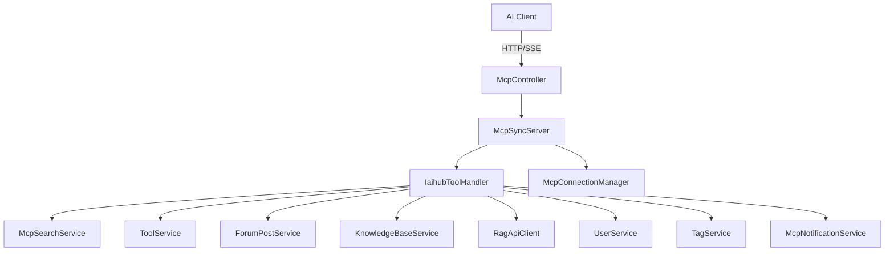

# MCP模块 (backend-mcp)

MCP 模块将 CodingHub 的后端能力以 [Model Context Protocol](https://modelcontextprotocol.io) 暴露给 AI 客户端。`McpController` 提供 `/mcp/health` 健康检查并承载 `McpSyncServer` 的 HTTP/SSE 传输；`IaihubToolHandler` 实现约 18 个工具，覆盖工具/帖子/知识库的搜索与 CRUD、文件上传下载、知识库语义检索与配置。

## 组件清单

| 层 | 组件 | 职责 |
|----|------|------|
| Controller | `McpController` | `/mcp` 端点 + 健康检查 |
| Handler | `IaihubToolHandler` | 18 个工具实现 |
| Manager | `McpConnectionManager` | 连接与会话管理 |
| Config | `McpSdkServerConfig` | MCP SDK 服务端装配 |
| Support | `McpNotificationService` / `McpPromptProvider` / `McpResourceHandler` | 通知/提示/资源 |

## 分层架构

## 关键设计

### 工具清单（约 18 个）

- 工具：`tool_search` / `tool_get` / `tool_files` / `tool_download` / `tool_create` / `tool_modify` / `tool_file_delete` / `tool_file_upload_info`
- 帖子：`post_search` / `post_get` / `post_create`
- 知识库：`kb_list` / `kb_search` / `kb_create` / `kb_update` / `kb_delete` / `kb_upload_document` / `kb_document_status` / `kb_get_config` / `kb_configure`

### MCP 内认证

工具若涉及写操作，由客户端传入 `username` / `password`，`IaihubToolHandler` 调用 `UserService.login` 换取用户身份后执行 `isOwner || isAdmin` 校验（复用各 Service 既有权限逻辑）。

### 版本自增

`handleToolModify` 未传版本号时通过 `incrementVersion("1.0.0" → "1.0.1")` 自动递增最后一位。

### 知识库上传

MCP 不支持二进制传输，因此 `kb_upload_document` 仅返回 RAG 服务的批量上传 URL（含 `ragCollection`），由客户端直接 POST 文件到 [RAG服务](rag.md)。

## 跨模块依赖

- 桥接 [核心模块](backend-core.md) / [论坛模块](backend-forum.md) / [知识库模块](backend-kb.md) / [标签模块](backend-tag.md)
- 事件广播依赖 `McpNotificationService`（被核心模块 `ToolService` 在创建/更新时调用）
- 端点公开无认证（`SecurityConfig` 中 `/mcp/**` 与 `/sse/**` permitAll）

## 约束

- 写操作必须 MCP 内登录 + 权限校验
- 所有工具异常捕获后返回 `isError=true` 的结构化错误
- 知识库上传走 RAG 直连，不经后端
