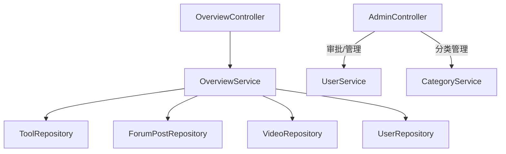

# 概览与统计模块 (backend-overview)

该模块聚合平台全局数据并提供管理能力：`OverviewController` 暴露统计与三类排行接口（只读聚合），`AdminController` 提供用户审批、状态管理、分类管理等后台操作（需 `ADMIN` / `SUPER_ADMIN`）。

## 组件清单

| 层 | 组件 | 职责 |
|----|------|------|
| Controller | `OverviewController` | `/api/overview/stats`、各类 `ranks` |
| Controller | `AdminController` | `/api/v1/admin/**` 用户审批/管理 |
| Service | `OverviewService` | 统计与排行聚合 |
| Service | `OverviewServiceImpl` | 实现类 |

## 分层架构

## 关键设计

### 统计看板

`OverviewService.getStats()` 聚合 `Tool / ForumPost / Video / User` 总量与近 7 日新增；`getToolRanks` / `getPostRanks` / `getVideoRanks` 分别按 `score DESC` 返回 Top N，驱动首页 `OverviewPage` 与 `ToolRankList` / `PostRankList` / `VideoRankList`。

### 后台审批

`AdminController` 的审批端点（`/approve/**`、`/reject/**`、`/pending-users`）限定 `SUPER_ADMIN`；其余 `/admin/**` 需 `ADMIN` 或 `SUPER_ADMIN`（见 [基础设施层](backend-infra.md) 的 `SecurityConfig`）。

## 跨模块依赖

- 统计查询依赖核心/论坛/微课的 Repository
- 审批操作复用 [核心模块](backend-core.md) 的 `UserService` / `User`

## 约束

- 统计接口只读、公开可读（`permitAll`）
- 管理操作强制角色校验（`@PreAuthorize` + `SecurityConfig`）
