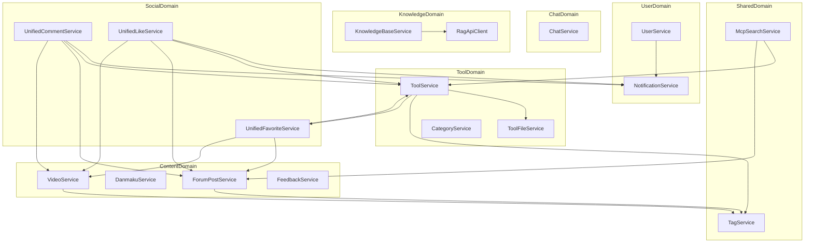
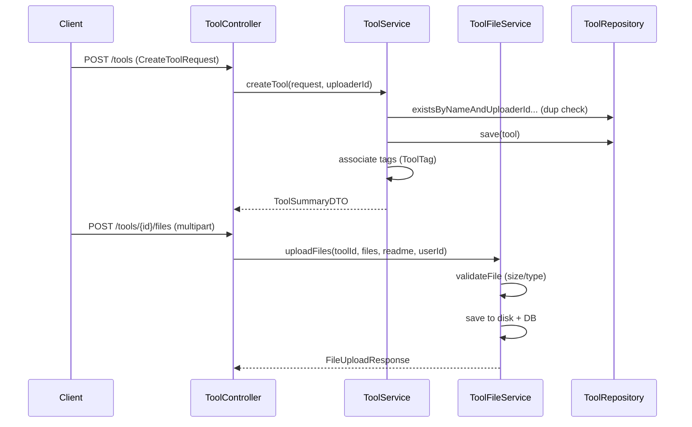

# backend-service 模块文档

## 模块简介

`backend-service` 是 CodingHub 平台的**业务逻辑层**，位于 `backend/src/main/java/com/iaihub/toolbox/service/` 目录下，包含 21 个 Java 文件和 6 个子包，共计约 207 个组件（类、方法、字段）。该层承载所有核心业务规则，向上为 Controller（[backend-api](backend-api.md)）提供业务接口，向下依赖 Repository（[backend-data](backend-data.md)）完成数据持久化，同时通过 `RagApiClient` 与外部 RAG 服务集成，为 MCP 工具层（[backend-mcp](backend-mcp.md)）提供搜索能力。

**技术栈**：Spring Boot + Spring Data JPA + Spring WebSocket (STOMP) + Java HttpClient

**核心职责**：
- 工具（[Tool](../../../backend/src/main/java/com/iaihub/toolbox/model/Tool.java)）全生命周期管理：CRUD、文件上传/下载、标签关联、热门排序
- 用户认证与授权：注册/登录/JWT 令牌/角色审批
- 统一社交互动：评论、点赞、收藏（跨工具/帖子/视频三种目标类型）
- 实时聊天系统：WebSocket 消息推送、表情回应、编辑/撤回
- 知识库代理：对接 RAG 服务实现语义搜索
- 内容管理：视频上传/弹幕、论坛帖子、反馈收集、通知推送

---

## 架构总览



---

## 按业务域分组说明

### 1. 工具管理域

| 类名 | 职责 |
|------|------|
| `ToolService` | 工具 CRUD、分页查询、热门排序、置顶、浏览量统计 |
| `ToolFileService` | 工具附件上传/下载/删除、文件校验、下载计数 |
| `CategoryService` | 工具分类管理 |

**[ToolService](../../../backend/src/main/java/com/iaihub/toolbox/service/ToolService.java) 核心方法**：

- `getTools(categoryId, keyword, tagId, sortBy, page, size)` — 多条件分页查询，支持 `hot`/`latest`/`name` 三种排序
- `createTool(request, uploaderId)` — 创建工具，校验同用户同分类下名称唯一性，关联标签
- `updateTool(id, request, user)` — 更新工具，权限校验（所有者或管理员），标签替换（先删后增）
- `deleteTool(id, user)` — 软删除（status=DELETED），同时清理关联文件
- `getToolById(id)` — 获取详情并自增浏览量
- `pinTool(id)` / `unpinTool(id)` — 管理员置顶/取消置顶

**[ToolFileService](../../../backend/src/main/java/com/iaihub/toolbox/service/ToolFileService.java) 核心方法**：

- `uploadFiles(toolId, files, readme, userId)` — 批量上传附件（单文件 50MB 上限，总请求 200MB 上限），同名文件自动替换
- `downloadFile(toolId, fileId)` — 下载文件并原子性递增下载计数
- `cleanupToolFiles(toolId)` — 工具删除时清理所有物理文件和数据库记录

### 2. 用户与认证域

| 类名 | 职责 |
|------|------|
| `UserService` | 注册/登录/JWT 刷新/个人资料/头像/密码/管理员审批 |
| `NotificationService` | 通知创建/查询/已读标记 |

**[UserService](../../../backend/src/main/java/com/iaihub/toolbox/service/UserService.java) 核心方法**：

- `register(request)` — 注册，USER 角色直接激活返回令牌；ADMIN 角色进入 PENDING 状态等待超管审批
- `login(request)` — 登录，校验密码和账号状态（PENDING/REJECTED/DISABLED 均拒绝）
- `refreshToken(refreshToken)` — 刷新 Access Token
- `uploadAvatar(userId, file)` — 头像上传（校验格式和大小），删旧写新，返回带时间戳的 URL
- `approveUser(userId)` / `rejectUser(userId)` — 超管审批 ADMIN 注册申请，触发通知

**权限模型**：
- 角色：`USER` / `ADMIN` / `SUPER_ADMIN`
- 账号状态：`ACTIVE` / `PENDING` / `REJECTED` / `DISABLED`
- 资源操作权限：所有者 OR 管理员（ADMIN/SUPER_ADMIN）

### 3. 社交互动域

| 类名 | 职责 |
|------|------|
| `UnifiedCommentService` | 统一评论（支持嵌套回复），跨 TOOL/FORUM_POST/VIDEO |
| `UnifiedLikeService` | 统一点赞（支持登录用户和匿名 IP），Toggle 模式 |
| `UnifiedFavoriteService` | 统一收藏（仅登录用户），Toggle 模式 |

**统一设计模式**：三个 Service 均通过 `TargetType` 枚举（`TOOL` / `FORUM_POST` / `VIDEO`）实现多态分发，使用 `switch` 表达式按目标类型路由到对应 Repository 操作。

**[UnifiedCommentService](../../../backend/src/main/java/com/iaihub/toolbox/service/UnifiedCommentService.java)**：
- `addComment(targetType, targetId, userId, userName, content, parentId)` — 发表评论/回复，XSS 过滤，自动递增目标 commentCount，触发 COMMENT_REPLY 通知
- `getComments(targetType, targetId, page, size)` — 分页获取评论列表
- `getMyComments(userId, page, size)` — 我的评论，解析目标标题，跳过已软删除目标
- `deleteComment(commentId, userId, isAdmin)` — 删除评论并递减计数

**[UnifiedLikeService](../../../backend/src/main/java/com/iaihub/toolbox/service/UnifiedLikeService.java)**：
- `toggleLike(targetType, targetId, userId, ipHash)` — 切换点赞状态，登录用户按 userId、匿名用户按 ipHash 去重
- `getLikeStatus(targetType, targetId, userId, ipHash)` — 查询点赞状态
- `getMyLikes(targetType, userId, page, size)` — 我的点赞列表，返回实际资源 DTO

**[UnifiedFavoriteService](../../../backend/src/main/java/com/iaihub/toolbox/service/UnifiedFavoriteService.java)**：
- `toggleFavorite(targetType, targetId, userId)` — 切换收藏状态（需登录）
- `getMyFavorites(targetType, userId, page, size)` — 我的收藏列表
- 收藏 TOOL 时同步更新工具级反规范化计数器

### 4. 聊天系统域

| 类名 | 职责 |
|------|------|
| `ChatService` | WebSocket 实时聊天：消息发送/历史/编辑/撤回/表情回应/输入状态 |

**核心机制**：
- **传输层**：Spring WebSocket + STOMP，通过 `SimpMessagingTemplate` 广播到 `/topic/chat.{roomId}`
- **频率限制**：ConcurrentHashMap 记录每用户/IP 最后发送时间，间隔 < 2s 拒绝
- **消息长度**：最大 1000 字，XSS 过滤
- **编辑/撤回窗口**：5 分钟内可操作，超时拒绝
- **表情回应**：Toggle 模式，按 ownerKey（userId 或 ipHash）+ emoji 去重
- **输入状态**：ScheduledExecutorService 实现 4 秒超时自动清除
- **游客支持**：未登录用户须提供昵称，以 ipHash 作为身份标识

**消息状态**：`ACTIVE` / `DELETED`（deletedType: `ADMIN` / `SELF`）

### 5. 知识库代理域

| 类名 | 职责 |
|------|------|
| `KnowledgeBaseService` | 知识库 CRUD、语义搜索代理、Collection 配置管理 |
| `RagApiClient` | 封装对 RAG 微服务的 HTTP 调用 |

**[KnowledgeBaseService](../../../backend/src/main/java/com/iaihub/toolbox/service/kb/KnowledgeBaseService.java) 核心方法**：
- `createKnowledgeBase(request, user)` — 创建知识库，生成 ASCII 安全的 ragCollection 名称（`{safeName}-{id}`），调用 RAG 初始化配置
- `search(kbId, request)` — 语义搜索代理，转发到 RAG `/api/collections/{name}/search`
- `configureCollection(kbId, config, user)` — 更新分块配置（chunk_mode/chunk_size/chunk_overlap/rerank）
- `deleteKnowledgeBase(id, user)` — 软删除 + 尽力删除 RAG Collection

**[RagApiClient](../../../backend/src/main/java/com/iaihub/toolbox/service/RagApiClient.java) 接口**：
- `PUT /api/collections/{name}/config` — 配置 Collection
- `GET /api/collections/{name}/config` — 获取配置
- `DELETE /api/collections/{name}` — 删除 Collection（best-effort）
- `POST /api/collections/{name}/search` — 语义搜索（60s 超时）
- `GET /api/collections/{name}/documents/status` — 文档状态查询

### 6. 内容管理域

| 类名 | 职责 |
|------|------|
| `VideoService` | 视频上传/列表/详情/更新/删除/封面/流式播放 |
| `DanmakuService` | 弹幕发送与查询 |
| `ForumPostService` | 论坛帖子 CRUD、置顶、可见性控制 |
| `ForumCategoryService` | 论坛分类管理 |
| `ForumTagService` | 论坛标签管理 |
| `FeedbackService` | 用户反馈提交与管理 |

**[VideoService](../../../backend/src/main/java/com/iaihub/toolbox/service/video/VideoService.java)**：
- `uploadVideo(file, title, description, uploaderId, tagIds)` — 仅支持 MP4，上限 1GB，先存临时目录再移动到 `uploads/videos/{userId}/{videoId}/original.mp4`
- `getVideoDetail(id, currentUserId)` — 递增观看次数，返回用户点赞/收藏状态
- `uploadCover(videoId, userId, file)` — 封面上传（JPEG/PNG，5MB 上限）
- 排序：`hot`（pinned DESC, score DESC）/ `latest`（createdAt DESC）

**[DanmakuService](../../../backend/src/main/java/com/iaihub/toolbox/service/video/DanmakuService.java)**：
- `sendDanmaku(videoId, userId, request)` — 发送弹幕（XSS 过滤），支持颜色/类型/时间轴定位
- `getDanmakuByVideoId(videoId)` — 获取视频全部弹幕

**[ForumPostService](../../../backend/src/main/java/com/iaihub/toolbox/service/forum/ForumPostService.java)**：
- `createPost(authorId, request)` — 发帖，支持 PUBLIC/PRIVATE 可见性
- `getPostById(id, currentUser)` — 查看帖子（私有帖仅作者和管理员可见），递增浏览量
- 置顶/热门 Top5/标签关联

### 7. 共享服务域

| 类名 | 职责 |
|------|------|
| `TagService` | 标签 CRUD、按类型查询、热门标签、批量解析创建 |
| `McpSearchService` | 为 MCP 工具层提供工具和帖子搜索 |
| `OverviewService` / `OverviewServiceImpl` | 平台概览统计 |

**[TagService](../../../backend/src/main/java/com/iaihub/toolbox/service/tag/TagService.java)**：
- `resolveOrCreateTags(names, tagType)` — 批量解析标签名，不存在则自动创建，处理并发唯一约束冲突（捕获 `DataIntegrityViolationException` 后回退查询）
- `getHotTags(type, limit)` — 按 usageCount 降序取热门标签
- 标签类型（[TagType](../../../backend/src/main/java/com/iaihub/toolbox/model/tag/TagType.java)）区分 TOOL / VIDEO / FORUM 等

**[McpSearchService](../../../backend/src/main/java/com/iaihub/toolbox/service/McpSearchService.java)**：
- `searchTools(query, category, tag, limit)` — 工具搜索，支持标签过滤，批量获取标签避免 N+1
- `searchPosts(query, limit)` — 帖子搜索
- 为 [backend-mcp](backend-mcp.md) 的 MCP [Tool](../../../backend/src/main/java/com/iaihub/toolbox/model/Tool.java) 提供底层检索能力

---

## 关键业务流程

### 工具发布流程



### 热门排序算法

所有支持热门排序的实体（[Tool](../../../backend/src/main/java/com/iaihub/toolbox/model/Tool.java)、[ForumPost](../../../backend/src/main/java/com/iaihub/toolbox/model/forum/ForumPost.java)、[Video](../../../backend/src/main/java/com/iaihub/toolbox/model/video/Video.java)）使用统一的加权评分公式：

```
score = viewCount * 1 + downloadCount * 2 + likeCount * 3 + favoriteCount * 4 + commentCount * 5
```

- 每次互动操作（浏览/下载/点赞/收藏/评论）触发 `incrementXxx()` 方法
- `incrementXxx()` 内部调用 `updateScore()` 实时重算分数
- 列表查询默认按 `pinned DESC, score DESC` 排序（置顶优先，分数次之）
- 管理员可通过 `pinTool`/`pinPost`/`pinVideo` 手动置顶

### 用户注册审批流程

1. 用户注册时选择角色（USER/ADMIN）
2. USER 角色：直接激活，返回 JWT 令牌
3. ADMIN 角色：状态设为 PENDING，不返回令牌
4. SUPER_ADMIN 在管理后台查看待审批列表（`getPendingUsers`）
5. 审批通过（`approveUser`）：状态改为 ACTIVE，发送 ADMIN_APPROVED 通知
6. 审批拒绝（`rejectUser`）：状态改为 REJECTED，发送 ADMIN_REJECTED 通知

---

## 事务与异常处理模式

### 事务管理

- **写操作**：所有修改方法标注 `@Transactional`（如 createTool、updateTool、deleteTool、toggleLike）
- **只读查询**：标注 `@Transactional(readOnly = true)`（如 getTools、getComments、getHistory）
- **通知发送**：采用 best-effort 模式，`try-catch` 包裹通知调用，失败仅记 warn 日志不回滚主事务

### 异常体系

| 异常类 | HTTP 状态码 | 使用场景 |
|--------|------------|----------|
| `ResourceNotFoundException` | 404 | 资源不存在或已软删除 |
| `ForbiddenException` | 403 | 无权操作（非所有者且非管理员） |
| `DuplicateResourceException` | 409 | 名称重复（工具/知识库/用户名/昵称） |
| `UnauthorizedException` | 401 | 认证失败（密码错误/令牌无效） |
| `BusinessException` | 自定义 | 通用业务错误（如"收藏需要登录"） |
| `FileValidationException` | 400 | 文件校验失败（大小/格式） |
| `AvatarValidationException` | 400 | 头像校验失败 |

### 通用模式

- **软删除**：[Tool](../../../backend/src/main/java/com/iaihub/toolbox/model/Tool.java)/[Video](../../../backend/src/main/java/com/iaihub/toolbox/model/video/Video.java)/[ForumPost](../../../backend/src/main/java/com/iaihub/toolbox/model/forum/ForumPost.java)/[KnowledgeBase](../../../backend/src/main/java/com/iaihub/toolbox/model/kb/KnowledgeBase.java) 均使用 status 字段标记删除，查询时过滤
- **权限校验**：`isOwner || isAdmin` 二元判断，管理员包含 ADMIN 和 SUPER_ADMIN
- **XSS 防护**：所有用户输入通过 `XssSanitizer.sanitize()` 过滤
- **反规范化计数**：likeCount/commentCount/downloadCount/favoriteCount 冗余存储在目标实体上，避免 COUNT 查询
- **懒加载处理**：使用 `Hibernate.initialize()` 显式初始化 LAZY 关联（[Category](../../../backend/src/main/java/com/iaihub/toolbox/model/Category.java)、Uploader）

---

## 热点方法（按 Fan-in 排序）

基于代码图分析，以下方法被调用次数最多，是系统的核心路径：

| 方法 | Fan-in | 说明 |
|------|--------|------|
| `UnifiedLikeService.getLikeCount` | 22 | 点赞计数查询，被列表/详情/状态接口广泛调用 |
| `UnifiedCommentService.addComment` | 21 | 评论入口，三种目标类型共用 |
| `UserService.login` | 17 | 登录核心路径 |
| `UnifiedLikeService.toggleLike` | 16 | 点赞切换 |
| `ToolService.getTools` | 14 | 工具列表查询 |
| `FeedbackService.delete` | 13 | 反馈删除 |
| `ToolFileService.uploadFiles` | 13 | 文件上传 |
| `TagService.resolveOrCreateTags` | 13 | 标签解析（MCP 调用入口） |
| `ToolService.updateTool` | 12 | 工具更新 |
| `ToolService.createTool` | 11 | 工具创建 |

---

## 目录结构

```
service/
├── ToolService.java              # 工具 CRUD 与排序
├── ToolFileService.java          # 工具附件管理
├── CategoryService.java          # 工具分类
├── UserService.java              # 用户认证与管理
├── ChatService.java              # WebSocket 实时聊天
├── UnifiedCommentService.java    # 统一评论
├── UnifiedLikeService.java       # 统一点赞
├── UnifiedFavoriteService.java   # 统一收藏
├── McpSearchService.java         # MCP 搜索服务
├── RagApiClient.java             # RAG 微服务 HTTP 客户端
├── OverviewService.java          # 概览统计接口
├── OverviewServiceImpl.java      # 概览统计实现
├── feedback/
│   └── FeedbackService.java      # 用户反馈
├── forum/
│   ├── ForumPostService.java     # 论坛帖子
│   ├── ForumCategoryService.java # 论坛分类
│   └── ForumTagService.java      # 论坛标签
├── kb/
│   └── KnowledgeBaseService.java # 知识库代理
├── notification/
│   └── NotificationService.java  # 通知服务
├── tag/
│   └── TagService.java           # 统一标签管理
└── video/
    ├── VideoService.java         # 视频管理
    └── DanmakuService.java       # 弹幕服务
```

---

## 交叉引用

- **[backend-api](backend-api.md)** — Controller 层，调用本模块 Service 完成请求处理
- **[backend-data](backend-data.md)** — Repository 层与实体模型，本模块通过 Repository 接口访问数据
- **[backend-mcp](backend-mcp.md)** — MCP 工具层，通过 [McpSearchService](../../../backend/src/main/java/com/iaihub/toolbox/service/McpSearchService.java) 和 [KnowledgeBaseService](../../../backend/src/main/java/com/iaihub/toolbox/service/kb/KnowledgeBaseService.java) 暴露 AI 工具能力
