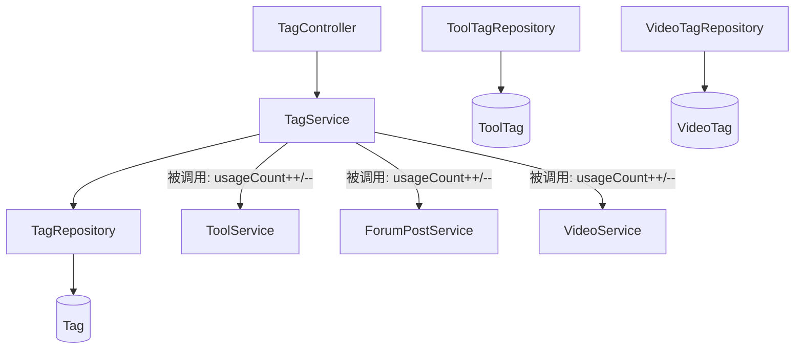

# 标签模块 (backend-tag)

标签模块提供**统一标签**能力，通过 `TagType`（TOOL / FORUM / VIDEO）区分领域，被 [核心模块](backend-core.md)、[论坛模块](backend-forum.md)、[微课模块](backend-video.md) 复用，实现跨域标签聚合与热门排序。

## 组件清单

| 层 | 组件 | 职责 |
|----|------|------|
| Controller | `TagController` | `/api/v1/tags` 标签查询 |
| Service | `TagService` | 标签解析/创建、用量增减 |
| Repository | `TagRepository` / `ToolTagRepository` / `VideoTagRepository` | 数据访问 |
| Model | `Tag` / `ToolTag` / `VideoTag` | 实体 |

## 分层架构

## 关键设计

### 统一标签模型

单一 `Tag` 表 + `tagType` 字段区分领域，避免重复建表。`ToolTag` / `VideoTag` 为关联中间表（论坛通过 `ForumPostTag` 关联，见 [论坛模块](backend-forum.md)）。

### 并发安全的标签解析

`resolveOrCreateTags(names, tagType)` 按名查找，缺失则创建；捕获 `DataIntegrityViolationException` 后回退查询，处理并发创建唯一约束冲突。

### 用量统计

`incrementUsage` / `decrementUsage` 维护 `usageCount`，供 `getHotTags(type, limit)` 按 `usageCount DESC` 排序返回热门标签。

## 跨模块依赖

- 被核心/论坛/微课模块在标签关联变更时调用
- 热门标签展示于各模块首页（[前端页面](frontend-pages.md)）

## 约束

- 标签名 + tagType 唯一
- 删除标签需同步清理关联中间表（中间表 ON DELETE 级联或手动清理）
