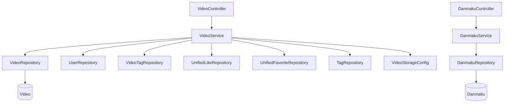

# 微课模块 (backend-video)

微课模块管理 AI 教学视频：`VideoController` 提供视频与弹幕 REST 接口，`VideoService` 负责上传（MP4、≤1GB）、流式播放、封面管理、标签关联与软删除。`DanmakuService` 处理弹幕。

## 组件清单

| 层 | 组件 | 职责 |
|----|------|------|
| Controller | `VideoController` | `/api/v1/videos` 视频接口 |
| Controller | `DanmakuController` | 弹幕接口 |
| Service | `VideoService` | 上传、播放、封面、标签、软删除 |
| Service | `DanmakuService` | 弹幕增查 |
| Repository | `VideoRepository` / `DanmakuRepository` | 数据访问 |
| Model | `Video` / `VideoComment` / `VideoLike` / `VideoFavorite` / `Danmaku` | 实体 |

## 分层架构

## 关键流程

### 视频上传

1. 校验 MP4 格式与 ≤1GB 大小
2. 先落临时目录，保存实体拿到 `videoId` 后再 `Files.move` 到 `uploads/videos/{userId}/{videoId}/original.mp4`
3. 关联标签（`VideoTag` + `Tag.usageCount++`）

### 流式播放

`getVideoFilePath` / `streamVideo` 通过 `VideoStorageConfig.getUploadBaseDir()` 拼接 `filePath` 解析本地文件，供 Controller 流式返回。

### 互动与热度

点赞/收藏复用 [核心模块](backend-core.md) 的 `UnifiedLike` / `UnifiedFavorite`（`TargetType=VIDEO`）。播放详情页会回填当前用户的 `userLiked` / `userFavorited` 状态。热度分沿用 `pinned DESC, score DESC`（与 [Tool](../../../backend/src/main/java/com/iaihub/toolbox/model/Tool.java) 同公式）。

### 弹幕

`Danmaku` 记录时间点与文本内容，前端 `DanmakuPlayer` 渲染。

## 跨模块依赖

- 标签复用 [标签模块](backend-tag.md)
- 点赞/收藏复用 [核心模块](backend-core.md) 统一互动
- 存储路径由 [基础设施层](backend-infra.md) 的 `VideoStorageConfig` 提供

## 约束

- 格式/大小校验失败抛 `IllegalArgumentException`
- 写操作 `isOwner || isAdmin`
- 软删除：`status=DELETED`（[VideoStatus](../../../backend/src/main/java/com/iaihub/toolbox/model/video/VideoStatus.java)）
