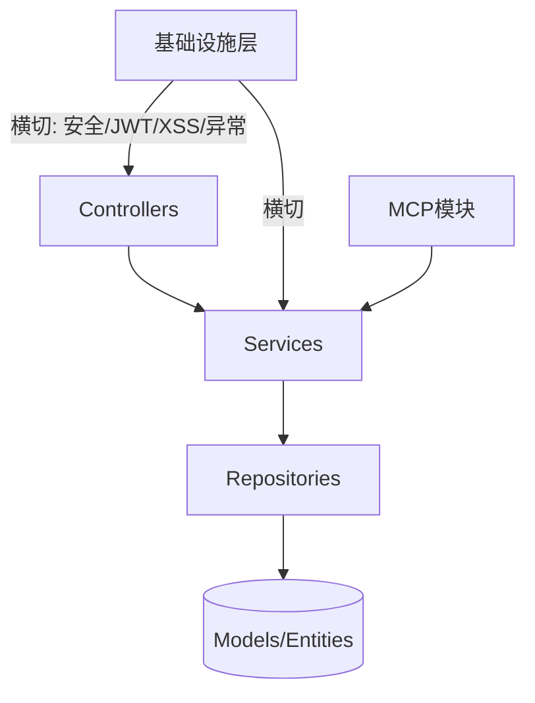

# 后端服务 (backend)

后端是基于 Spring Boot 3.2.5（Java 17）的单体服务，监听 `8082`，对外暴露 REST API（`/api/v1/**`、`/api/forum/**`、`/api/overview`）与 MCP（`/mcp`）。整体遵循单向分层：**Controller → Service → Repository → Model**，禁止循环依赖。

## 模块组成

| 子模块 | 文档 | 说明 |
|--------|------|------|
| 核心模块 | [backend-core.md](backend-core.md) | 认证、工具CRUD、分类、文件、统一互动、聊天 |
| 论坛模块 | [backend-forum.md](backend-forum.md) | 帖子、分类、标签、收藏 |
| 微课模块 | [backend-video.md](backend-video.md) | 视频上传/播放/弹幕 |
| 知识库模块 | [backend-kb.md](backend-kb.md) | RAG 知识库桥接 |
| 反馈与通知 | [backend-feedback.md](backend-feedback.md) | 留言、通知 |
| 标签模块 | [backend-tag.md](backend-tag.md) | 统一标签 |
| 概览与统计 | [backend-overview.md](backend-overview.md) | 统计、后台管理 |
| MCP模块 | [backend-mcp.md](backend-mcp.md) | 18 tools 协议暴露 |
| 基础设施层 | [backend-infra.md](backend-infra.md) | 安全/JWT/XSS/异常/存储 |

## 分层架构

## 关键约定

- **软删除**：`status=DELETED`
- **权限**：USER / ADMIN / SUPER_ADMIN，`isOwner || isAdmin`
- **JWT**：Bearer，access 15min / refresh 7d
- **XSS**：`XssSanitizer.sanitize()`
- **禁止 null**：缺失抛异常
- **双库**：MySQL / PostgreSQL（`ddl-auto: update` 按 profile 生成）
- **端口**：8082

## 跨模块依赖

- 经 [RAG服务](rag.md) 完成知识库检索
- [前端应用](frontend.md) 为唯一消费方
- MCP 模块可被任意 AI 客户端消费
