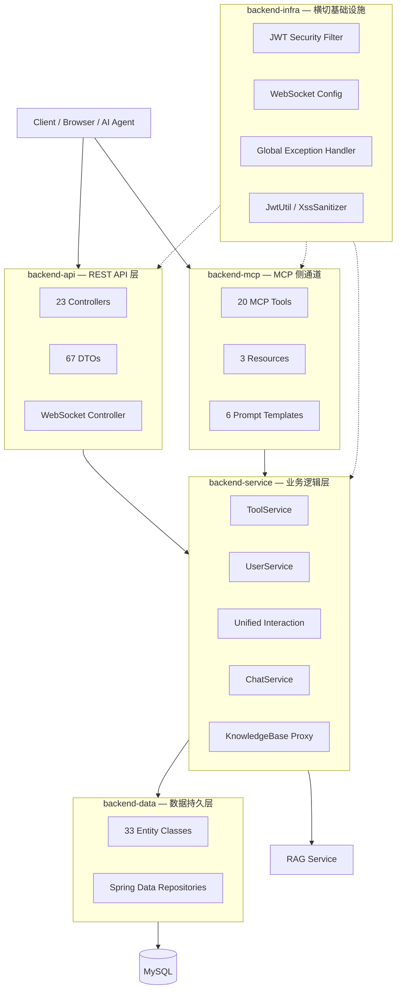
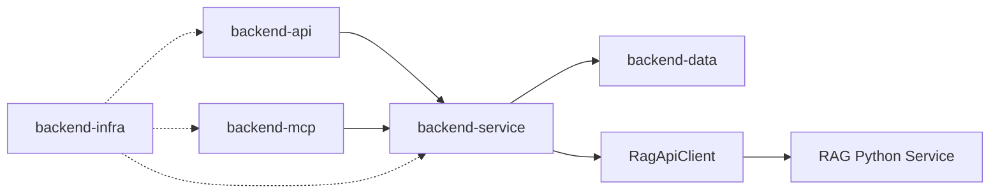

# backend — 后端服务总览

## 模块简介

`backend` 是 CodingHub（AI [Tool](../../../backend/src/main/java/com/iaihub/toolbox/model/Tool.java) Square）平台的核心后端服务，基于 **Java 17 + Spring Boot 3 + Spring Data JPA + MySQL** 构建。该服务采用经典三层分层架构（API → Service → Data），并通过 MCP 侧通道为 AI Agent 提供标准化工具调用能力，Infra 层则提供安全、通信、异常处理等横切关注点的统一实现。

**技术栈概览：**

| 维度 | 选型 |
|------|------|
| 语言/运行时 | Java 17 |
| 框架 | Spring Boot 3.x |
| ORM | Spring Data JPA (Hibernate) |
| 数据库 | MySQL |
| 认证 | Spring Security + JWT（无状态） |
| 实时通信 | WebSocket (STOMP) |
| AI 协议 | MCP SDK 2.0.0（Streamable HTTP + SSE） |
| 构建工具 | Maven |

## 分层架构图

## 子模块一览

| 子模块 | 定位 | 规模 | 文档链接 |
|--------|------|------|----------|
| backend-api | REST API 统一入口，请求校验、路由分发、响应封装 | 23 Controller / 96 路由 / 111 方法 | [backend-api.md](backend-api.md) |
| backend-service | 核心业务逻辑，工具管理、用户认证、社交互动、实时聊天 | 21 文件 / 6 子包 / 207 组件 | [backend-service.md](backend-service.md) |
| backend-data | 数据持久层，Entity 定义与 Repository 接口 | 33 文件 / 218 组件 / 10 业务域 | [backend-data.md](backend-data.md) |
| backend-mcp | MCP 协议服务端，为 AI Agent 提供工具调用能力 | 20 Tools / 3 Resources / 6 Prompts | [backend-mcp.md](backend-mcp.md) |
| backend-infra | 横切基础设施：安全、WebSocket、异常处理、工具类 | 23 组件 / 3 包 | [backend-infra.md](backend-infra.md) |

## 核心技术决策

### 1. JWT 无状态认证

采用 Spring Security + JWT 实现无状态认证，避免服务端 Session 存储。支持三级权限模型（USER / ADMIN / SUPER_ADMIN），通过方法级注解（`@PreAuthorize`）进行细粒度权限控制。Token 刷新机制保障前端无感续期。

### 2. 统一响应封装

所有 API 响应使用 `ApiResponse<T>` 泛型包装，统一 `code / message / data` 结构。全局异常处理器（`@RestControllerAdvice`）捕获业务异常并标准化输出，前端无需处理异构错误格式。

### 3. 软删除策略

核心业务实体（[Tool](../../../backend/src/main/java/com/iaihub/toolbox/model/Tool.java)、[ForumPost](../../../backend/src/main/java/com/iaihub/toolbox/model/forum/ForumPost.java) 等）采用软删除（`deleted` 标志位），保留数据可追溯性。Repository 查询默认过滤已删除记录。

### 4. MCP 协议集成

通过 Java MCP SDK 2.0.0 实现 MCP 服务端，支持 Streamable HTTP（`/mcp`）和 SSE（`/sse`）双传输协议。将工具搜索/安装/发布、论坛交互、知识库 RAG 等能力封装为 20 个 MCP 工具，使 AI Agent 无需了解底层 REST API 即可完成复杂工作流。

### 5. 统一社交互动模型

评论、点赞、收藏采用统一设计（`Unified*` 前缀），通过 `targetType + targetId` 多态关联支持工具、帖子、视频三种目标类型，避免为每种内容类型重复建设互动功能。

## 跨模块依赖关系

- **backend-api → backend-service**：Controller 委派业务逻辑
- **backend-service → backend-data**：通过 Repository 完成持久化
- **backend-mcp → backend-service**：MCP 工具复用 Service 层能力
- **backend-service → RAG**：通过 `RagApiClient` HTTP 调用 Python RAG 服务
- **backend-infra → 全部**：安全过滤、异常处理、WebSocket 配置横切所有层

## 关键数据流

1. **工具浏览**：Client → [ToolController](../../../backend/src/main/java/com/iaihub/toolbox/controller/ToolController.java) → [ToolService](../../../backend/src/main/java/com/iaihub/toolbox/service/ToolService.java) → [ToolRepository](../../../backend/src/main/java/com/iaihub/toolbox/repository/ToolRepository.java) → MySQL
2. **AI Agent 搜索**：Agent → MCP /mcp → [IaihubToolHandler](../../../backend/src/main/java/com/iaihub/toolbox/mcp/IaihubToolHandler.java) → [ToolService](../../../backend/src/main/java/com/iaihub/toolbox/service/ToolService.java) → MySQL
3. **知识库检索**：Client → [KnowledgeBaseController](../../../backend/src/main/java/com/iaihub/toolbox/controller/kb/KnowledgeBaseController.java) → KbService → [RagApiClient](../../../backend/src/main/java/com/iaihub/toolbox/service/RagApiClient.java) → RAG Python
4. **实时聊天**：Client → STOMP /ws → [ChatService](../../../backend/src/main/java/com/iaihub/toolbox/service/ChatService.java) → ChatRepository + WebSocket Broadcast

## 相关文档

- [frontend.md](frontend.md) — 前端服务总览
- [rag.md](rag.md) — RAG 知识库服务总览
- [overview.md](overview.md) — 仓库级架构总览
