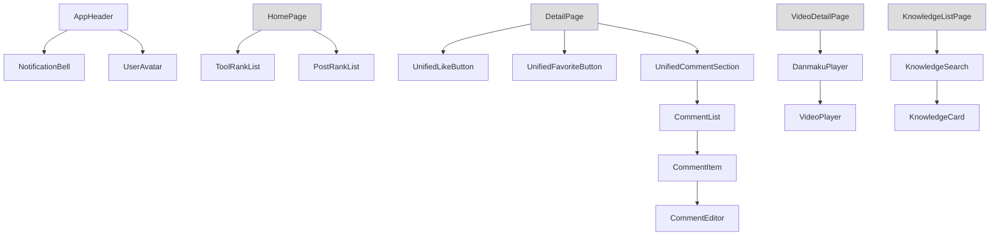

# 业务组件 (frontend-components)

组件层（L3）包含 36 个可复用 Vue 组件，按功能分 6 组。组件依赖 [状态与类型](frontend-stores.md) 与 [服务层](frontend-services.md)，被 [页面与路由](frontend-pages.md) 消费。

## 组件分组

| 分组 | 代表组件 | 职责 |
|------|----------|------|
| 通用 | `AppHeader`、`UserAvatar`、`StatsCard`、`ToolRankList` / `PostRankList` / `VideoRankList`、`AuthorBadge` | 布局、排行、统计、作者展示 |
| common | `ConfirmDialog`、`GeneralizedSidebar`、`LogoUploader`、`NotificationBell`、`SortTab`、`TagBadge`、`TagSelector`、`UnifiedCommentSection`、`UnifiedFavoriteButton`、`UnifiedLikeButton` | 跨域复用件，其中 `Unified*Button`/`UnifiedCommentSection` 统一互动 |
| chat | `ChatLauncher`、`ChatRoom`、`MessageMarkdown`、`MessageReactions`、`ReplyQuote`、`TypingIndicator` | 实时聊天 UI |
| forum | `CategoryFilter`、`CommentEditor`、`CommentItem`、`CommentList`、`PostCard`、`PostContent`、`TagInput` | 论坛交互 |
| knowledge | `ChunkCard`、`ChunkingPreviewPanel`、`ConfigPanel`、`DocumentList`、`DocumentUpload`、`InfoBanner`、`KnowledgeCard`、`KnowledgeSearch`、`StatusBadge`、`StrategyBadge` | 知识库管理/检索 |
| video | `DanmakuPlayer`、`VideoCard`、`VideoCoverPicker`、`VideoPlayer` | 视频播放/弹幕 |
| feedback | `FeedbackCard`、`FeedbackForm` | 留言反馈 |

## 组件依赖关系（节选）

## 关键组件

### UnifiedLikeButton / UnifiedFavoriteButton / UnifiedCommentSection

统一互动三件套（对应 [核心模块](backend-core.md) 的 `InteractionController`）。`useInteraction` composable 封装 `/like`、`/comment`、`/favorite` 调用与乐观更新，保证三域（TOOL/FORUM/VIDEO）UI 一致。

### NotificationBell

读取 `notification` 服务获取未读计数与列表，下拉展示，点击标记已读。

### DanmakuPlayer

基于 `VideoPlayer` 叠加弹幕层，拉取 `danmaku` 服务数据按时间轴渲染。

## 跨模块依赖

- 互动组件依赖 [服务层](frontend-services.md) 的 `interaction` / `notification`
- 视频组件依赖 `video` 服务（见 [微课模块](backend-video.md)）
- 知识库组件依赖 `knowledge` 服务（见 [知识库模块](backend-kb.md)）

## 约束

- 组件为 L3，禁止反向依赖 pages
- 所有文本渲染前由后端 `XssSanitizer` 已净化，前端 `MessageMarkdown` 再做渲染层转义
- 主题样式经 `stores/theme` 的 CSS 变量注入
