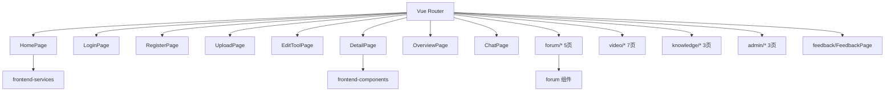

# 页面与路由 (frontend-pages)

前端页面层（L4）由 28 个 Vue 单文件组件构成，按领域分布在 `src/pages/` 子目录。所有页面挂在 `src/router` 下，依赖 [业务组件](frontend-components.md)、[服务层](frontend-services.md) 与 [状态与类型](frontend-stores.md)。

## 页面清单

| 领域 | 页面 |
|------|------|
| 核心 | `HomePage` 首页、`LoginPage`、`RegisterPage`、`ProfilePage`、`UploadPage`、`EditToolPage`、`DetailPage`、`AboutPage`、`QuickStartPage`、`OverviewPage`、`ChatPage`、`NotFoundPage` |
| 管理 | `admin/ApprovalPage` 审批、`admin/CategoryManagePage` 分类管理、`admin/UserListPage` 用户管理 |
| 反馈 | `feedback/FeedbackPage` |
| 论坛 | `forum/PostListPage`、`forum/PostDetailPage`、`forum/PostEditorPage`、`forum/MyPostsPage`、`forum/MyFavoritesPage` |
| 微课 | `video/VideoListPage`、`video/VideoDetailPage`、`video/VideoUploadPage`、`video/VideoEditPage`、`video/MyVideosPage`、`video/MyVideoFavoritesPage` |
| 知识库 | `knowledge/KnowledgeListPage`、`knowledge/KnowledgeDetailPage`、`knowledge/KnowledgeEditorPage` |

## 路由与页面关系

## 关键页面

### HomePage

首页聚合：工具检索/排序（`sortBy` 经 URL query）、分类侧边栏（`GeneralizedSidebar`）、热门排行（`ToolRankList` / `PostRankList` / `VideoRankList`）、`StatsCard` 统计。数据来自 [服务层](frontend-services.md) 的 `tool` / `overview`。

### DetailPage / 各领域详情

`DetailPage`（工具详情）展示 logo、描述、文件列表、下载、`UnifiedLikeButton` / `UnifiedFavoriteButton` / `UnifiedCommentSection`，以及聊天入口。`forum/PostDetailPage` 与 `video/VideoDetailPage` 类似，视频详情内嵌 `DanmakuPlayer`。

### ChatPage

承载 [核心模块](backend-core.md) 的实时聊天，集成 `ChatLauncher` / `ChatRoom` 组件。

## 跨模块依赖

- 数据访问全部经 [服务层](frontend-services.md) 调用后端 REST
- 交互状态依赖 [状态与类型](frontend-stores.md) 的 Pinia stores
- 鉴权控制依赖 `stores/auth` 与 `useContentPermissions`

## 约束

- 页面为 L4，只能依赖 L0–L3（types/composables/services/stores/components）
- 写操作前校验 `useContentPermissions` 的 `isOwner/isAdmin`
- 双主题（Cyberpunk Dark / Glassmorphism Light）由 `stores/theme` 驱动
