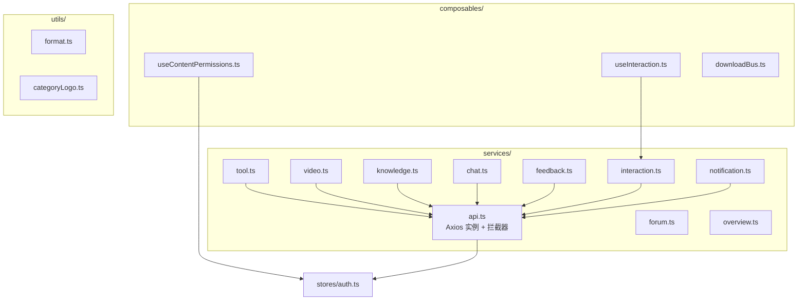
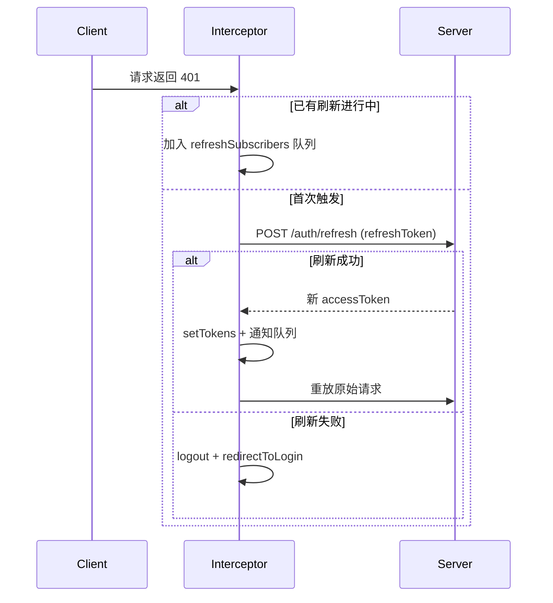

# frontend-services — API 通信层

## 模块简介

`frontend-services` 是 CodingHub 前端的 API 通信层，涵盖 `frontend/src/services/`、`frontend/src/composables/` 和 `frontend/src/utils/` 三个目录（共 86 组件）。该层负责：

- 封装 Axios 实例与请求/响应拦截器（Token 注入、401 自动刷新、错误提示）
- 按业务域提供 REST API 调用函数
- 通过 Composables 提供可复用的交互逻辑（点赞/收藏/评论）
- 提供格式化工具函数

## 架构图

## 请求封装（api.ts）

| 特性 | 说明 |
|------|------|
| 基础路径 | `VITE_API_BASE_URL` 或 `/api/v1` |
| 超时 | 60s（文件上传 600s） |
| 请求拦截 | 自动从 `useAuthStore` 读取 accessToken 注入 `Authorization: Bearer` |
| 401 处理 | 单飞模式刷新 Token（`isRefreshing` + 订阅队列），刷新失败则登出并跳转登录页 |
| 403 处理 | 弹出「没有权限执行此操作」提示 |
| 其他错误 | 提取 `response.data.message` 弹出 ElMessage.error |

### Token 刷新流程

### 附加导出

- `fileUploadApi`：工具文件上传/列表/删除/下载（Blob 下载）
- `tagApi`：通用标签 CRUD（getTags / getHotTags / createTag）

## 按业务域分组的 API 函数清单

### 工具（tool.ts）

| 函数 | 方法 | 端点 | 说明 |
|------|------|------|------|
| `getToolDetail` | GET | `/tools/:id` | 获取工具详情（含互动统计） |
| `getTool` | GET | `/tools/:id` | 获取工具（原始响应） |
| `pinTool` | POST | `/tools/:id/pin` | 置顶工具 |
| `unpinTool` | DELETE | `/tools/:id/pin` | 取消置顶 |
| `getHotTop5` | GET | `/tools/hot-top5` | 热门 Top5 ID 列表 |

### 论坛（forum.ts）

独立 Axios 实例（baseURL `/api/forum`），含独立请求拦截器。

| 函数 | 方法 | 端点 | 说明 |
|------|------|------|------|
| `getPostList` | GET | `/posts` | 分页帖子列表（支持分类/标签/关键词/排序） |
| `getMyPosts` | GET | `/posts/my` | 我的帖子 |
| `getPostById` | GET | `/posts/:id` | 帖子详情 |
| `createPost` | POST | `/posts` | 创建帖子 |
| `updatePost` | PUT | `/posts/:id` | 更新帖子 |
| `deletePost` | DELETE | `/posts/:id` | 删除帖子 |
| `pinPost` / `unpinPost` | POST/DELETE | `/posts/:id/pin` | 置顶/取消 |
| `getHotTop5` | GET | `/posts/hot-top5` | 热门 Top5 |
| `getCategories` | GET | `/categories` | 分类列表 |
| `getTags` / `getHotTags` / `createTag` | GET/POST | `/tags` | 标签管理 |
| `getComments` / `createComment` / `deleteComment` | GET/POST/DELETE | `/posts/:id/comments` | 评论 |
| `like` / `unlike` | POST/DELETE | `/likes` | 点赞 |

### 视频（video.ts）

| 函数 | 方法 | 端点 | 说明 |
|------|------|------|------|
| `uploadVideo` | POST | `/videos` | 上传视频（FormData + 进度回调） |
| `getVideoList` | GET | `/videos` | 分页列表 |
| `getVideoDetail` | GET | `/videos/:id` | 详情（自增播放量） |
| `getStreamUrl` | — | `/api/v1/videos/:id/stream` | 返回流媒体 URL |
| `updateVideo` | PUT | `/videos/:id` | 更新信息 |
| `uploadCover` | POST | `/videos/:id/cover` | 上传封面 |
| `deleteVideo` | DELETE | `/videos/:id` | 软删除 |
| `getMyVideos` | GET | `/videos/my` | 我的视频 |
| `pinVideo` / `unpinVideo` | POST/DELETE | `/videos/:id/pin` | 置顶 |
| `getHotTop5` | GET | `/videos/hot-top5` | 热门 Top5 |

### 知识库（knowledge.ts）

双通道设计：Java 代理（CRUD + 搜索）+ 直连 RAG 服务（文档/配置/分片）。

| 函数 | 通道 | 说明 |
|------|------|------|
| `getList` / `getDetail` / `create` / `update` / `delete` | Java | 知识库 CRUD |
| `search` | Java | 语义搜索 |
| `getDocuments` / `batchUpload` / `uploadDocument` / `deleteDocument` | RAG 直连 | 文档管理 |
| `getDocumentStatus` / `getSingleDocumentStatus` | RAG 直连 | 处理状态轮询 |
| `getConfig` / `updateConfig` | RAG 直连 | RAG 配置 |
| `previewChunking` | RAG 直连 | 分片预览 |

### 聊天（chat.ts）

| 函数 | 说明 |
|------|------|
| `getHistory` | 获取历史消息（roomId + limit） |
| `deleteMessage` | 删除消息 |

### 互动（interaction.ts）

统一互动 API，支持 `TOOL` / `FORUM_POST` / `VIDEO` 三种 targetType：

- `toggleLike` / `getLikeStatus` — 点赞
- `getComments` / `addComment` / `deleteComment` — 评论
- `toggleFavorite` / `getFavoriteStatus` / `getMyFavorites` — 收藏
- `getMyLikes` / `getMyComments` — 个人中心

### 反馈（feedback.ts）

`getFeedbacks` / `createFeedback` / `replyFeedback` / `deleteFeedback`

### 通知（notification.ts）

`getNotifications` / `getUnreadCount` / `markAsRead` / `markAllAsRead`

### 总览（overview.ts）

独立 Axios 实例（baseURL `/api`）：`fetchStats` / `fetchToolRanks` / `fetchPostRanks` / `fetchVideoRanks`

## Composables

| 文件 | 导出 | 职责 |
|------|------|------|
| `useInteraction.ts` | `useInteraction(targetType, targetId)` | 封装点赞/收藏/评论的响应式状态与操作 |
| `useContentPermissions.ts` | `useContentPermissions(ownerId)` | 判断当前用户是否可编辑/删除（owner 或 admin） |
| `downloadBus.ts` | `sessionDownloads` / `addDownload` / `clearDownloads` | 会话内下载计数（首页即时反馈） |

## Utils

| 文件 | 导出 | 职责 |
|------|------|------|
| `format.ts` | `formatCount(n)` | 数字紧凑格式化（≥1万→x.x万，≥1000→x.xk） |
| `categoryLogo.ts` | `getDefaultLogo(categoryName)` | 按分类名返回本地默认 logo 路径 |

## 交叉引用

- [[frontend-types]] — 所有 Service 的请求/响应类型定义
- [[frontend-stores]] — `api.ts` 和 `forum.ts` 依赖 `useAuthStore` 获取 Token；`useContentPermissions` 依赖 auth store 判断权限
- 后端 API — 所有端点均对应 Java Spring Boot 后端 REST 控制器
- RAG 服务 — `knowledge.ts` 中部分方法直连 Python RAG 微服务
