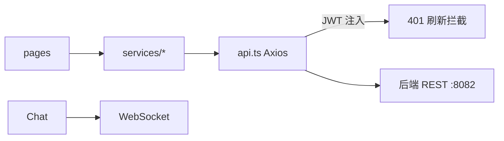

# 服务层 (frontend-services)

服务层（L1）是前端与 [后端服务](backend.md) REST API 的唯一通信边界，共 9 个模块。每个模块导出聚合的异步函数，统一经过 `api.ts` 的 Axios 实例（带 JWT 注入与 401 刷新拦截）。

## 模块清单

| 模块 | 对应后端 | 职责 |
|------|----------|------|
| `api.ts` | 全部 | 全局 Axios 实例、JWT 注入、401 刷新、错误归一 |
| `tool.ts` | 核心模块 | 工具检索/CRUD/下载/点赞收藏 |
| `forum.ts` | 论坛模块 | 帖子列表/详情/发帖/收藏 |
| `video.ts` | 微课模块 | 视频列表/详情/上传/弹幕 |
| `knowledge.ts` | 知识库模块 | 知识库 CRUD/搜索/文档/配置 |
| `feedback.ts` | 反馈模块 | 留言提交/列表 |
| `notification.ts` | 通知模块 | 通知列表/未读/已读 |
| `overview.ts` | 概览模块 | 统计/排行 |
| `chat.ts` | 核心聊天 | 聊天历史/WebSocket 封装 |
| `interaction.ts` | 核心互动 | 统一点赞/评论/收藏 |

## 调用链路

## 关键设计

### 统一 Axios 实例

`api.ts` 创建带 `baseURL` 的实例，请求拦截器从 `stores/auth` 读取 access token 注入 `Authorization`；响应拦截器捕获 401 调用 `refresh` 并重试，失败则跳转登录。

### 模块约定

每个领域模块（`tool`/`forum`/...）导出 `getXxx`、`createXxx`、`updateXxx`、`deleteXxx` 函数，入参为 DTO，返回 `Promise<T>`。错误由 `api.ts` 归一为带 `code/message` 的异常供组件捕获。

## 跨模块依赖

- 依赖 [状态与类型](frontend-stores.md) 的 `auth` store 取令牌
- 被 [页面与路由](frontend-pages.md)、[业务组件](frontend-components.md) 调用

## 约束

- 服务层为 L1，禁止依赖 components/pages
- 所有请求经统一拦截，禁止组件直连后端
- 令牌仅存内存（Pinia），刷新令牌存 httpOnly cookie 思路
