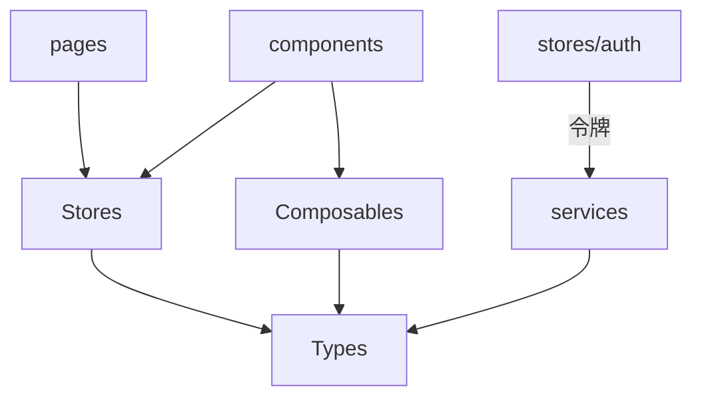

# 状态与类型 (frontend-stores)

本模块聚合前端的「状态」与「契约」层：Pinia stores（L2）、组合式函数 composables（L0）与 TypeScript 类型（L0）。

## 组成

| 类别 | 文件 | 职责 |
|------|------|------|
| Stores | `stores/auth.ts` | 当前用户、令牌、登录态、权限判定 |
| Stores | `stores/chat.ts` | 聊天会话、消息缓存、在线状态 |
| Stores | `stores/forum.ts` | 论坛草稿/筛选态 |
| Stores | `stores/theme.ts` | 双主题切换（Cyberpunk Dark / Glassmorphism Light） |
| Composables | `composables/useInteraction.ts` | 统一互动（点赞/评论/收藏）逻辑封装 |
| Composables | `composables/useContentPermissions.ts` | `isOwner`/`isAdmin` 权限判定 |
| Composables | `composables/downloadBus.ts` | 跨组件下载事件总线 |
| Types | `types/index.ts` 及 `tool`/`forum`/`video`/`knowledge`/`feedback`/`chat`/`overview` | DTO 与领域类型 |

## 依赖关系

## 关键设计

### stores/auth

持有 `user`、`accessToken`、`roles`。`login/logout` 与 [服务层](frontend-services.md) 的 `api` 协作；`isAdmin()` / `isSuperAdmin()` 供 `useContentPermissions` 复用。令牌存内存，刷新逻辑在 `api.ts` 拦截器中。

### useInteraction

封装 `POST /api/v1/interactions/{type}` 调用，对 `UnifiedLikeButton` 等组件提供乐观更新与回滚，对应 [核心模块](backend-core.md) 的 `InteractionController`。

### useContentPermissions

基于 `auth` store 的 user 与目标 `uploaderId/authorId` 计算 `canEdit`/`canDelete`，处处复用 `isOwner || isAdmin` 规则（与后端一致）。

### types/*

与后端 DTO（`backend/.../dto`）一一对应，是前后端契约的 TypeScript 镜像。

## 跨模块依赖

- stores 依赖 [服务层](frontend-services.md) 取数据
- types 与后端 DTO 对齐

## 约束

- stores(L2) 可依赖 types(L0)/services(L1)
- composables/types(L0) 不得依赖任何内部模块
- 类型变更须与后端 DTO 同步
