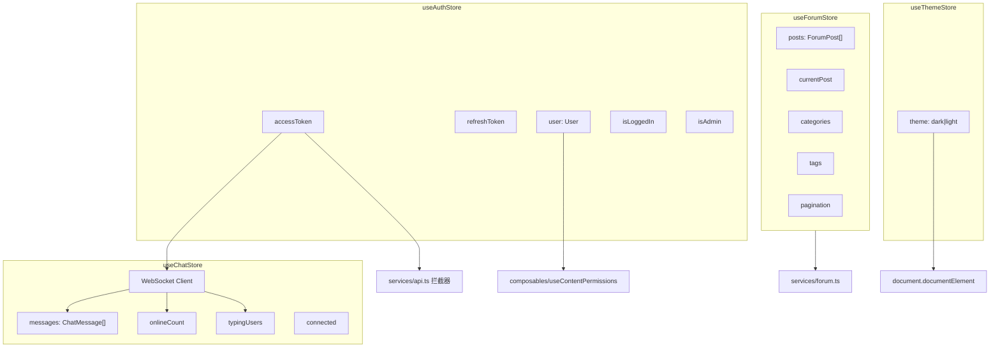

# frontend-stores — 状态管理

## 模块简介

`frontend-stores` 是 CodingHub 前端的 Pinia 状态管理层，位于 `frontend/src/stores/`（共 8 组件）。包含 4 个 Store：

| Store | 文件 | 风格 | 职责 |
|-------|------|------|------|
| `useAuthStore` | auth.ts | Composition API | 认证状态（Token、用户信息、角色判断） |
| `useChatStore` | chat.ts | Composition API | 实时聊天（WebSocket 连接、消息、在线人数、输入指示） |
| `useForumStore` | forum.ts | Options API | 论坛数据（帖子列表、分类、标签、分页） |
| `useThemeStore` | theme.ts | Composition API | 主题切换（dark/light） |

## 状态流转图

## 各 Store 详解

### useAuthStore（auth.ts）

**状态：**

| 字段 | 类型 | 说明 |
|------|------|------|
| `accessToken` | `string \| null` | JWT 访问令牌，初始化从 localStorage 读取 |
| `refreshToken` | `string \| null` | 刷新令牌 |
| `user` | `User \| null` | 当前用户信息 |

**计算属性：**

| 属性 | 逻辑 |
|------|------|
| `isLoggedIn` | `!!accessToken` |
| `isAdmin` | role 为 ADMIN 或 SUPER_ADMIN |
| `isSuperAdmin` | role 为 SUPER_ADMIN |

**方法：**

- `setTokens(access, refresh)` — 保存 Token 到 state + localStorage
- `setUser(userData)` — 保存用户信息
- `logout()` — 清空所有认证状态和 localStorage
- `initFromStorage()` — 从 localStorage 恢复状态（应用启动时调用）

**被依赖方：** `services/api.ts`（请求拦截器）、`services/forum.ts`（独立拦截器）、`useChatStore`、`useContentPermissions`

---

### useChatStore（chat.ts）

基于 STOMP over WebSocket 的实时聊天状态管理。

**状态：**

| 字段 | 类型 | 说明 |
|------|------|------|
| `messages` | `ChatMessage[]` | 当前房间消息列表 |
| `onlineCount` | `number` | 在线人数 |
| `typingUsers` | `Array` | 正在输入的用户列表 |
| `connected` | `boolean` | WebSocket 连接状态 |
| `loading` | `boolean` | 历史消息加载中 |
| `error` | `string` | 错误信息 |

**WebSocket 订阅主题：**

| 主题 | 事件类型 | 处理 |
|------|------|------|
| `/topic/chat.global` | [ChatMessage](../../../backend/src/main/java/com/iaihub/toolbox/model/ChatMessage.java) / DELETE / PRESENCE / ERROR | 新消息、删除、在线数、错误 |
| `/topic/chat.reactions.global` | REACTION | 更新消息 reactions |
| `/topic/chat.edit.global` | [ChatMessage](../../../backend/src/main/java/com/iaihub/toolbox/model/ChatMessage.java) | 替换已编辑消息 |
| `/topic/chat.recall.global` | RECALL | 标记消息为 DELETED |
| `/topic/chat.typing.global` | TYPING | 更新 typingUsers |
| `/user/queue/errors` | — | 私有错误队列 |

**发送方法（发布到 /app/ 前缀）：**

- `send(payload)` → `/app/chat.send`
- `react(messageId, emoji)` → `/app/chat.react`
- `editMessage(id, content)` → `/app/chat.edit`
- `recallMessage(id)` → `/app/chat.recall`
- `sendTyping(isTyping)` → `/app/chat.typing`（内置 1s 节流 + 3s 自动停止）

**其他：**

- `loadHistory(roomId, limit)` — 通过 fetch 加载历史消息
- `deleteMessage(id)` — 通过 fetch 删除消息
- `connect()` — 建立 WebSocket 连接（自动携带 token，5s 重连）
- `disconnect()` — 断开连接

---

### useForumStore（forum.ts）

Options API 风格，封装论坛数据的获取与缓存。

**状态：**

| 字段 | 类型 | 说明 |
|------|------|------|
| `posts` | `ForumPost[]` | 帖子列表 |
| `currentPost` | `ForumPost \| null` | 当前查看的帖子 |
| `categories` | `ForumCategory[]` | 分类列表 |
| `tags` | `ForumTag[]` | 标签列表 |
| `pagination` | `object` | 分页信息（page/size/totalElements/totalPages） |
| `loading` | `boolean` | 加载状态 |

**Actions：**

| 方法 | 说明 |
|------|------|
| `fetchPosts(params?)` | 分页获取帖子（支持分类/标签/关键词/排序） |
| `fetchPostById(id)` | 获取单个帖子详情 |
| `fetchCategories()` | 加载分类 |
| `fetchTags()` | 加载标签 |
| `fetchMyPosts()` | 加载我的帖子 |
| `deletePost(id)` | 删除帖子（返回 success/errorCode） |
| `_mapErrorToCode(error)` | 将 HTTP 错误映射为业务错误码 |

---

### useThemeStore（theme.ts）

轻量级主题管理。

**状态：** `theme: 'dark' | 'light'`（从 localStorage 初始化，默认 light）

**行为：**

- `toggleTheme()` — 切换 dark/light
- `setTheme(newTheme)` — 设置指定主题
- 内部 `watch` 自动持久化到 localStorage 并应用到 `document.documentElement[data-theme]`

## 设计特点

1. **混合风格**：auth/chat/theme 使用 Composition API（`setup` 函数），forum 使用 Options API——反映不同阶段的开发习惯
2. **Token 持久化**：auth store 与 localStorage 双向同步，确保刷新页面后保持登录
3. **WebSocket 单例**：chat store 内部维护 STOMP Client 实例，通过 `connect()`/`disconnect()` 控制生命周期
4. **错误映射**：forum store 的 `deletePost` 将 HTTP 状态码转换为业务错误码（AUTH/FORBIDDEN/NOT_FOUND/UNKNOWN）

## 交叉引用

- [frontend-services](frontend-services.md) — `useForumStore` 调用 `forumService`；`useChatStore` 内部使用 fetch 直接调用 REST API
- [frontend-types](frontend-types.md) — `useAuthStore` 使用 `User`；`useChatStore` 使用 `ChatMessage`/`ChatEvent`/各类 Payload；`useForumStore` 使用 `ForumPost`/`ForumCategory`/`ForumTag`
- `services/api.ts` — 请求拦截器读取 `useAuthStore.accessToken`
- `composables/useContentPermissions.ts` — 读取 `useAuthStore` 的 `isLoggedIn`/`user`/`isAdmin`
- `composables/useInteraction.ts` — 不直接依赖 store，但通过 services 间接使用 auth token

<!-- crosslinks (auto-generated) -->
## Related Modules
- Depends on: [frontend-services](frontend-services.md)
