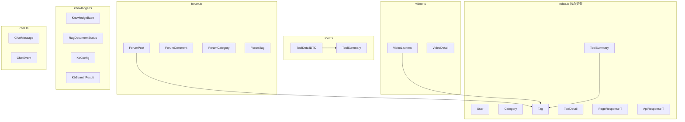

# frontend-types — 类型系统

## 模块简介

`frontend-types` 是 CodingHub 前端的 TypeScript 类型定义层，位于 `frontend/src/types/`（共 67 组件）。该模块为整个前端提供：

- 核心业务实体的接口定义（[User](../../../backend/src/main/java/com/iaihub/toolbox/model/User.java)、[Tool](../../../backend/src/main/java/com/iaihub/toolbox/model/Tool.java)、[ForumPost](../../../backend/src/main/java/com/iaihub/toolbox/model/forum/ForumPost.java)、[Video](../../../backend/src/main/java/com/iaihub/toolbox/model/video/Video.java)、[KnowledgeBase](../../../backend/src/main/java/com/iaihub/toolbox/model/kb/KnowledgeBase.java) 等）
- API 请求/响应的 DTO 类型
- 通用泛型容器（[PageResponse](../../../backend/src/main/java/com/iaihub/toolbox/dto/PageResponse.java)、[ApiResponse](../../../backend/src/main/java/com/iaihub/toolbox/dto/ApiResponse.java)）
- WebSocket 事件类型（聊天实时通信）

所有类型均为纯接口/类型声明，无运行时逻辑，被 services、stores、composables 和 views 广泛引用。

## 类型关系图



## 核心数据模型

### User（index.ts）

```typescript
interface User {
  id: number
  username: string
  nickname?: string
  avatarUrl?: string | null
  role?: string          // 'USER' | 'ADMIN' | 'SUPER_ADMIN'
  status?: string
  createdAt?: string
  lastLoginAt?: string
}
```

被 `useAuthStore` 持有，代表当前登录用户。`role` 字段驱动前端权限判断。

### ToolSummary / ToolDetail（index.ts）

- `ToolSummary`：列表卡片用，含分类、上传者、统计计数、标签
- `ToolDetail`：详情页用，增加 `content`（Markdown 正文）、`updatedAt`

### ToolDetailDTO（tool.ts）

服务层专用 DTO，与 `ToolDetailVO`（services/tool.ts 中扩展）配合使用。包含 `viewCount`、`likeCount`、`commentCount`、`score`、`isLiked` 等互动统计字段。

### ForumPost（forum.ts）

```typescript
interface ForumPost {
  id: number
  title: string
  content: string
  authorId: number
  authorName: string
  authorNickname?: string
  authorAvatarUrl?: string | null
  categoryId: number
  categoryName: string
  viewCount: number
  likeCount: number
  commentCount: number
  score?: number
  pinned?: boolean
  visibility?: string
  tags?: Tag[]
  createdAt: string
  updatedAt: string
  isFavorited?: boolean
  favoriteCount?: number
}
```

### ChatMessage（chat.ts）

```typescript
interface ChatMessage {
  id: number
  roomId: string
  userId: number | null
  displayName: string
  avatarUrl: string | null
  content: string
  status: string
  createdAt: string
  guest: boolean
  replyTo?: number | null
  replyToDisplayName?: string | null
  replyToContentPreview?: string | null
  edited?: boolean
  deletedType?: string | null
  reactions?: Record<string, number>
  myReactions?: string[]
}
```

支持回复、编辑、撤回、表情回应等实时聊天特性。

### VideoDetail（video.ts）

含 `duration`、`fileSize`、`danmakuEnabled`（弹幕开关）、`userLiked`、`userFavorited` 等字段，支持视频详情页全功能渲染。

### KnowledgeBase（knowledge.ts）

```typescript
interface KnowledgeBase {
  id: number
  name: string
  description: string | null
  ownerId: number
  ownerNickname: string | null
  ragCollection: string    // RAG 服务集合名
  ragBaseUrl: string       // RAG 服务地址
  documentsUrl: string     // 文档管理端点
  createdAt: string
}
```

包含 RAG 服务连接信息，前端据此直连 RAG 微服务进行文档管理。

## WebSocket 事件类型（chat.ts）

| 类型 | 用途 |
|------|------|
| `PresencePayload` | 在线人数广播 |
| `DeleteEvent` | 消息删除事件 |
| `RecallEvent` | 消息撤回事件 |
| `ReactionUpdateEvent` | 表情回应更新 |
| `EditEvent` | 消息编辑事件 |
| `TypingEvent` | 正在输入指示 |
| `ChatEvent` | 联合类型（以上所有 + [ChatMessage](../../../backend/src/main/java/com/iaihub/toolbox/model/ChatMessage.java)） |

发送载荷：`SendPayload`、`ReactionActionPayload`、`EditPayload`、`RecallPayload`、`TypingPayload`

## 通用泛型容器

| 类型 | 说明 |
|------|------|
| `PageResponse<T>` | 分页响应（content / totalElements / totalPages / page / size） |
| `ApiResponse<T>` | 统一响应包装（code / message / data） |

注意：`forum.ts` 中定义了独立的 `PageResponse<T>`（使用 `number` 代替 `page`），与 `index.ts` 版本略有差异。

## 请求类型汇总

| 类型 | 所属域 | 用途 |
|------|------|------|
| `LoginRequest` / `RegisterRequest` | 认证 | 登录/注册 |
| `CreateToolRequest` / `UpdateToolRequest` | 工具 | 工具 CRUD |
| `ForumPostCreateRequest` / `ForumCommentCreateRequest` | 论坛 | 发帖/评论 |
| `ForumLikeRequest` | 论坛 | 点赞（postId 或 commentId） |
| `VideoUploadRequest` / `VideoUpdateRequest` | 视频 | 上传/更新 |
| `KbCreateRequest` / `KbUpdateRequest` / `KbSearchRequest` / `KbConfigRequest` | 知识库 | KB 操作 |
| `FeedbackCreateRequest` / `FeedbackReplyRequest` | 反馈 | 提交/回复 |

## 文件清单

| 文件 | 主要导出 |
|------|------|
| `index.ts` | [User](../../../backend/src/main/java/com/iaihub/toolbox/model/User.java), [Category](../../../backend/src/main/java/com/iaihub/toolbox/model/Category.java), [Tag](../../../backend/src/main/java/com/iaihub/toolbox/model/tag/Tag.java), [ToolSummary](../../../frontend/src/types/index.ts), [ToolDetail](../../../frontend/src/types/index.ts), [PageResponse](../../../backend/src/main/java/com/iaihub/toolbox/dto/PageResponse.java), [ApiResponse](../../../backend/src/main/java/com/iaihub/toolbox/dto/ApiResponse.java), 请求类型, [ToolFile](../../../backend/src/main/java/com/iaihub/toolbox/model/ToolFile.java), [PendingUser](../../../frontend/src/types/index.ts), [AdminUser](../../../frontend/src/types/index.ts) |
| `tool.ts` | [ToolDetailDTO](../../../backend/src/main/java/com/iaihub/toolbox/dto/ToolDetailDTO.java), [ToolSummary](../../../frontend/src/types/index.ts)（服务层专用） |
| `chat.ts` | [ChatMessage](../../../backend/src/main/java/com/iaihub/toolbox/model/ChatMessage.java), ChatEvent 联合类型, 各类 Payload |
| `forum.ts` | [ForumPost](../../../backend/src/main/java/com/iaihub/toolbox/model/forum/ForumPost.java), [ForumComment](../../../frontend/src/types/forum.ts), [ForumCategory](../../../backend/src/main/java/com/iaihub/toolbox/model/forum/ForumCategory.java), [ForumTag](../../../backend/src/main/java/com/iaihub/toolbox/model/forum/ForumTag.java), [ForumLikeRequest](../../../backend/src/main/java/com/iaihub/toolbox/dto/forum/ForumLikeRequest.java), [PageResponse](../../../backend/src/main/java/com/iaihub/toolbox/dto/PageResponse.java) |
| `video.ts` | [VideoListItem](../../../backend/src/main/java/com/iaihub/toolbox/dto/video/VideoListItem.java), [VideoDetail](../../../frontend/src/types/video.ts), [VideoComment](../../../frontend/src/types/video.ts), [VideoPageResponse](../../../frontend/src/types/video.ts) |
| `knowledge.ts` | [KnowledgeBase](../../../backend/src/main/java/com/iaihub/toolbox/model/kb/KnowledgeBase.java), [RagDocumentStatus](../../../frontend/src/types/knowledge.ts), [RagDocument](../../../frontend/src/types/knowledge.ts), [KbConfig](../../../frontend/src/types/knowledge.ts), [KbSearchResult](../../../frontend/src/types/knowledge.ts), 请求类型 |
| `feedback.ts` | [FeedbackCategory](../../../backend/src/main/java/com/iaihub/toolbox/model/feedback/FeedbackCategory.java), [FeedbackMessage](../../../backend/src/main/java/com/iaihub/toolbox/model/feedback/FeedbackMessage.java), [FeedbackPageResponse](../../../frontend/src/types/feedback.ts) |
| `overview.ts` | [StatsDto](../../../backend/src/main/java/com/iaihub/toolbox/dto/StatsDto.java), [ToolRankDto](../../../backend/src/main/java/com/iaihub/toolbox/dto/ToolRankDto.java), [PostRankDto](../../../backend/src/main/java/com/iaihub/toolbox/dto/PostRankDto.java), [VideoRankDto](../../../backend/src/main/java/com/iaihub/toolbox/dto/VideoRankDto.java) |

## 交叉引用

- [frontend-services](frontend-services.md) — 所有 Service 函数使用这些类型作为参数和返回值
- [[frontend-stores]] — `useAuthStore` 持有 `User`；`useChatStore` 使用 `ChatMessage`/`ChatEvent`；`useForumStore` 使用 `ForumPost`/`ForumCategory`/`ForumTag`
- `composables/useInteraction.ts` — 使用 `interaction.ts` 中内联定义的 `CommentResponse`、`TargetType` 等类型
- 后端 Java DTO — 前端类型与后端 DTO 保持字段对齐（如 `ToolDetailDTO`、`StatsDto`）


<!-- crosslinks (auto-generated) -->
## Related Modules
- Used by: [frontend-services](frontend-services.md)
