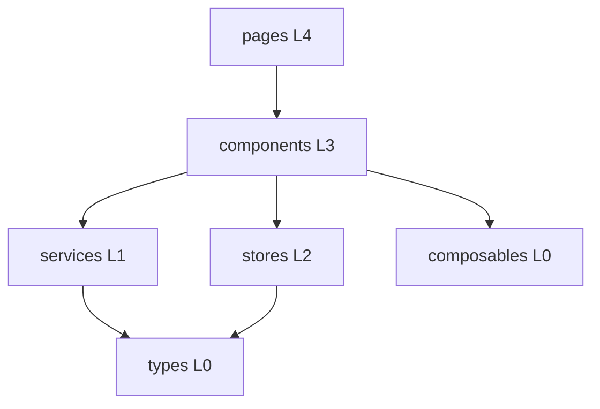

# 前端应用 (frontend)

前端是基于 Vue 3.4 / TypeScript 5.4 / Vite 5.2 的单页应用，监听 `5173`。整体遵循单向分层：**pages(4) → components(3) → services(1)/stores(2) → types(0)/composables(0)**。

## 模块组成

| 子模块 | 文档 | 说明 |
|--------|------|------|
| 页面与路由 | [frontend-pages.md](frontend-pages.md) | 28 个页面 |
| 业务组件 | [frontend-components.md](frontend-components.md) | 36 个组件 |
| 服务层 | [frontend-services.md](frontend-services.md) | 9 个 API 模块 |
| 状态与类型 | [frontend-stores.md](frontend-stores.md) | Pinia stores / composables / types |

## 分层架构

## 关键约定

- **双主题**：Cyberpunk Dark / Glassmorphism Light（`stores/theme` 驱动 CSS 变量）
- **通信边界**：组件/页面不得直连后端，一律经 `services`
- **契约镜像**：`types/*` 与后端 DTO 对齐
- **权限 UI**：`useContentPermissions` 复用 `isOwner || isAdmin`

## 跨模块依赖

- 数据全部来自 [后端服务](backend.md) REST API
- 知识库检索经后端桥接 [RAG服务](rag.md)
- 实时聊天经后端 WebSocket
