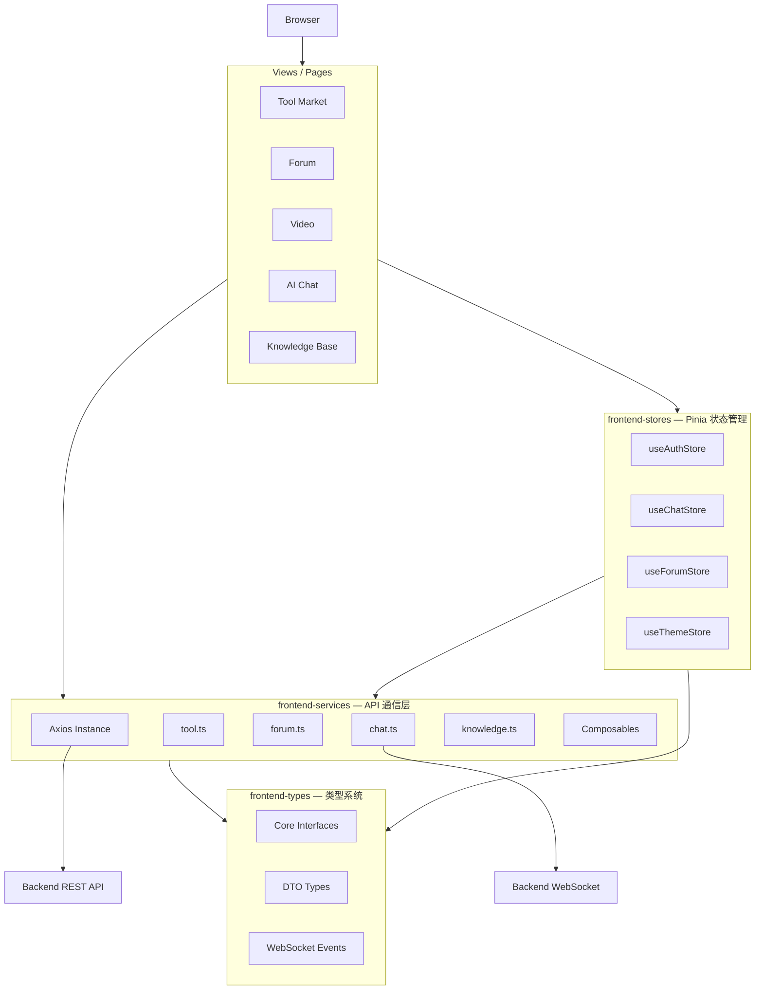

# frontend — 前端服务总览

## 模块简介

`frontend` 是 CodingHub（AI [Tool](../../../backend/src/main/java/com/iaihub/toolbox/model/Tool.java) Square）平台的 Web 前端应用，基于 **Vue 3 + TypeScript + Pinia + Axios** 构建。采用 Composition API 为主的开发模式，通过 Vite 构建，提供工具广场、社区论坛、视频分享、知识库、AI 聊天等功能的用户界面。

**技术栈概览：**

| 维度 | 选型 |
|------|------|
| 框架 | Vue 3 (Composition API) |
| 语言 | TypeScript |
| 状态管理 | Pinia |
| HTTP 客户端 | Axios |
| 实时通信 | WebSocket (STOMP) |
| 构建工具 | Vite |
| UI 组件 | Element Plus / 自定义组件 |

## 架构分层图

## 子模块一览

| 子模块 | 定位 | 规模 | 文档链接 |
|--------|------|------|----------|
| frontend-services | API 通信层：Axios 封装、拦截器、按业务域的 API 函数、Composables | 86 组件 | [frontend-services.md](frontend-services.md) |
| frontend-types | TypeScript 类型定义：实体接口、DTO、泛型容器、WS 事件 | 67 组件 | [frontend-types.md](frontend-types.md) |
| frontend-stores | Pinia 状态管理：认证、聊天、论坛、主题 4 个 Store | 8 组件 / 4 Stores | [frontend-stores.md](frontend-stores.md) |

## 架构设计要点

### 1. 分层职责清晰

- **Views** 负责 UI 渲染与用户交互，不包含业务逻辑
- **Stores** 管理全局状态（认证信息、聊天连接、论坛数据、主题偏好）
- **Services** 封装所有 HTTP/WS 通信，对上层提供纯函数接口
- **Types** 为全应用提供类型安全，无运行时逻辑

### 2. Axios 拦截器机制

请求拦截器自动注入 JWT Token；响应拦截器处理 401 自动刷新、统一错误提示。业务层无需关心认证细节。

### 3. Composables 复用模式

点赞、收藏、评论等跨页面交互逻辑通过 Vue Composables 抽取复用，避免在多个 View 中重复实现相同逻辑。

### 4. 类型安全贯穿全栈

所有 API 响应均通过 `ApiResponse<T>` / `PageResponse<T>` 泛型容器约束，与后端 DTO 结构一一对应，确保前后端契约一致性。

## 与后端的交互模式

| 通信方式 | 用途 | 端点 |
|----------|------|------|
| REST (Axios) | CRUD、分页查询、文件上传 | `/api/**` |
| WebSocket (STOMP) | 实时聊天、在线状态 | `/ws` |

## 相关文档

- [backend.md](backend.md) — 后端服务总览
- [rag.md](rag.md) — RAG 知识库服务总览
- [overview.md](overview.md) — 仓库级架构总览
