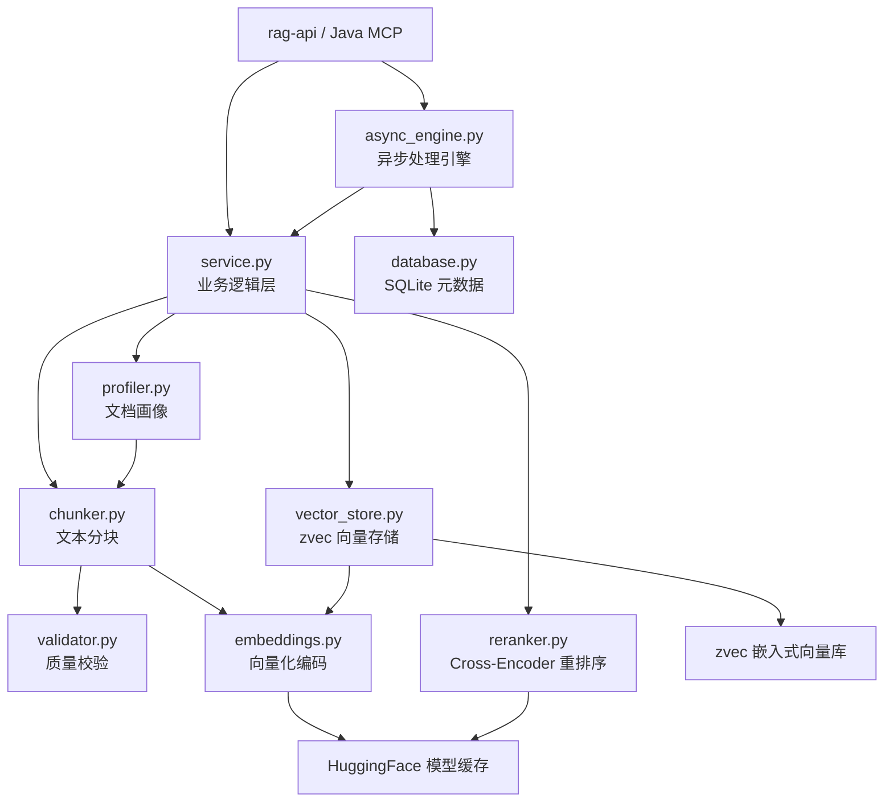
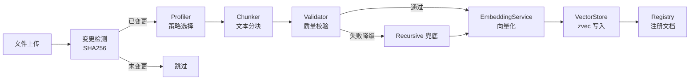
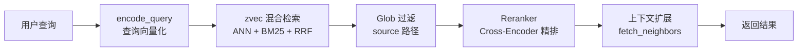
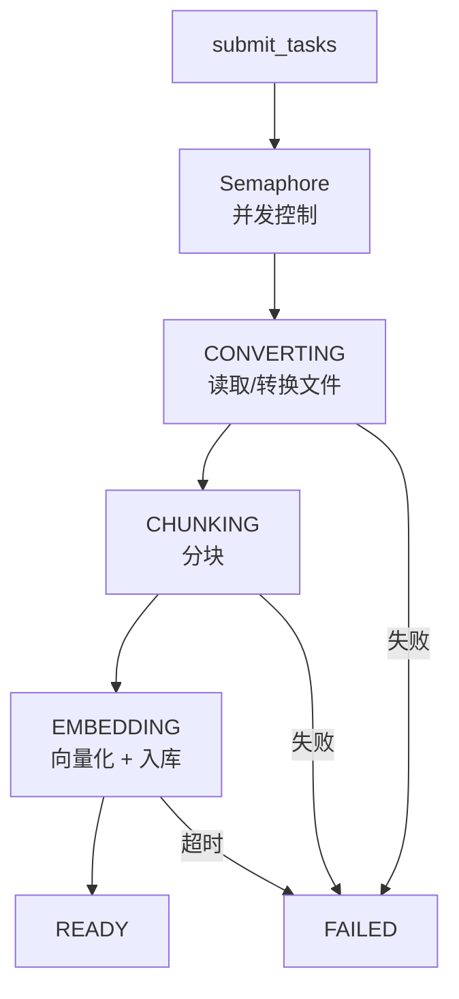

# rag-core 模块

## 模块简介

`rag/core/` 是 CodingHub 项目 RAG（Retrieval-Augmented Generation，检索增强生成）系统的核心引擎层。该模块以纯 Python 实现，提供从文档摄入、文本分块、向量化编码、向量存储到混合检索与重排序的完整 RAG 管线。上层 [rag-api](rag-api.md) 通过 REST HTTP 接口暴露这些能力，Java 后端的 MCP 工具（`h3_coding_hub_kb_*`）也经由该 API 代理调用本模块。

**技术栈要点：**

| 维度 | 选型 |
|------|------|
| 向量数据库 | zvec（嵌入式，本地文件存储） |
| Embedding 模型 | Qwen/Qwen3-Embedding-0.6B（1024 维，中英双语） |
| Reranker 模型 | BAAI/bge-reranker-v2-m3（Cross-Encoder） |
| 全文检索 | zvec FTS（jieba 分词 + BM25） |
| 元数据存储 | SQLite（WAL 模式） |
| 异步处理 | asyncio + Semaphore 并发控制 |

## 架构图

## 核心组件职责

### service.py — 业务逻辑层

模块的中枢协调器，持有 `VectorStore` 单例，对外提供结构化操作（返回 dict）：

- **文件摄入** (`ingest_file` / `ingest_content`)：读取文件 → 变更检测（SHA256）→ 自动策略选择 → 分块 → 向量化入库
- **检索** (`search`)：向量 + BM25 混合检索 → 可选 glob 过滤 → 可选 Rerank → 上下文扩展
- **集合管理**：`list_collections`、`delete_collection`、配置读写
- **文件读取**：支持纯文本（40+ 扩展名）和二进制格式（PDF/DOCX/PPTX/XLSX），XLSX 使用 openpyxl 直接转换以规避 markitdown 挂起问题

### chunker.py — 文本分块引擎

提供三种分块策略，均输出 `Chunk` 数据类（text, source, chunk_index, doc_id, context_header）：

| 策略 | 函数 | 适用场景 |
|------|------|----------|
| recursive | `chunk_text()` | 通用兜底，按段落→句子→字符递归切分 |
| semantic | `semantic_chunk_text()` | 基于句间 embedding 相似度检测话题边界 |
| structural | `structural_chunk_text()` | 识别 Markdown 标题/代码块/表格，保留文档结构 |

**关键机制：**

- **保护区域**（`protected_spans`）：LaTeX 公式、MD 图片/链接、表格行、围栏代码块在切分时保持完整，不被截断
- **质量验证 + 层级降级**（`chunk_with_validation`）：structural 验证失败自动降级为 recursive；semantic 为用户显式选择，不降级
- **context_header**：structural 模式下每个 chunk 携带所属标题面包屑，嵌入时拼接到文本前面以提升检索精度

### embeddings.py — 向量化编码服务

`EmbeddingService` 单例，懒加载 sentence-transformers 模型：

- `encode(texts)` — 批量编码文档段落，返回归一化向量列表
- `encode_query(query)` — 编码查询，自动添加 `"query: "` 前缀（Qwen3-Embedding 非对称检索最佳实践）
- 维度在加载时自动探测（默认 1024）
- 支持 `RAG_EMBEDDING_MODEL` 环境变量切换模型
- HuggingFace 镜像端点自动配置（hf-mirror.com）

### vector_store.py — zvec 向量存储

`VectorStore` 封装 zvec 嵌入式向量数据库：

- **Collection 管理**：每个集合独立目录（`data/{name}/db/`），schema 包含 embedding(FP32)、text、source、chunk_index、context_header
- **混合检索**（`search`）：ANN 向量查询 + BM25 全文检索，通过 RRF（Reciprocal Rank Fusion, k=60）融合排序；FTS 不可用时自动降级为纯向量检索
- **FTS 索引**：jieba 分词 + lowercase 过滤器，支持 `rebuild_fts_index` 为旧集合补建
- **批量写入**：按 1024 条一批插入（zvec 上限），避免内存尖峰
- **文档注册表**（`_registry.json`）：记录每个文件的 chunk_count 和 file_hash，支持快速删除和变更检测
- **上下文扩展**（`fetch_neighbors`）：按 doc_id + chunk_index 获取相邻 chunk

### reranker.py — Cross-Encoder 重排序

`RerankerService` 单例，使用 BAAI/bge-reranker-v2-m3 对候选结果精排：

- 输入 (query, text) 对，输出相关性分数
- 按 rerank_score 降序排列，截取 top_n
- 仅在候选数 > 1 且配置启用时触发

### profiler.py — 文档画像与策略选择

单次遍历提取文档特征（`DocumentProfile`），无需 LLM：

- heading_count / heading_density — Markdown 标题密度
- code_ratio — 代码块字符占比
- has_tables — 是否含表格

`select_strategy()` 决策逻辑：
- 文档 < 200 字符 → recursive
- 标题数 >= 3 且密度 > 0.005 → structural
- 代码占比 > 50% → structural
- 默认 → structural

### validator.py — 分块质量校验

5 条规则验证分块输出质量：

1. 非空：至少产生 1 个 chunk
2. 大文档不能只有 1 个 chunk（> 2×chunk_size 时）
3. 碎片率：排除末尾 chunk 后，< 50 字符的 chunk 占比 ≤ 25% 且数量 ≤ 2
4. 无超大 chunk（≤ 2×chunk_size）
5. 非全碎片：最大 chunk ≥ chunk_size/4

### database.py — SQLite 元数据层

`Database` 类管理文档处理状态（WAL 模式，线程本地连接）：

- 状态机：`UPLOADING → CONVERTING → CHUNKING → EMBEDDING → READY / FAILED`
- 启动恢复（`mark_stale_as_failed`）：中间态文档若源文件存在则重置为 UPLOADING 重新处理，否则标记 FAILED
- 索引：(collection, status) 和 (collection, created_at DESC)

### async_engine.py — 异步处理引擎

`AsyncEngine` 基于 asyncio.Task + Semaphore 实现并发控制：

- 默认 `MAX_CONCURRENT=1`（CPU 模式下 embedding 必须串行，避免 CPU 争用）
- 每文档超时 600s（`RAG_PROCESS_TIMEOUT`）
- 管线阶段：CONVERTING → CHUNKING → EMBEDDING → READY/FAILED
- 各阶段通过 `asyncio.to_thread` 在线程池中执行阻塞操作

## 关键数据流

### 文档摄入流程

### 检索流程

### 异步批量处理流程

## 配置与环境变量

| 环境变量 | 默认值 | 说明 |
|----------|--------|------|
| `RAG_EMBEDDING_MODEL` | Qwen/Qwen3-Embedding-0.6B | Embedding 模型名 |
| `RAG_RERANKER_MODEL` | BAAI/bge-reranker-v2-m3 | Reranker 模型名 |
| `RAG_DATA_DIR` | ./data/ | 数据存储根目录 |
| `RAG_EMBEDDING_BATCH_SIZE` | 32 | 编码批大小 |
| `RAG_MAX_CONCURRENT` | 1 | 异步引擎最大并发数 |
| `RAG_PROCESS_TIMEOUT` | 600 | 单文档处理超时（秒） |

**集合级配置**（存储于 `data/{collection}/_config.json`）：

| 字段 | 默认值 | 说明 |
|------|--------|------|
| chunk_mode | structural | 分块策略 |
| chunk_size | 800 | 目标块大小（字符） |
| chunk_overlap | 50 | 块间重叠 |
| rerank | true | 是否启用重排序 |
| context_header | true | 是否携带标题面包屑 |
| strategy | auto | auto 时使用 Profiler 自动选择 |

## 热点函数（高扇入）

基于代码图分析，以下函数被调用最频繁，是模块的核心枢纽：

| 函数 | 扇入 | 角色 |
|------|------|------|
| `EmbeddingService.encode` | 19 | 所有向量化操作的唯一入口 |
| `service.get_store` | 18 | [VectorStore](../../../rag/core/vector_store.py) 单例获取 |
| `Database._get_conn` | 10 | 线程本地 DB 连接 |
| `VectorStore._collection_path` | 9 | 集合路径解析 |
| `chunker.compute_doc_id` | 6 | 文档 ID 计算 |

## 交叉引用

- [rag-api](rag-api.md) — REST API 层，暴露本模块能力为 HTTP 端点
- Java 后端 MCP 工具（`h3_coding_hub_kb_*`）通过 rag-api 代理调用本模块
- zvec — 嵌入式向量数据库（Rust 实现，Python binding）
- sentence-transformers — HuggingFace 模型加载与推理框架

<!-- crosslinks (auto-generated) -->
## Related Modules
- Depends on: [rag-api](rag-api.md)
- Used by: [rag-api](rag-api.md)
