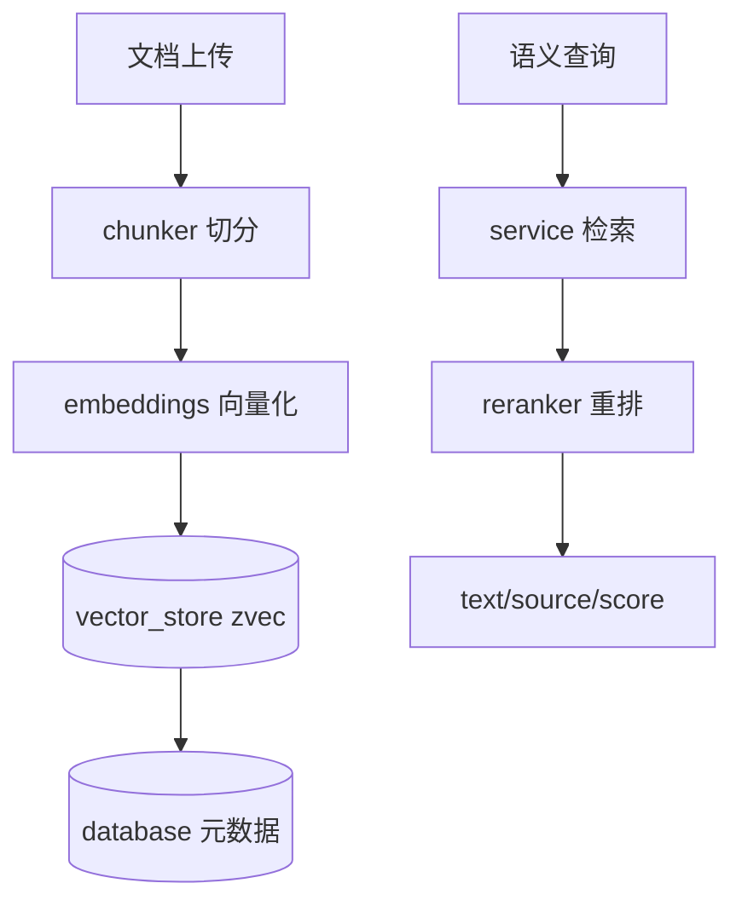

# RAG服务 (rag)

RAG 服务是从 [知识库模块](backend-kb.md) 剥离出的独立 Python 应用，负责真实的文档处理与语义检索。它对外提供两类接口：REST API（`rag/api/app.py`，供后端 `RagApiClient` 调用）与 MCP server（`rag/server.py`，供 AI 客户端直连）。

## 核心模块

| 文件 | 职责 |
|------|------|
| `server.py` | MCP server 装配，暴露知识库工具给 AI 客户端 |
| `api/app.py` | FastAPI 应用，集合/文档/搜索 REST 端点 |
| `core/async_engine.py` | 异步处理引擎（上传/索引流水线） |
| `core/chunker.py` | 文档切分（按策略生成 chunks） |
| `core/database.py` | 元数据存储（SQLAlchemy/SQLite） |
| `core/embeddings.py` | 向量化（embedding 模型封装） |
| `core/vector_store.py` | 向量库（zvec，要求 collection 名 ASCII） |
| `core/reranker.py` | 结果重排 |
| `core/service.py` | 业务编排（搜索/索引/配置） |
| `core/validator.py` | 集合名/参数校验 |
| `core/profiler.py` | 性能剖析 |

## 处理流水线

## 关键设计

### 集合命名约束

`validator` 强制 `ragCollection` 为 ASCII（zvec 限制）。后端 [知识库模块](backend-kb.md) 在创建时已将中文名转换，并在此追加 `-{id}` 保证唯一。

### 切分策略

`chunker` 支持多种策略（按长度/标题/语义），前端 `ChunkingPreviewPanel` / `StrategyBadge` 可预览与选择策略，对应 `core/chunker.py` 的 `ChunkingStrategy`。

### 检索与重排

`service.search` 走向量召回 + `reranker` 交叉编码重排，返回按 `score` 排序的结果，支持 `topK` / `expandContext`（拼接相邻 chunk 上下文）。

### 双协议暴露

同一份 `core/service` 逻辑分别由 `api/app.py`（HTTP）与 `server.py`（MCP）暴露，保证后端桥接与 AI 直连语义一致。

## 跨模块依赖

- 被 [知识库模块](backend-kb.md) 的 `RagApiClient` 调用（HTTP）
- 被 [MCP模块](backend-mcp.md) 的 `kb_*` 工具经 `server.py` 调用（MCP）
- 中文名 → ASCII 的约定与后端 `KnowledgeBaseService` 对齐

## 约束

- collection 名必须 ASCII
- 文档上传走 REST（MCP 仅返回上传 URL）
- 向量库为本地/嵌入式，无独立部署要求
