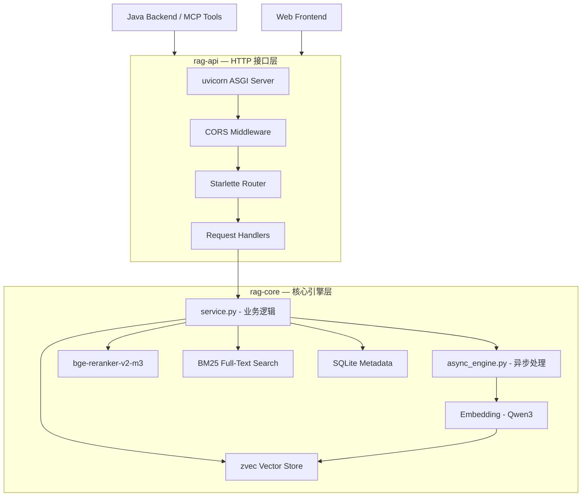

# rag — RAG 知识库服务总览

## 模块简介

`rag` 是 CodingHub 平台的 RAG（Retrieval-Augmented Generation，检索增强生成）知识库服务，以纯 Python 实现，提供从文档摄入、文本分块、向量化编码、向量存储到混合检索与重排序的完整 RAG 管线。该服务独立于 Java 后端运行，通过 REST API 对外提供能力，Java 后端和 MCP 工具均经由 HTTP 代理调用。

**技术栈概览：**

| 维度 | 选型 |
|------|------|
| 语言 | Python 3.10+ |
| Web 框架 | Starlette (ASGI) + uvicorn |
| 向量数据库 | zvec（嵌入式，本地文件存储） |
| Embedding 模型 | Qwen/Qwen3-Embedding-0.6B（1024 维，中英双语） |
| Reranker | BAAI/bge-reranker-v2-m3（Cross-Encoder） |
| 全文检索 | zvec FTS（jieba 分词 + BM25） |
| 元数据存储 | SQLite（WAL 模式） |
| 异步处理 | asyncio + Semaphore 并发控制 |

## 架构分层图

## 子模块一览

| 子模块 | 定位 | 核心文件 | 文档链接 |
|--------|------|----------|----------|
| rag-core | RAG 核心引擎：文档摄入、分块、向量化、混合检索、重排序 | service.py, async_engine.py, database.py | [rag-core.md](rag-core.md) |
| rag-api | HTTP 接口层：文档 CRUD、批量上传、语义搜索 REST 端点 | server.py, api/app.py | [rag-api.md](rag-api.md) |

## 核心设计决策

### 1. 混合检索策略

采用向量语义检索 + BM25 全文检索的混合模式，经 Reranker 重排序后返回结果。兼顾语义理解与关键词精确匹配，提升中文场景下的召回率。

### 2. 嵌入式向量数据库

使用 zvec 嵌入式向量数据库（本地文件存储），无需外部数据库服务依赖，简化部署架构。适合中小规模知识库场景。

### 3. 异步摄入管线

文档摄入通过 asyncio + Semaphore 并发控制实现异步处理，避免大文档阻塞 API 响应。支持批量上传与后台索引构建。

### 4. 轻量级 Web 框架

选用 Starlette（而非 FastAPI）作为 ASGI 框架，减少依赖层次，保持服务轻量。通过 uvicorn 运行，支持高并发异步请求。

## 与后端的集成方式

Java 后端通过 `RagApiClient`（HTTP 客户端）调用本服务的 REST 接口，主要场景：

- **知识库搜索**：`KnowledgeBaseController` → `RagApiClient` → rag-api `/search`
- **MCP 工具代理**：`h3_coding_hub_kb_*` 系列 MCP 工具 → Service → rag-api
- **文档管理**：上传、删除、列表等 CRUD 操作代理

## 相关文档

- [backend.md](backend.md) — 后端服务总览
- [frontend.md](frontend.md) — 前端服务总览
- [overview.md](overview.md) — 仓库级架构总览
