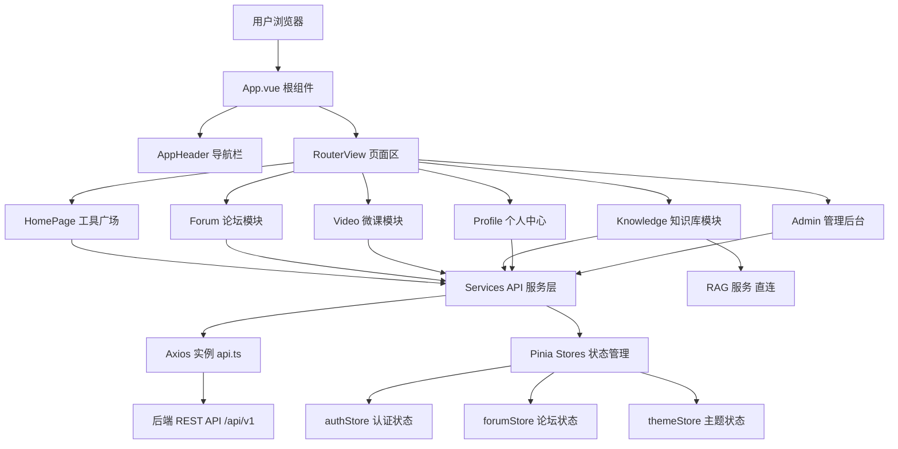

# 前端应用

## 模块概述

前端应用是 CodingHub 平台的单页应用（SPA），采用 Vue 3 Composition API + TypeScript 构建，使用 Vite 作为构建工具。整体技术栈如下：

| 类别 | 技术选型 |
|------|----------|
| 框架 | Vue 3.4（Composition API + `<script setup>`） |
| 语言 | TypeScript 5.4 |
| 构建 | Vite 5.2 |
| 路由 | Vue Router 4（History 模式） |
| 状态管理 | Pinia 2 |
| UI 组件库 | Element Plus 2.7 |
| HTTP 客户端 | Axios 1.6 |
| 图标 | Element Plus Icons + Lucide Vue |
| Markdown 渲染 | markdown-it + highlight.js + github-markdown-css |
| 图表 | Mermaid 11 |
| 工具库 | @vueuse/core |

应用入口为 `frontend/src/main.ts`，初始化流程：创建 Vue 应用 → 注册 Pinia → 从 localStorage 恢复认证状态 → 注册 Element Plus 图标 → 挂载路由 → 挂载应用。

根组件 `App.vue` 采用简洁布局：顶部固定 `AppHeader` 导航栏 + `<RouterView>` 渲染页面内容。

## 架构总览

## 路由结构

路由定义于 `frontend/src/router/index.ts`，使用 `createWebHistory` 模式，所有页面组件均采用懒加载（动态 `import()`）。

### 路由守卫

- **认证守卫**：`meta.requiresAuth` 标记的路由，未登录时重定向到 `/login?redirect=原路径`
- **角色守卫**：`meta.roles` 指定允许的角色数组（如 `['SUPER_ADMIN']`），不满足则跳转首页

### 主要路由表

| 路径 | 名称 | 页面组件 | 权限 |
|------|------|----------|------|
| `/` | Home | HomePage | 公开 |
| `/tools/:id` | [ToolDetail](../../../frontend/src/types/index.ts) | DetailPage | 公开 |
| `/tools/upload` | UploadTool | UploadPage | 需登录 |
| `/me/profile` | Profile | ProfilePage | 需登录 |
| `/me/tools/:id/edit` | EditTool | EditToolPage | 需登录 |
| `/login` | Login | LoginPage | 公开 |
| `/register` | Register | RegisterPage | 公开 |
| `/forum` | ForumList | PostListPage | 公开 |
| `/forum/posts/:id` | ForumPostDetail | PostDetailPage | 公开 |
| `/forum/editor` | ForumEditor | PostEditorPage | 需登录 |
| `/forum/my-posts` | MyPosts | MyPostsPage | 需登录 |
| `/forum/my-favorites` | MyFavorites | MyFavoritesPage | 需登录 |
| `/videos` | VideoList | VideoListPage | 公开 |
| `/videos/:id` | [VideoDetail](../../../frontend/src/types/video.ts) | VideoDetailPage | 公开 |
| `/videos/upload` | VideoUpload | VideoUploadPage | 需登录 |
| `/videos/my-videos` | MyVideos | MyVideosPage | 需登录 |
| `/knowledge` | KnowledgeList | KnowledgeListPage | 公开 |
| `/knowledge/:id` | KnowledgeDetail | KnowledgeDetailPage | 公开 |
| `/knowledge/create` | KnowledgeCreate | KnowledgeEditorPage | 需登录 |
| `/overview` | Overview | OverviewPage | 公开 |
| `/feedback` | Feedback | FeedbackPage | 公开 |
| `/admin/approvals` | AdminApprovals | ApprovalPage | SUPER_ADMIN |
| `/admin/users` | AdminUsers | UserListPage | ADMIN+ |
| `/admin/categories` | AdminCategories | CategoryManagePage | ADMIN+ |
| `/:pathMatch(.*)*` | NotFound | NotFoundPage | 公开 |

## 状态管理

应用使用 Pinia 进行全局状态管理，共 3 个 Store：

### authStore（认证状态）

文件：`src/stores/auth.ts`，采用 Composition API 风格（`setup` 函数）。

- **状态**：`accessToken`、`refreshToken`、`user`（[User](../../../backend/src/main/java/com/iaihub/toolbox/model/User.java) 对象）
- **计算属性**：`isLoggedIn`、`isAdmin`、`isSuperAdmin`
- **方法**：`setTokens()`、`setUser()`、`logout()`、`initFromStorage()`
- **持久化**：Token 和用户信息存储于 localStorage，应用启动时通过 `initFromStorage()` 恢复

### forumStore（论坛状态）

文件：`src/stores/forum.ts`，采用 Options API 风格。

- **状态**：帖子列表、当前帖子、分类列表、标签列表、分页信息、加载状态
- **Actions**：`fetchPosts()`（支持分类/标签/关键词/排序筛选）、`fetchPostById()`、`fetchCategories()`、`fetchTags()`、`fetchMyPosts()`、`deletePost()`
- **错误映射**：内部 `_mapErrorToCode()` 将 HTTP 状态码映射为业务错误码

### themeStore（主题状态）

文件：`src/stores/theme.ts`，采用 Composition API 风格。

- **状态**：`theme`（`'dark' | 'light'`）
- **方法**：`toggleTheme()`、`setTheme()`
- **持久化**：通过 `watch` 监听变化写入 localStorage，通过 `data-theme` 属性控制 DOM 主题

## API 服务层

服务层位于 `src/services/` 目录，封装所有后端通信逻辑。

### api.ts（核心 Axios 实例）

- 基础 URL：`VITE_API_BASE_URL` 环境变量或默认 `/api/v1`
- **请求拦截器**：自动注入 `Authorization: Bearer <token>` 头
- **响应拦截器**：
  - 401 错误：自动尝试 Refresh Token 刷新，支持并发请求排队等待刷新完成
  - 刷新失败：清除认证状态并重定向到登录页
  - 403 错误：提示「没有权限执行此操作」
  - 其他错误：显示后端返回的错误消息
- **附加 API**：`fileUploadApi`（文件上传/下载/删除）、`tagApi`（标签 CRUD）

### 各业务服务模块

| 文件 | 职责 | 主要方法 |
|------|------|----------|
| `tool.ts` | 工具详情 | `getToolDetail()`、`pinTool()`、`unpinTool()`、`getHotTop5()` |
| `forum.ts` | 论坛帖子/评论/点赞 | `getPostList()`、`createPost()`、`getComments()`、`like()`/`unlike()` |
| `video.ts` | 微课视频 | `uploadVideo()`、`getVideoList()`、`getVideoDetail()`、`getStreamUrl()`、`uploadCover()` |
| `knowledge.ts` | 知识库与 RAG | `getList()`、`create()`、`batchUpload()`、`search()`、`getConfig()`、`configureCollection()`、`previewChunking()`、`getDocumentStatus()` |
| `interaction.ts` | 统一互动（点赞/收藏/评论） | `toggleLike()`、`toggleFavorite()`、`getComments()`、`addComment()` |
| `notification.ts` | 通知消息 | `getNotifications()`、`getUnreadCount()`、`markAsRead()`、`markAllAsRead()` |
| `overview.ts` | 热榜统计 | `fetchStats()`、`fetchToolRanks()`、`fetchPostRanks()`、`fetchVideoRanks()` |
| `feedback.ts` | 留言反馈 | `getFeedbacks()`、`createFeedback()`、`replyFeedback()` |

**特殊设计**：`knowledge.ts` 中知识库元数据操作经 Java 后端代理（`/api/v1/knowledge`），而文档上传/删除/状态查询/配置操作直连 RAG Python 服务（通过 KB 详情中的 `ragBaseUrl` 和 `documentsUrl`）。

## 核心页面

### HomePage（工具广场）

平台首页，展示工具列表，支持分类筛选、标签过滤、关键词搜索和排序。工具卡片展示 Logo、下载/收藏数等热度信息。包含工具上传入口。

### DetailPage（工具详情）

展示单个工具的完整信息：Logo、Markdown 内容渲染、文件列表、下载/收藏计数、评论区、点赞/收藏互动。支持管理员置顶。

### Forum 模块页面

- **PostListPage**：帖子列表，支持分类/标签/搜索/排序筛选
- **PostDetailPage**：帖子详情 + 嵌套评论
- **PostEditorPage**：发帖/编辑帖子（Markdown 编辑器）
- **MyPostsPage / MyFavoritesPage**：个人帖子与收藏管理

### [Video](../../../backend/src/main/java/com/iaihub/toolbox/model/video/Video.java) 模块页面

- **VideoListPage**：视频列表（热门/最新排序）
- **VideoDetailPage**：视频播放器 + 弹幕（DanmakuPlayer）+ 评论互动
- **VideoUploadPage / VideoEditPage**：视频上传（进度条）与编辑
- **MyVideosPage / MyVideoFavoritesPage**：个人视频管理

### Knowledge 模块页面

- **KnowledgeListPage**：知识库列表（全部/我的）
- **KnowledgeDetailPage**：知识库详情：文档列表、上传、搜索、RAG 配置面板（策略选择、上下文标题开关、分块预览 ChunkingPreviewPanel）
- **KnowledgeEditorPage**：创建/编辑知识库

### 其他页面

- **OverviewPage**：热榜总览（平台统计 + 工具/帖子/视频排行榜）
- **ProfilePage**：个人资料管理
- **FeedbackPage**：留言板（支持分类：建议/Bug/表扬/其他）
- **ApprovalPage / UserListPage**：管理后台（用户审批、用户列表管理）
- **LoginPage / RegisterPage**：认证页面

## Composables（组合式函数）

| 文件 | 功能 |
|------|------|
| `useInteraction.ts` | 统一封装点赞/收藏/评论逻辑，支持 TOOL、FORUM_POST、VIDEO 三种目标类型 |
| `useContentPermissions.ts` | 内容权限判断：内容所有者或管理员可编辑/删除 |

## 组件体系

### 通用组件（components/common/）

- `UnifiedCommentSection`：统一评论区（基于 interaction API）
- `UnifiedLikeButton` / `UnifiedFavoriteButton`：统一点赞/收藏按钮
- `NotificationBell`：通知铃铛（未读计数）
- `GeneralizedSidebar`：通用侧边栏
- `SortTab`：排序选项卡
- `TagBadge` / `TagSelector`：标签展示与选择
- `LogoUploader`：工具/分类 Logo 上传组件（对接 `/api/v1/uploads/images`）
- `ConfirmDialog`：确认对话框

### 业务组件

- **forum/**：PostCard、CommentList、CommentEditor、CategoryFilter、TagInput
- **knowledge/**：KnowledgeCard、DocumentList、DocumentUpload、KnowledgeSearch、ConfigPanel、StatusBadge、ChunkingPreviewPanel、ChunkCard、StrategyBadge
- **video/**：VideoCard、VideoPlayer、DanmakuPlayer、VideoCoverPicker
- **feedback/**：FeedbackCard、FeedbackForm
- **其他**：AppHeader、UserAvatar、AuthorBadge、StatsCard、ToolRankList、PostRankList、VideoRankList

## 类型系统

类型定义位于 `src/types/` 目录，为所有 API 交互提供完整的 TypeScript 类型支持：

| 文件 | 主要接口 |
|------|----------|
| `index.ts` | `User`、`Category`、`Tag`、`ToolSummary`、`ToolDetail`、`PageResponse<T>`、`ApiResponse<T>`、`LoginRequest`、`RegisterRequest`、`CreateToolRequest`、`ToolFile`、`PendingUser`、`AdminUser` |
| `tool.ts` | `ToolDetailDTO`、`ToolSummary`（含 logoUrl、favoriteCount、downloadCount 等互动统计字段） |
| `forum.ts` | `ForumPost`、`ForumPostCreateRequest`、`ForumComment`、`ForumCategory`、`ForumTag`、`ForumLikeRequest`、`PageResponse<T>` |
| `video.ts` | `VideoListItem`、`VideoDetail`、`VideoComment`、`VideoUploadRequest`、`VideoUpdateRequest`、`VideoPageResponse` |
| `knowledge.ts` | `KnowledgeBase`、`RagDocument`、`RagDocumentStatus`、`DocumentStatus`（枚举）、`KbConfig`（含 strategy、contextHeader 分块配置字段）、`KbSearchResult`、`KbCreateRequest`、`KbSearchRequest`、`KbPageResponse` |
| `overview.ts` | `StatsDto`、`ToolRankDto`、`PostRankDto`、`VideoRankDto` |
| `feedback.ts` | `FeedbackMessage`、`FeedbackCreateRequest`、`FeedbackCategory`（联合类型）、`FeedbackPageResponse` |

### 关键设计模式

- **泛型分页**：`PageResponse<T>` 统一分页响应结构（content、totalElements、totalPages、page、size）
- **统一 API 响应**：`ApiResponse<T>` 包装 `{code, message, data}` 结构
- **互动目标多态**：`TargetType = 'TOOL' | 'FORUM_POST' | 'VIDEO'` 实现跨模块统一互动
- **文档状态枚举**：`DocumentStatus` 描述 RAG 文档处理流水线（UPLOADING → CONVERTING → CHUNKING → EMBEDDING → READY/FAILED）

## 交叉引用

- [工具广场](工具广场.md) — 后端工具管理 API、分类与标签体系
- [用户与认证](用户与认证.md) — JWT 认证流程、角色权限模型、用户管理
- [知识库与RAG](知识库与RAG.md) — RAG 服务架构、文档处理流水线、向量检索
- [互动系统](统一互动.md) — 点赞/收藏/评论/通知的统一互动后端
- [视频服务](工具广场.md) — 视频存储、流式播放、弹幕系统

<!-- crosslinks (auto-generated) -->
## Related Modules
- Depends on: [MCP服务](mcp服务.md), [知识库与RAG](知识库与rag.md)
